**第⼀周环境准备任务**
**任务⽬标：**准备学习环境，学习 web 服务器的搭建过程，并做相应的加固学习
**电脑要求：**必须有⼀台⾃⼰的电脑，配置最好⾼⼀点，⾃⼰⽤着舒服就⾏
**操作系统**：主机不限制操作系统，需要安装虚拟机
**推荐环境：**linux+nginx+php-fpm +mysql（为后续搭建 nginx+lua 的 waf 做准备）
**报告要求：**将整个环境的搭建过程进⾏详细记录，收集⽹络上的加固⽂档，学习加固技术，从⽽思考不加固可能存在的安全问题，对于加固的过程以及对于安全的思考都需要做详细的记录。
最终⽬标：最终⽬标：能够运⾏ php 代码并且可以使⽤ php 连接 mysql，成功执⾏ mysql 的语句
拓展任务：拓展任务：除了这个 web 环境还有其他的环境可以搭建，能⼒强者可以做更多的练习，⽐如：基于 apache 的环境、基于 Windows server 的 iis 环境等；


**第一周任务报告：**

**电脑配置：**i7-4700MQ; 16G内存 ；NVIDIA GeForce GTX 770M

**操作系统：**win10*64位系统 ；教育版 ；已安装VituralBox虚拟机

					基于 apache 的环境
	
					基于 Windows ser ver 的 iis 环境

**环境搭建过程：**linux+nginx+php-fpm +mysql

**一、linux系统搭建**

	1、下载ubuntu-18.04-desktop-amd64.iso镜像，用VituralBox安装虚拟机
	
			虚拟机配置内存2G、硬盘25G、1个CPU;
	
	2、开机后设置中文，并安装ubuntu，选择汉语；

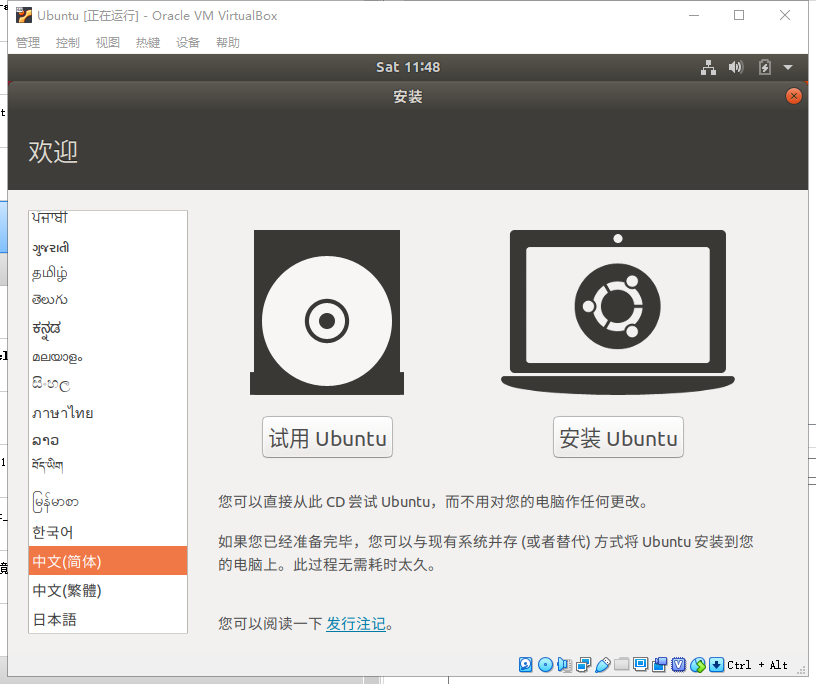


3、清除硬盘并安装

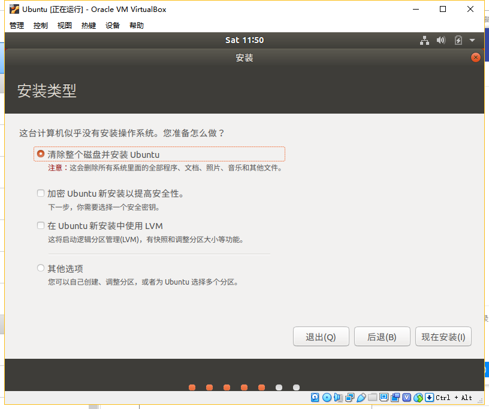

4、设置用户名密码

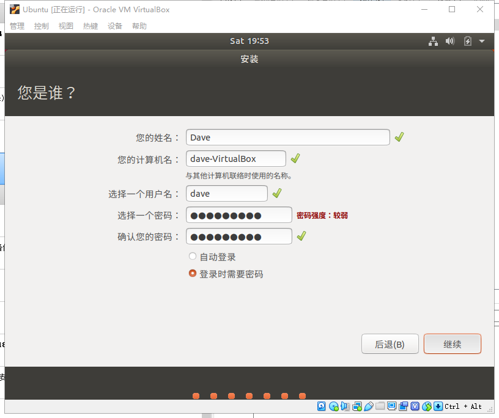

5、启动后安装增强插件 实现自动缩放屏幕；

	点击菜单栏的”设备“–>安装增强功能；按照提示进行安装。安装完成后，重启系统。

6、安装ssh，以方便进行putty连接；	

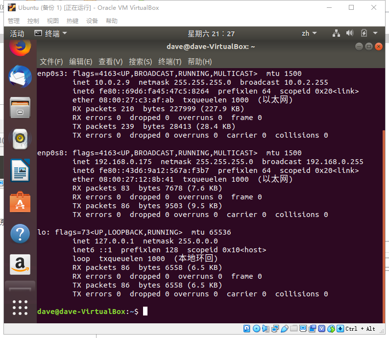

```
sudo apt-get install openssh-server
sudo service ssh start
sudo ps -e | grep ssh       #有 sshd，说明 ssh 服务已经启动
sudo systemctl enable ssh   #设置自动启动ssh
sudo apt install net-tools  #安装ifconfig命令
```

7、putty登陆；至此 ubuntu系统配置完成；使用桌面版的原因是，以后可以仅ubuntu系统里查看文件；

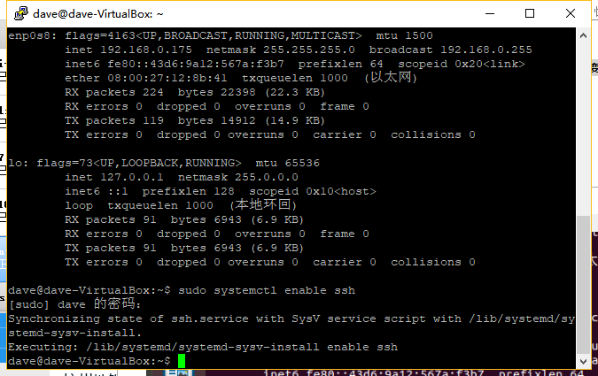

**二、nginx配置**	

```
sudo apt-get install nginx
nginx -v  						#查看是否安装成功；显示版本则安装成功；
```

		打开浏览器也显示安装成功；

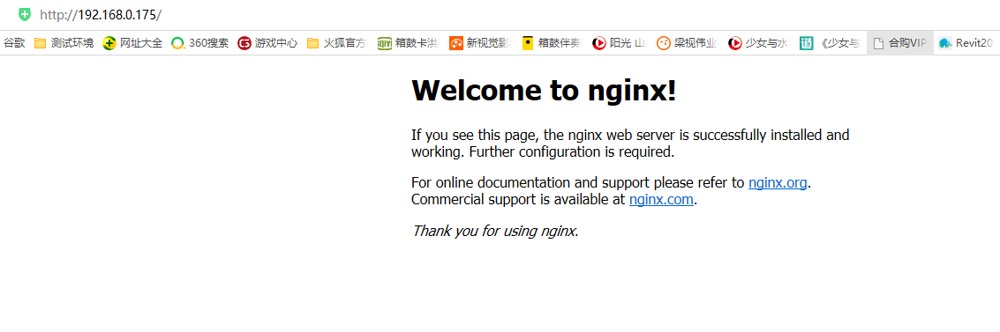

搜索nginx后得知目录：

```
dave@dave-VirtualBox:~$ sudo find / -name nginx
```

```
	/var/log/nginx								  	#存放日志目录
	/var/lib/nginx
	/etc/init.d/nginx
	/etc/logrotate.d/nginx
	/etc/nginx										#存放配置文件目录								
	/etc/ufw/applications.d/nginx
	/etc/default/nginx
	/usr/share/doc/nginx
	/usr/share/nginx								#存放静态文件目录
	/usr/lib/nginx
	/usr/sbin/nginx									#主程序目录
```

三、安装php-fpm

	网上安装命令
	
	（sudo apt-get install php7.2-mysql php7.2-fpm php7.2-curl php7.2-xml php7.2-gd php7.2-mbstring php-memcached php7.2-zip）


实际安装命令

```
	sudo apt install php7.2 php7.2-fpm

	sudo vi /etc/nginx/sites-available/default  

```

Nginx默认服务器块文件如下所示：

```
server {
    listen 80 default_server;
    listen [::]:80 default_server;

    root /var/www/html;
    index index.html index.htm index.nginx-debian.html;

    server_name _;

    location / {
        try_files $uri $uri/ =404;
    }
}

```

 #按如下修改

对当前文件进行几点更改：

- 首先，我们需要添加index.php作为index指令的第一个值，以便index.php在请求目录时提供命名的文件（如果可用）。

- 我们可以修改server_name指令以指向我们服务器的域名或公共IP地址。

- 对于实际的PHP处理，我们只需要通过从每行前面删除井号（＃）来取消注释处理PHP请求的文件段。这将是location
  ~.php$位置块，包含的fastcgi-php.conf代码段和与之关联的套接字php-fpm。

- 我们还将.htaccess使用相同的方法取消注释处理文件的位置块。Nginx不处理这些文件。如果这些文件中的任何一个恰好进入文档根目录，则不应向访问者提供这些文件。

  更改在中标记的文本：

  > ```
  > #   /etc/nginx/sites-available/default  配置文件
  > server {
  > listen 80 default_server;
  > listen [::]:80 default_server;
  > 
  > root /var/www/html;
  > 
  > #这一行中添加了index.php
  > index index.php index.html index.htm index.nginx-debian.html;
  > 
  > #此处修改你的域名，如果没有则不需要修改源文件
  > server_name _;
  > 
  > location / {
  > try_files $uri $uri/ =404;
  > }
  > 
  > #以下所有内容需要添加
  > location ~ \.php$ {
  > include snippets/fastcgi-php.conf;
  > fastcgi_pass unix:/run/php/php7.2-fpm.sock;
  > }
  > 
  > location ~ /\.ht {
  > deny all;
  > }
  > #以上所有内容需要添加 
  > 
  > ```

> }


检查ng的语法错误；nginx  -t

这里大括号一定要配对，我在这里错了好几次，一直错误；

cat /etc/php/7.2/fpm/pool.d/www.conf

没有问题重启Nginx

```
  sudo systemctl reload nginx

```

	确认 
	
		配置文件/etc/php/7.2/fpm/pool.d/www.conf中
	
		listen = /run/php/php7.2-fpm.sock
	
	配置好后重启nginx与php服务：


```
$ service nginx restart 
$ service php7.2-fpm restart

```

在

```
cd 		/var/www/html/

touch   info.php

sudo vi info.php   #修改内容如下并：wq！保存；

```

如下所示：

```
									<?php
									phpinfo();
									?>

```

打开浏览器，打开127.0.0.1/info.php  #未出错后证明php配置成功；

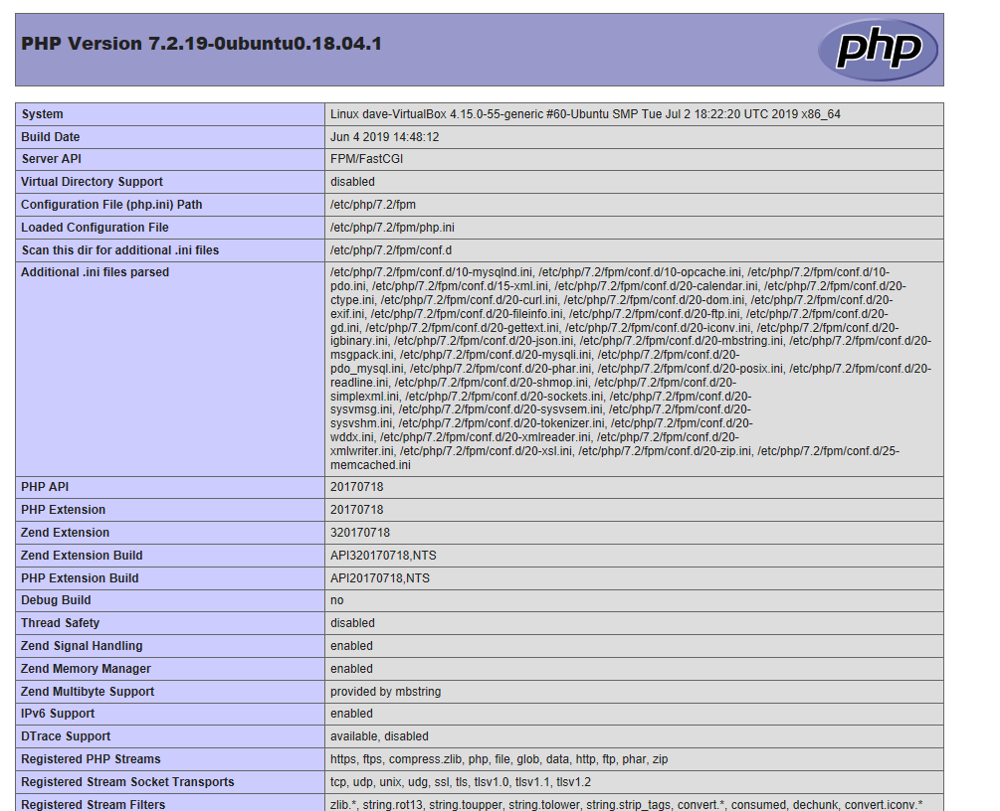


四、安装mysql

```
sudo  apt-get  install mysql-server mysql-client php7.2-mysql
sudo  mysql_secure_installation  #配置sql
systemctl status mysql.service   #测试mysql

```

配置DVWA；

```
git clone https://github.com/ethicalhack3r/DVWA.git
cp -r   /DVWA  /var/www/html/DVWA/
cd /var/www/html/DVWA/config/
cp  config.inc.php.dist config.inc.php.dist.cp
mv config.inc.php.dist  config.inc.php
sudo vi config.inc.php  #修改 
						$_DVWA[ 'db_user' ] = 'root';
						$_DVWA[ 'db_password' ] = 'p@ssw0rd';
						$_DVWA[ 'db_database' ] = 'dvwa';
保存后登陆127.0.0.1/DVWA/login.php  #报错，数据库连接不上；

```

 安装过程中无添加用户密码过程，无法在DVWA中添加密码；

修改密码过程；

	mysql出现ERROR1698(28000):Access denied for user root@localhost错误
	
	因为安装的过程中没让设置密码，可能密码为空，但无论如何都进不去mysql。
	
	那么该怎么做呢，接下来就将这个解决方法总结记录一下。


**step1：**在ubuntu的terminal（也即终端）上输入sudo vim /etc/mysql/mysql.conf.d/mysqld.cnf,进入到这个配置文件，然后在这个配置文件中的[mysqld]这一块中加入skip-grant-tables这句话。

	**作用：**就是让你可以不用密码登录进去mysql。


```
[mysqld]
#
# * Basic Settings
#
user            　 = mysql
pid-file        　 = /var/run/mysqld/mysqld.pid
socket        　　 = /var/run/mysqld/mysqld.sock
port            　 = 3306
basedir        　　= /usr
datadir       　　 = /var/lib/mysql
tmpdir       　　　= /tmp
lc-messages-dir   = /usr/share/mysql
skip-external-locking
character-set-server=utf8
collation-server=utf8_general_ci
skip-grant-tables　　　　<-- add here

```

**保存:wq，退出**。输入：service mysql restart，重新启动mysql。

**step2：**在终端上输入mysql -u root -p，遇见输入密码的提示直接回车即可,进入mysql后，分别执行下面三句话：

```
1 use mysql;   然后敲回车
2 update user set authentication_string=password("你的密码") where user="root";  然后敲回车
3 flush privileges;  然后敲回车
4 quit   #退出mysql

```

再返回终端输入mysql -u root -p，应该就可以进入数据库了

**step3：**重新进入到mysqld.cnf文件中去把刚开始加的skip-grant-tables这条语句给注释掉。

	再返回终端输入mysql -u root -p，应该就可以进入数据库了。


**step4：**如果此时还是报出错误，那么就需要返回step3中，把注释掉的那条语句重新生效（就是删除#符号），重新进入mysql中，先选择一个数据库（use mysql;）,然后输入select user,plugin from user;

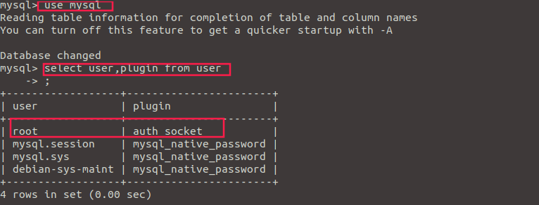

从图中可以看到在执行了select user,plugin from user;后，错误原因是因为plugin root的字段是auth_socket，那我们改掉它为下面的mysql_native_password就行了。

从图中可以看到在执行了select user,plugin from user;后，错误原因是因为plugin root的字段是auth_socket，那我们改掉它为下面的mysql_native_password就行了。输入：

```
1 update user set authentication_string=password("ln122920"),plugin='mysql_native_password' where user='root';

```

然后回车执行以下，再输入select user,plugin from user;回车，我们能看到root用户的字段改成功了。

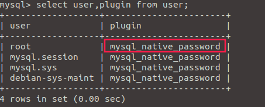

最后quit退出。返回执行step3。

那么这个问题就完全解决了。


修改后DVWA 正常显示

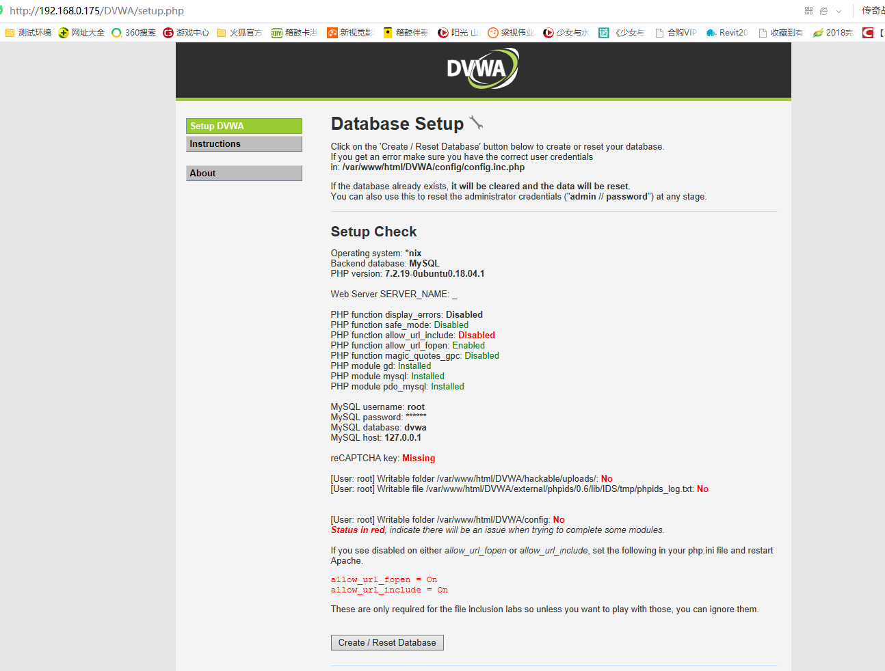

------

**拓展**

mysql修改用户密码的方法及命令

**方法1：** 用SET PASSWORD命令 
首先登录MySQL。 
格式：mysql> set password for 用户名@localhost = password('新密码'); 
例子：mysql> set password for root@localhost = password('123'); 

**方法2：**用mysqladmin 
格式：mysqladmin -u用户名 -p旧密码 password 新密码 
例子：mysqladmin -uroot -p123456 password 123 

**方法3：**用UPDATE直接编辑user表 
首先登录MySQL。 
mysql> use mysql; 
mysql> update user set password=password('123') where user='root' and host='localhost'; 
mysql> flush privileges; 

**方法4：**在忘记root密码的时候，可以这样 
以windows为例： 

1. 关闭正在运行的MySQL服务。 
2. 打开DOS窗口，转到mysql\bin目录。 
3. 输入mysqld --skip-grant-tables 回车。--skip-grant-tables 的意思是启动MySQL服务的时候跳过权限表认证。 
4. 再开一个DOS窗口（因为刚才那个DOS窗口已经不能动了），转到mysql\bin目录。 
5. 输入mysql回车，如果成功，将出现MySQL提示符 >。 
6. 连接权限数据库： use mysql; 。 
7. 改密码：update user set password=password("123") where user="root";（别忘了最后加分号） 。 
8. 刷新权限（必须步骤）：flush privileges;　。 
9. 退出 quit。 
10. 注销系统，再进入，使用用户名root和刚才设置的新密码123登录。

linux系统：

	**step1：**在ubuntu的terminal（也即终端）上输入sudo vim /etc/mysql/mysql.conf.d/mysqld.cnf,进入到这个配置文件，然后在这个配置文件中的[mysqld]这一块中加入skip-grant-tables这句话。
	
	**step2：**在终端上输入mysql -u root -p，遇见输入密码的提示直接回车即可,进入mysql后，分别执行下面三句话：
	
	**step3：**重新进入到mysqld.cnf文件中去把刚开始加的skip-grant-tables这条语句给注释掉。
	
	**step4：**如果此时还是报出错误，那么就需要返回step3中，把注释掉的那条语句重新生效（就是删除#符号），重新进入mysql中，先选择一个数据库（use mysql;）,然后输入


```
select user,plugin from user;

update user set authentication_string=password("ln122920"),plugin='mysql_native_password' where user='root';

```

	最后quit退出。返回执行step3。

------

**建议学习内容：windows service 2008 安装**

1、MSDN网站下载cn_windows_server_2008_r2_hpc_edition_with_service_pack_1_x64_dvd_700632.iso

2、进行虚拟机安装；

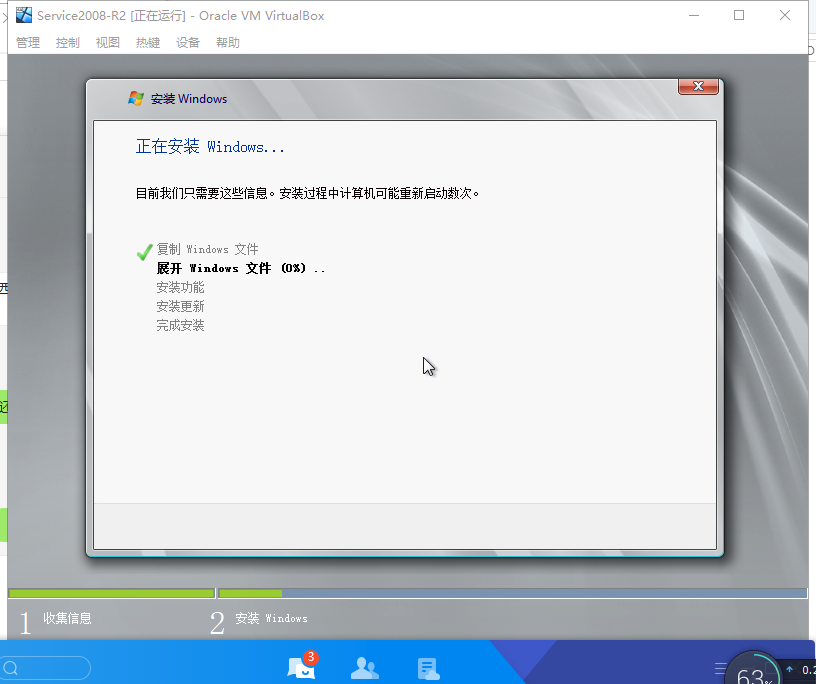


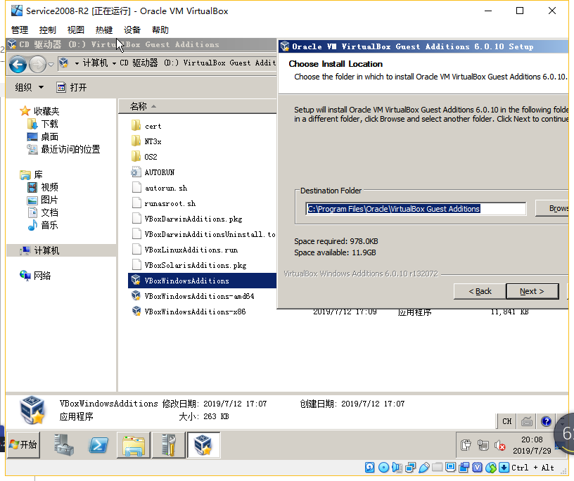

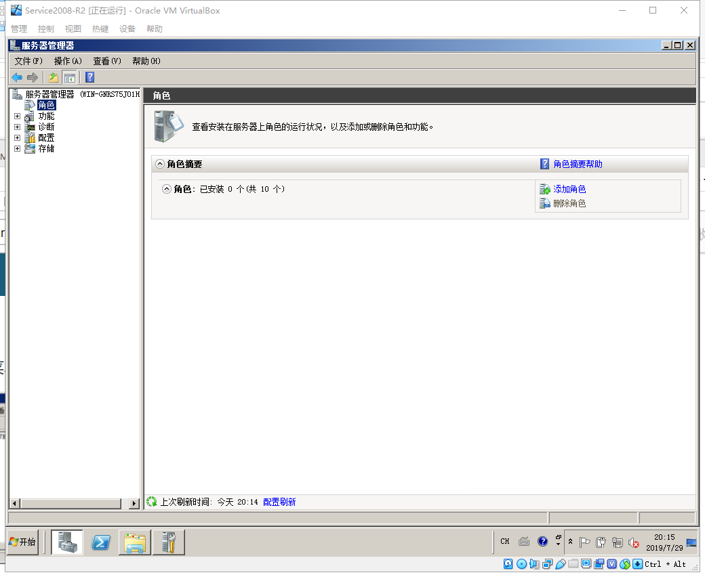

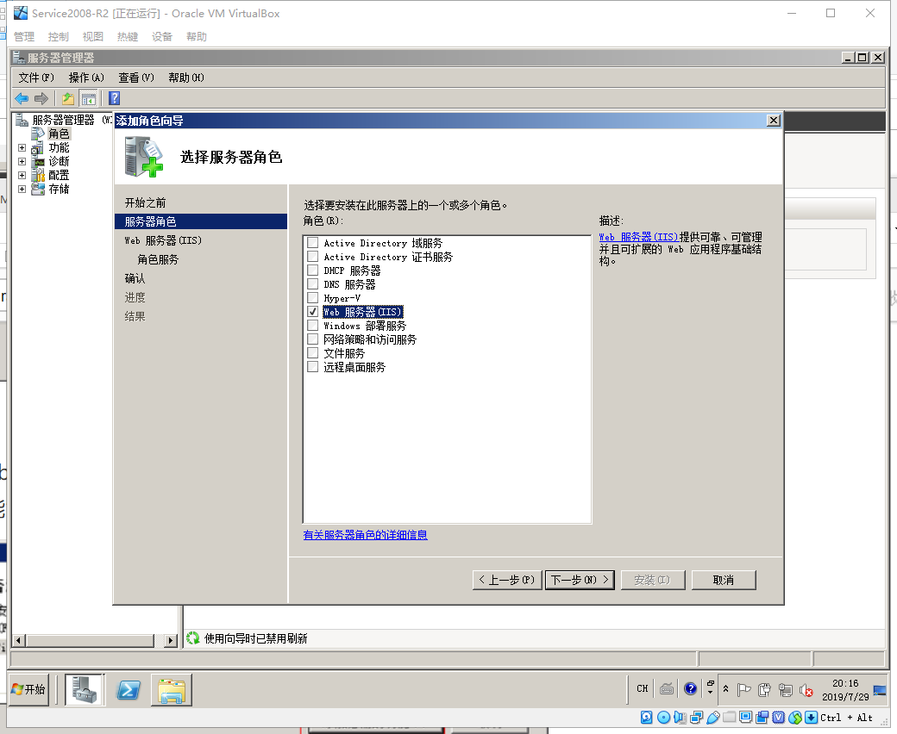


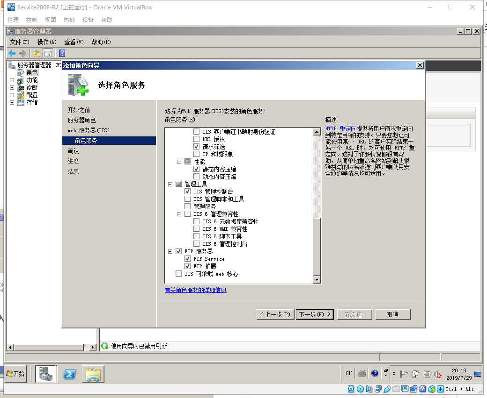

3、显示IIS7 就已经搭建成功；

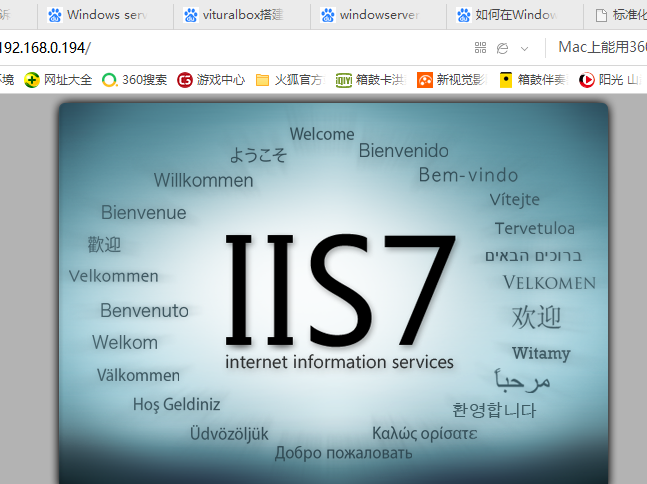