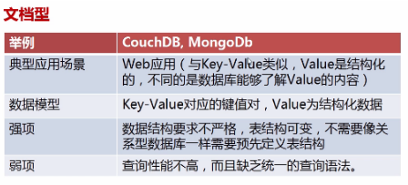
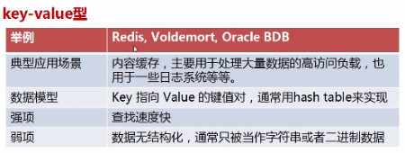
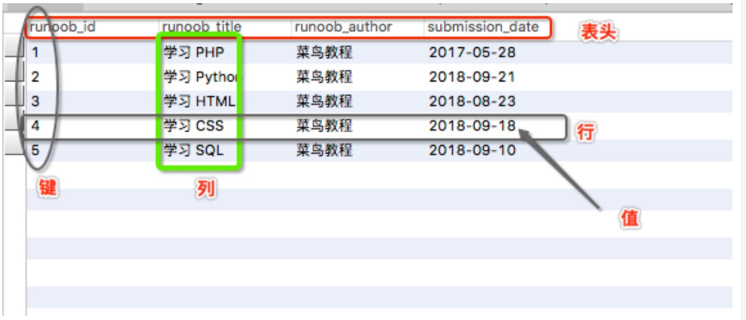
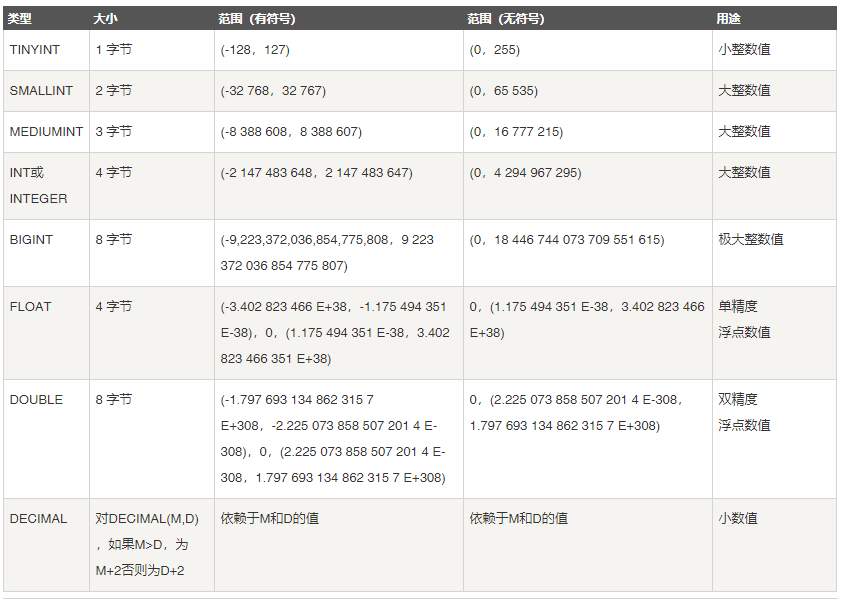
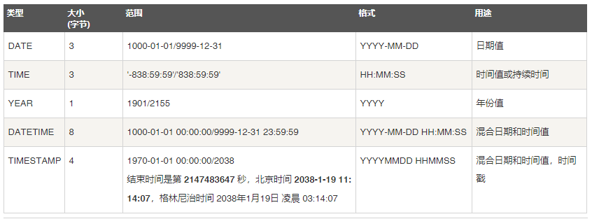
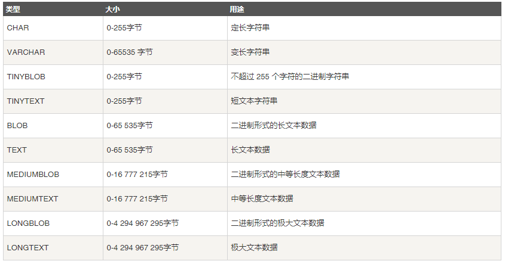
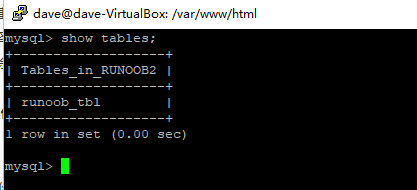
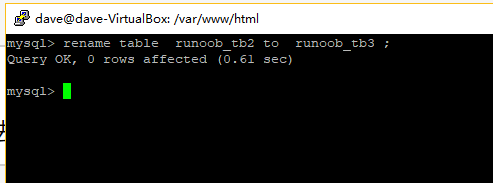
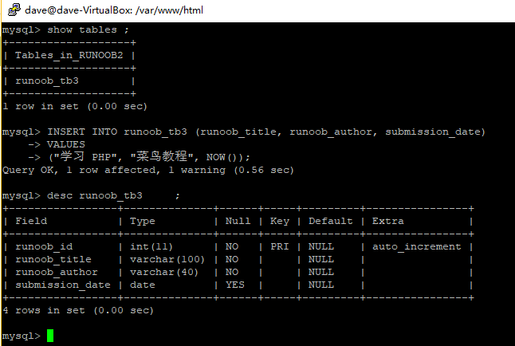
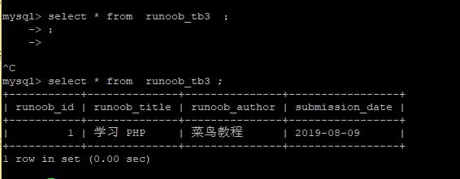

[TOC]

# 学习目标

## 第⼆阶段⽬标：sql 基础学习

		学习 web 安全，sql 注⼊是必学的，因为 sql 注⼊问题是多年来⼀直位居榜⾸的 web 漏洞，⽽学习 sql 注⼊，核⼼的基础是 sql，所以在接下来的⼀段时间以学习 sql 为主要⽬标。
		sql 注⼊可以分为⼏个阶段，⽐如：检测是否存在注⼊、通过注⼊漏洞获取数据、通过注⼊漏洞获取权限，根据这个三个不同阶段的要求进⾏划分。

## 第⼆周：认识 sql 并学习数据库的基础操作

1. 什么是关系型和⾮关系型数据库，两者都包含哪些种类的数据库（理解两者的区别）
2. 选择⼀种关系型数据库进⾏学习（选择⾃⼰不熟悉的进⾏学习，因为不同的数据库，其特性也不同，所以可以选择不熟悉或者感兴趣进⾏研究学习）
3. 学习数据库中的字段类型并创建库和⽤⼾表，需要包含所有字段类型（主要熟悉数据库的基本使⽤，可以⾃由创建、删除、修改数据库和表）
4. 学习数据库的增删改查，记录学习过程（重点是 sql 语句的理解）并形成报告（最终结果）


------

# 学习记录

## 一、关系型与非关系型数据库

当前主流的关系型数据库有Oracle、DB2、Microsoft SQL Server、Microsoft Access、MySQL等。

非关系型数据库有 NoSql、Cloudant。

### 1.1  关系型数据库


关系型数据库最典型的数据结构是表，由二维表及其之间的联系所组成的一个数据组织

		**优点：**

- 易于维护：都是使用表结构，格式一致；

- 使用方便：SQL语言通用，可用于复杂查询；

- 复杂操作：支持SQL，可用于一个表以及多个表之间非常复杂的查询。

  **缺点：**

- 读写性能比较差，尤其是海量数据的高效率读写；

- 固定的表结构，灵活度稍欠；

- 高并发读写需求，传统关系型数据库来说，硬盘I/O是一个很大的瓶颈。

### 1.2  非关系型数据库


非关系型数据库严格上不是一种数据库，应该是一种数据结构化存储方法的集合，可以是文档或者键值对等。
	**优点：**

- 格式灵活：存储数据的格式可以是key,value形式、文档形式、图片形式等等，文档形式、图片形式等等，使用灵活，应用场景广泛，而关系型数据库则只支持基础类型。

- 速度快：nosql可以使用硬盘或者随机存储器作为载体，而关系型数据库只能使用硬盘；

- 高扩展性；

- 成本低：nosql数据库部署简单，基本都是开源软件。

  **缺点：**

- 不提供sql支持，学习和使用成本较高；

- 无事务处理；

- 数据结构相对复杂，复杂查询方面稍欠。

非关系型数据库的分类和比较：

1. 文档型



2. key-value型



3. 列式数据库


4. 图形数据库


### 1.3 二者区别

1. 数据存储方式不同。
   关系型和非关系型数据库的主要差异是数据存储的方式。关系型数据天然就是表格式的，因此存储在数据表的行和列中。数据表可以彼此关联协作存储，也很容易提取数据。

   与其相反，非关系型数据不适合存储在数据表的行和列中，而是大块组合在一起。非关系型数据通常存储在数据集中，就像文档、键值对或者图结构。你的数据及其特性是选择数据存储和提取方式的首要影响因素。

2. 扩展方式不同。

   SQL和NoSQL数据库最大的差别可能是在扩展方式上，要支持日益增长的需求当然要扩展。

   要支持更多并发量，SQL数据库是纵向扩展，也就是说提高处理能力，使用速度更快速的计算机，这样处理相同的数据集就更快了。
   因为数据存储在关系表中，操作的性能瓶颈可能涉及很多个表，这都需要通过提高计算机性能来客服。虽然SQL数据库有很大扩展空间，但最终肯定会达到纵向扩展的上限。而NoSQL数据库是横向扩展的。

   而非关系型数据存储天然就是分布式的，NoSQL数据库的扩展可以通过给资源池添加更多普通的数据库服务器(节点)来分担负载。

3. 对事务性的支持不同。

   如果数据操作需要高事务性或者复杂数据查询需要控制执行计划，那么传统的SQL数据库从性能和稳定性方面考虑是你的最佳选择。SQL数据库支持对事务原子性细粒度控制，并且易于回滚事务。

   虽然NoSQL数据库也可以使用事务操作，但稳定性方面没法和关系型数据库比较，所以它们真正闪亮的价值是在操作的扩展性和大数据量处理方面。

## 二、mysql学习

### 2.1 mysql基础

MySQL 是最流行的关系型数据库管理系统，在 WEB 应用方面 MySQL 是最好的 RDBMS(Relational Database Management System：关系数据库管理系统)应用软件之一。

#### 2.1.1什么是数据库？

数据库（Database）是按照数据结构来组织、存储和管理数据的仓库。每个数据库都有一个或多个不同的 API 用于创建，访问，管理，搜索和复制所保存的数据。

我们也可以将数据存储在文件中，但是在文件中读写数据速度相对较慢。

所以，现在我们使用关系型数据库管理系统（RDBMS）来存储和管理的大数据量。所谓的关系型数据库，是建立在关系模型基础上的数据库，借助于集合代数等数学概念和方法来处理数据库中的数据。RDBMS 即关系数据库管理系统(Relational Database Management System)的特点：

```
1.数据以表格的形式出现
2.每行为各种记录名称
3.每列为记录名称所对应的数据域
4.许多的行和列组成一张表单
5.若干的表单组成database
```

#### 2.1.2 RDBMS 术语

```
数据库: 数据库是一些关联表的集合。
数据表: 表是数据的矩阵。在一个数据库中的表看起来像一个简单的电子表格。
列: 一列(数据元素) 包含了相同类型的数据, 例如邮政编码的数据。
行：一行（=元组，或记录）是一组相关的数据，例如一条用户订阅的数据。
冗余：存储两倍数据，冗余降低了性能，但提高了数据的安全性。
主键：主键是唯一的。一个数据表中只能包含一个主键。你可以使用主键来查询数据。
外键：外键用于关联两个表。
复合键：复合键（组合键）将多个列作为一个索引键，一般用于复合索引。
索引：使用索引可快速访问数据库表中的特定信息。索引是对数据库表中一列或多列的值进行排序的一种结构。类似于书籍的目录。
参照完整性: 参照的完整性要求关系中不允许引用不存在的实体。与实体完整性是关系模型必须满足的完整性约束条件，目的是保证数据的一致性。
```

MySQL 为关系型数据库(Relational Database Management System), 这种所谓的"关系型"可以理解为"表格"的概念, 一个关系型数据库由一个或数个表格组成。

```
表头(header): 每一列的名称;
列(col): 具有相同数据类型的数据的集合;
行(row): 每一行用来描述某条记录的具体信息;
值(value): 行的具体信息, 每个值必须与该列的数据类型相同;
键(key): 键的值在当前列中具有唯一性。
```



#### 2.1.2 数值类型

MySQL中定义数据字段的类型对你数据库的优化是非常重要的。

MySQL支持多种类型，大致可以分为三类：数值、日期/时间和字符串(字符)类型。

**1、数值**

MySQL支持所有标准SQL数值数据类型。

这些类型包括严格数值数据类型(INTEGER、SMALLINT、DECIMAL和NUMERIC)，以及近似数值数据类型(FLOAT、REAL和DOUBLE PRECISION)。

关键字INT是INTEGER的同义词，关键字DEC是DECIMAL的同义词。

BIT数据类型保存位字段值，并且支持MyISAM、MEMORY、InnoDB和BDB表。

作为SQL标准的扩展，MySQL也支持整数类型TINYINT、MEDIUMINT和BIGINT。下面的表显示了需要的每个整数类型的存储和范围。



**2、日期/时间**

表示时间值的日期和时间类型为DATETIME、DATE、TIMESTAMP、TIME和YEAR。

每个时间类型有一个有效值范围和一个"零"值，当指定不合法的MySQL不能表示的值时使用"零"值。

TIMESTAMP类型有专有的自动更新特性，将在后面描述。



**3、字符串**

字符串类型指CHAR、VARCHAR、BINARY、VARBINARY、BLOB、TEXT、ENUM和SET。该节描述了这些类型如何工作以及如何在查询中使用这些类型。



CHAR 和 VARCHAR 类型类似，但它们保存和检索的方式不同。它们的最大长度和是否尾部空格被保留等方面也不同。在存储或检索过程中不进行大小写转换。

BINARY 和 VARBINARY 类似于 CHAR 和 VARCHAR，不同的是它们包含二进制字符串而不要非二进制字符串。也就是说，它们包含字节字符串而不是字符字符串。这说明它们没有字符集，并且排序和比较基于列值字节的数值值。

BLOB 是一个二进制大对象，可以容纳可变数量的数据。有 4 种 BLOB 类型：TINYBLOB、BLOB、MEDIUMBLOB 和 LONGBLOB。它们区别在于可容纳存储范围不同。

有 4 种 TEXT 类型：TINYTEXT、TEXT、MEDIUMTEXT 和 LONGTEXT。对应的这 4 种 BLOB 类型，可存储的最大长度不同，可根据实际情况选择。

#### 2.1.3 数据库连接

**1、php连接语法**

MySQL 可应用于多种语言，包括 PERL, C, C++, JAVA 和 PHP。 在这些语言中，Mysql在PHP的web开发中是应用最广泛。

在本教程中我们大部分实例都采用了 PHP 语言。如果你想了解 Mysql 在 PHP 中的应用，可以访问我们的 PHP 中使用 Mysqli 介绍。

PHP提供了多种方式来访问和操作Mysql数据库记录。PHP Mysqli函数格式如下：

```
mysqli_function(value,value,...);
```

以上格式中 function部分描述了mysql函数的功能，如

```
mysqli_connect($connect);
mysqli_query($connect,"SQL 语句");
mysqli_fetch_array()
mysqli_close()
```

以下实例展示了PHP调用mysql函数的语法：

- **实例 (MySQLi)**

```//php
<?php

$retval = mysqli_function(value, [value,...]);
if( !$retval ) 
{
	die ( "相关错误信息" ); 
} 
// 其他 MySQL 或 PHP 语句 

?>
```

2、**使用 PHP 脚本连接 MySQL**

PHP 提供了 mysqli_connect() 函数来连接数据库。

该函数有 6 个参数，在成功链接到 MySQL 后返回连接标识，失败返回 FALSE 。

```
mysqli_connect(host,username,password,dbname,port,socket);
```

| 参数       | 描述                                        |
| :--------- | :------------------------------------------ |
| *host*     | 可选。规定主机名或 IP 地址。                |
| *username* | 可选。规定 MySQL 用户名。                   |
| *password* | 可选。规定 MySQL 密码。                     |
| *dbname*   | 可选。规定默认使用的数据库。                |
| *port*     | 可选。规定尝试连接到 MySQL 服务器的端口号。 |
| *socket*   | 可选。规定 socket 或要使用的已命名 pipe。   |

你可以使用 PHP 的 mysqli_close() 函数来断开与 MySQL 数据库的链接。

该函数只有一个参数为 mysqli_connect() 函数创建连接成功后返回的 MySQL 连接标识符。

**示例：连接 MySQL**   

```
<?php
$dbhost = 'localhost';       // mysql服务器主机地址
$dbuser = 'root';            // mysql用户名
$dbpass = '123456';          // mysql用户名密码
$conn = mysqli_connect($dbhost, $dbuser, $dbpass);
if(! $conn )
{
    die('Could not connect: ' . mysqli_error());
}
echo '数据库连接成功！';
mysqli_close($conn);
?>
```


```
bool mysqli_close ( mysqli $link )


```

本函数关闭指定的连接标识所关联的到 MySQL 服务器的非持久连接。如果没有指定 link_identifier，则关闭上一个打开的连接。

**提示：**通常不需要使用 mysqli_close()，因为已打开的非持久连接会在脚本执行完毕后自动关闭。

2、使用mysql二进制方式连接**

 

  注意 ：-h指的是host地址 ； -u指的是user ， 之所以打到-p回车再输入密码，是为了防止密码泄露；如果-h 不写则默认是localhost


### 2.2  数据库操作

#### 2.2.1 数据库操作

##### 2.2.1.1 创建数据库

- 登陆 MySQL 服务后，使用 create 命令创建数据库

```
create database 数据库名; 
create database test;


```

```
结果：
mysql> create database test;
Query OK, 1 row affected (0.02 sec)

mysql> show databases;
+--------------------+
| Database           |
+--------------------+
| information_schema |
| dvwa               |
| mysql              |
| performance_schema |
| sys                |
| test               |
+--------------------+
6 rows in set (0.00 sec)


```

注：`system clear ` 清理屏幕命令

- 使用 mysqladmin 创建数据库

  使用普通用户，你可能需要特定的权限来创建或者删除 MySQL 数据库。

  所以我们这边使用root用户登录，root用户拥有最高权限，可以使用 mysql **mysqladmin** 命令来创建数据库。

  以下命令简单的演示了创建数据库的过程，数据名为 RUNOOB:

```
[root@host]# mysqladmin -u root -p create RUNOOB
Enter password:******


```

以上命令执行成功后会创建 MySQL 数据库 RUNOOB。


- 使用 PHP脚本 创建数据库

PHP 使用 mysqli_query 函数来创建或者删除 MySQL 数据库。

该函数有两个参数，在执行成功时返回 TRUE，否则返回 FALSE。

```
mysqli_query(connection,query,resultmode);


```

| 参数         | 描述                                                         |
| :----------- | :----------------------------------------------------------- |
| *connection* | 必需。规定要使用的 MySQL 连接。                              |
| *query*      | 必需，规定查询字符串。                                       |
| *resultmode* | 可选。一个常量。可以是下列值中的任意一个：MYSQLI_USE_RESULT（如果需要检索大量数据，请使用这个）MYSQLI_STORE_RESULT（默认） |

**实际操作：**以下实例演示了使用PHP来创建一个数据库：

```
cd 		/var/www/html/
sudo touch   mysqli_query.php
sudo nano mysqli_query.php   #修改内容如下并保存；


```

```
<?php
$dbhost = 'localhost:3306';  // mysql服务器主机地址
$dbuser = 'root';            // mysql用户名
$dbpass = '123456';          // mysql用户名密码
$conn = mysqli_connect($dbhost, $dbuser, $dbpass);
if(! $conn )
{
die('连接错误: ' . mysqli_error($conn));
}
echo '连接成功<br />';
$sql = 'CREATE DATABASE RUNOOB1';
$retval = mysqli_query($conn,$sql );
if(! $retval )
{
die('创建数据库失败: ' . mysqli_error($conn));
}
echo "数据库 RUNOOB 创建成功\n";
mysqli_close($conn);
?>


```


实际查看数据库 NUNOOB已创建好；


##### 2.2.1.2 选择数据库

- 从命令提示窗口中选择MySQL数据库

```
use 数据库名; 
use test;


```

```
屏幕显示：
mysql> use test;
Database changed


```

注意:所有的数据库名，表名，表字段都是区分大小写的。所以你在使用SQL命令时需要输入正确的名称。

- 使用PHP脚本选择MySQL数据库

PHP 提供了函数 mysqli_select_db 来选取一个数据库。函数在执行成功后返回 TRUE ，否则返回 FALSE 。

```
mysqli_select_db(connection,dbname);


```

| 参数         | 描述                            |
| :----------- | :------------------------------ |
| *connection* | 必需。规定要使用的 MySQL 连接。 |
| *dbname*     | 必需，规定要使用的默认数据库。  |

以下实例展示了如何使用 mysqli_select_db 函数来选取一个数据库：

```
cd 		/var/www/html/
sudo touch   mysqli_select_db.php
sudo nano mysqli_select_db.php   #修改内容如下并保存；


```

```
<?php
$dbhost = 'localhost:3306';  // mysql服务器主机地址
$dbuser = 'root';            // mysql用户名
$dbpass = '123456';          // mysql用户名密码
$conn = mysqli_connect($dbhost, $dbuser, $dbpass);
if(! $conn )
{
die('连接失败: ' . mysqli_error($conn));
}
echo '连接成功';
mysqli_select_db($conn, 'test' );
mysqli_close($conn);
?>


```


##### 2.2.1.3 删除数据库

- drop 命令删除数据库

  使用普通用户登陆 MySQL 服务器，你可能需要特定的权限来创建或者删除 MySQL 数据库，所以我们这边使用 root 用户登录，root 用户拥有最高权限。

  在删除数据库过程中，务必要十分谨慎，因为在执行删除命令后，所有数据将会消失。

```
drop database 数据库名; 
drop database runoob;

```

```
屏幕显示：
mysql> create database runoob ;
Query OK, 1 row affected (0.00 sec)

mysql> drop database runoob ;
Query OK, 0 rows affected (0.52 sec)

```

- 使用 mysqladmin 删除数据库

  你也可以使用 mysql **mysqladmin** 命令在终端来执行删除命令。

  以下实例删除数据库 RUNOOB(该数据库在前一章节已创建)：

  ```
  [root@host]# mysqladmin -u root -p drop RUNOOB
  Enter password:******
  
  ```

  执行以上删除数据库命令后，会出现一个提示框，来确认是否真的删除数据库：

  


- 使用PHP脚本删除数据库

  PHP使用 mysqli_query 函数来创建或者删除 MySQL 数据库。

  该函数有两个参数，在执行成功时返回 TRUE，否则返回 FALSE。

  ```
  mysqli_query(connection,query,resultmode);
  
  ```

  | 参数         | 描述                                                         |
  | :----------- | :----------------------------------------------------------- |
  | *connection* | 必需。规定要使用的 MySQL 连接。                              |
  | *query*      | 必需，规定查询字符串。                                       |
  | *resultmode* | 可选。一个常量。可以是下列值中的任意一个：MYSQLI_USE_RESULT（如果需要检索大量数据，请使用这个）MYSQLI_STORE_RESULT（默认） |

以下实例演示了使用PHP mysqli_query函数来删除数据库：

```
cd 		/var/www/html/
sudo touch   mysqli_query_drop.php
    sudo nano mysqli_query_drop.php   #修改内容如下并保存；


```

```
<?php
$dbhost = 'localhost:3306';  // mysql服务器主机地址
$dbuser = 'root';            // mysql用户名
$dbpass = '123456';          // mysql用户名密码
$conn = mysqli_connect($dbhost, $dbuser, $dbpass);
if(! $conn )
{
    die('连接失败: ' . mysqli_error($conn));
}
echo '连接成功<br />';
$sql = 'DROP DATABASE RUNOOB';
$retval = mysqli_query( $conn, $sql );
if(! $retval )
{
    die('删除数据库失败: ' . mysqli_error($conn));
}
echo "数据库 RUNOOB 删除成功\n";
mysqli_close($conn);
?>


```

执行后：


删除失败原因是刚才使用 mysqladmin 删除数据库 RUNOOB已成功；

下面删除RUNOOB1；执行成功


#### 2.2.2 数据表

##### 2.2.2.1 创建数据表

- SQL通用语法：

创建MySQL数据表需要以下信息：

表名、表字段名、定义每个表字段；

` CREATE TABLE 数据表名 (字段名 字段类型);`

```
CREATE TABLE `runoob_tbl`(
   `runoob_id` INT UNSIGNED AUTO_INCREMENT,
   `runoob_title` VARCHAR(100) NOT NULL,
   `runoob_author` VARCHAR(40) NOT NULL,
   `submission_date` DATE,
   PRIMARY KEY ( `runoob_id` )
)ENGINE=InnoDB DEFAULT CHARSET=utf8;


```


实例解析：

如果你不想字段为 NULL 可以设置字段的属性为 NOT NULL， 在操作数据库时如果输入该字段的数据为NULL ，就会报错。
AUTO_INCREMENT定义列为自增的属性，一般用于主键，数值会自动加1。
PRIMARY KEY关键字用于定义列为主键。 您可以使用多列来定义主键，列间以逗号分隔。
ENGINE 设置存储引擎，CHARSET 设置编码。


- 通过命令提示符创建表

  通过 mysql> 命令窗口可以很简单的创建MySQL数据表。你可以使用 SQL 语句 CREATE TABLE 来创建数据表。

  以下为创建数据表 runoob_tbl 实例:

  ```
  root@host# mysql -u root -p
  Enter password:*******
  mysql> use RUNOOB;
  Database changed
  mysql> CREATE TABLE runoob_tbl(
     -> runoob_id INT NOT NULL AUTO_INCREMENT,
     -> runoob_title VARCHAR(100) NOT NULL,
     -> runoob_author VARCHAR(40) NOT NULL,
     -> submission_date DATE,
     -> PRIMARY KEY ( runoob_id )
     -> )ENGINE=InnoDB DEFAULT CHARSET=utf8;
  Query OK, 0 rows affected (0.16 sec)
  mysql>
  
  
  ```

  **注意：**MySQL命令终止符为分号 **;** 

  **注意：** **->** 是换行符标识，不要复制。

- 使用PHP脚本创建数据表

  可以使用 PHP 的 mysqli_query() 函数来创建已存在数据库的数据表。

  该函数有两个参数，在执行成功时返回 TRUE，否则返回 FALSE。

  ```
  mysqli_query(connection,query,resultmode);
  
  
  ```

  | 参数         | 描述                                                         |
  | :----------- | :----------------------------------------------------------- |
  | *connection* | 必需。规定要使用的 MySQL 连接。                              |
  | *query*      | 必需，规定查询字符串。                                       |
  | *resultmode* | 可选。一个常量。可以是下列值中的任意一个：MYSQLI_USE_RESULT（如果需要检索大量数据，请使用这个）MYSQLI_STORE_RESULT（默认） |

以下实例使用了PHP脚本来创建数据表：

```
cd 		/var/www/html/
sudo touch   mysqli_query_createtable.php
sudo nano mysqli_query_createtable.php   #修改内容如下并保存；

mysqladmin -u root -p create RUNOOB2     #先创建RUNOOB2库，为后面创建表打好基础


```

```
<?php
$dbhost = 'localhost:3306';  // mysql服务器主机地址
$dbuser = 'root';            // mysql用户名
$dbpass = '123456';          // mysql用户名密码
$conn = mysqli_connect($dbhost, $dbuser, $dbpass);
if(! $conn )
{
    die('连接失败: ' . mysqli_error($conn));
}
echo '连接成功<br />';
$sql = "CREATE TABLE runoob_tbl( ".
        "runoob_id INT NOT NULL AUTO_INCREMENT, ".
        "runoob_title VARCHAR(100) NOT NULL, ".
        "runoob_author VARCHAR(40) NOT NULL, ".
        "submission_date DATE, ".
        "PRIMARY KEY ( runoob_id ))ENGINE=InnoDB DEFAULT CHARSET=utf8; ";
mysqli_select_db( $conn, 'RUNOOB2' );
$retval = mysqli_query( $conn, $sql );
if(! $retval )
{
    die('数据表创建失败: ' . mysqli_error($conn));
}
echo "数据表创建成功\n";
mysqli_close($conn);
?>


```

执行成功后，就可以通过命令行查看表结构：


##### 2.2.2.2 删除数据表

MySQL中删除数据表是非常容易操作的， 但是你再进行删除表操作时要非常小心，因为执行删除命令后所有数据都会消失。

以下为删除MySQL数据表的通用语法：

```
DROP TABLE table_name ;


```

```
DROP TABLE 数据表名 ; 
DROP TABLE runoob_tbl ;


```

- 在命令提示窗口中删除数据表

  在mysql>命令提示窗口中删除数据表SQL语句为 DROP TABLE ：
  以下实例删除了数据表runoob_tbl:

```
root@host# mysql -u root -p
Enter password:*******
mysql> use RUNOOB;
Database changed
mysql> DROP TABLE runoob_tbl
Query OK, 0 rows affected (0.8 sec)
mysql>


```

- 使用PHP脚本删除数据表

PHP使用 mysqli_query 函数来删除 MySQL 数据表。

该函数有两个参数，在执行成功时返回 TRUE，否则返回 FALSE。

```
mysqli_query(connection,query,resultmode);


```

| 参数         | 描述                                                         |
| :----------- | :----------------------------------------------------------- |
| *connection* | 必需。规定要使用的 MySQL 连接。                              |
| *query*      | 必需，规定查询字符串。                                       |
| *resultmode* | 可选。一个常量。可以是下列值中的任意一个：MYSQLI_USE_RESULT（如果需要检索大量数据，请使用这个）MYSQLI_STORE_RESULT（默认） |

以下实例使用了PHP脚本删除数据表 runoob_tbl:

```
<?php
$dbhost = 'localhost:3306';  // mysql服务器主机地址
$dbuser = 'root';            // mysql用户名
$dbpass = '123456';          // mysql用户名密码
$conn = mysqli_connect($dbhost, $dbuser, $dbpass);
if(! $conn )
{
  die('连接失败: ' . mysqli_error($conn));
}
echo '连接成功<br />';
$sql = "DROP TABLE runoob_tbl";
mysqli_select_db( $conn, 'RUNOOB' );
$retval = mysqli_query( $conn, $sql );
if(! $retval )
{
  die('数据表删除失败: ' . mysqli_error($conn));
}
echo "数据表删除成功\n";
mysqli_close($conn);
?>


```

执行成功后，我们使用以下命令，就看不到 runoob_tbl 表了：

```
mysql> show tables;
Empty set (0.01 sec)


```

##### 2.2.2.3 查一个数据库有什么表 ： show tables；



##### 2.2.2.4 修改表名 ： rename table 旧表名 to 新表名    （不能修改数据库的名字）



##### 2.2.2.5 查看一个表的结构     ： desc 表名   （仅是查看列的结构，不含数据）


#### 2.2.3 数据操作

##### 2.2.3.1 增  MySQL 插入数据

- mySQL 表中使用 INSERT INTO SQL语句来插入数据。

你可以通过 mysql> 命令提示窗口中向数据表中插入数据，或者通过PHP脚本来插入数据。

```
INSERT INTO table_name ( field1, field2,...fieldN ) 
	VALUES 
	( value1, value2,...valueN ); 

```

```
INSERT INTO runoob_tbl (runoob_title, runoob_author, submission_date)
VALUES
("学习 PHP", "菜鸟教程", NOW());

```





```
mysql> use RUNOOB;
Database changed
mysql> INSERT INTO runoob_tbl 
    -> (runoob_title, runoob_author, submission_date)
    -> VALUES
    -> ("学习 PHP", "菜鸟教程", NOW());
Query OK, 1 rows affected, 1 warnings (0.01 sec)
mysql> INSERT INTO runoob_tbl
    -> (runoob_title, runoob_author, submission_date)
    -> VALUES
    -> ("学习 MySQL", "菜鸟教程", NOW());
Query OK, 1 rows affected, 1 warnings (0.01 sec)
mysql> INSERT INTO runoob_tbl
    -> (runoob_title, runoob_author, submission_date)
    -> VALUES
    -> ("JAVA 教程", "RUNOOB.COM", '2016-05-06');
Query OK, 1 rows affected (0.00 sec)
mysql>

```

**注意：** 使用箭头标记 **->** 不是 SQL 语句的一部分，它仅仅表示一个新行，如果一条SQL语句太长，我们可以通过回车键来创建一个新行来编写 SQL 语句，SQL 语句的命令结束符为分号 **;**。

在以上实例中，我们并没有提供 runoob_id 的数据，因为该字段我们在创建表的时候已经设置它为 AUTO_INCREMENT(自动增加) 属性。 所以，该字段会自动递增而不需要我们去设置。实例中 NOW() 是一个 MySQL 函数，该函数返回日期和时间。

- 使用PHP脚本插入数据

  你可以使用PHP 的 mysqli_query() 函数来执行 SQL INSERT INTO命令来插入数据。

  该函数有两个参数，在执行成功时返回 TRUE，否则返回 FALSE。
  `mysqli_query(connection,query,resultmode);`

| 参数         | 描述                                                         |
| :----------- | :----------------------------------------------------------- |
| *connection* | 必需。规定要使用的 MySQL 连接。                              |
| *query*      | 必需，规定查询字符串。                                       |
| *resultmode* | 可选。一个常量。可以是下列值中的任意一个：MYSQLI_USE_RESULT（如果需要检索大量数据，请使用这个）MYSQLI_STORE_RESULT（默认） |

以下实例中程序接收用户输入的三个字段数据，并插入数据表中：

```
<?php
$dbhost = 'localhost:3306';  // mysql服务器主机地址
$dbuser = 'root';            // mysql用户名
$dbpass = '123456';          // mysql用户名密码
$conn = mysqli_connect($dbhost, $dbuser, $dbpass);
if(! $conn )
{
  die('连接失败: ' . mysqli_error($conn));
}
echo '连接成功<br />';
// 设置编码，防止中文乱码
mysqli_query($conn , "set names utf8");
 
$runoob_title = '学习 Python';
$runoob_author = 'RUNOOB.COM';
$submission_date = '2016-03-06';
 
$sql = "INSERT INTO runoob_tbl ".
        "(runoob_title,runoob_author, submission_date) ".
        "VALUES ".
        "('$runoob_title','$runoob_author','$submission_date')";
 
 
 
mysqli_select_db( $conn, 'RUNOOB' );
$retval = mysqli_query( $conn, $sql );
if(! $retval )
{
  die('无法插入数据: ' . mysqli_error($conn));
}
echo "数据插入成功\n";
mysqli_close($conn);
?>

```

对于含有中文的数据插入，需要添加 **mysqli_query($conn , "set names utf8");** 语句。

接下来我们可以通过以下语句查看数据表数据：


##### 2.2.3.2 删

- MySQL-DELECT语句

```
DELETE FROM table_name [WHERE Clause];  
#指定删除数据的表(table_name)，使用条件来指定要在WHERE子句中删除的行记录。如果行匹配条件，这些行记录将被删除。如果省略WHERE子句，DELETE语句将删除表中的所有行。

```

`DELETE FROM runoob_tbl WHERE runoob_id=1;`

- MySQL-DELECT和LIMIT

  ```
  如果要限制要删除的行数，则配合Order By使用LIMIT子句。
  单表语法：delete [low_priority] [quick] [ignore] from tbl_name
  [where where_definition]
  [order by ...]
  [limit row_count]
  
  ```

  1.删除所有行

  ```
      可以在不删除表的情况下删除所有的行。这意味着表的结构、属性和索引都是完整的：
      delete from table_name  
              或者：
      delete * from table_name
  
  ```

   2.删除指定量的数据，如0,30

  ```
  delete from db limit 0,30  
          这里基本我测试都通不过，delete from db limit 30是可以测试通过的，不知道是不是我的版本问题
  
  好像limit 后面是指删除多少条记录，并没有给像select 中的起始记录数样!
  
  然后如果我想limit 30 应该是删除默认的，也就跟select * from db limit 0, 30差不多，
  
  Sql代码  
  select from `sheet1` where 1 limit 0, 1  
  delete from `sheet1` where 1 limit 1  
          对于记录数较多的情况，我们一般用limit 100
  
  Sql代码  
  delete from tag_list where aid='6666' limit 100; 
  
  ```

  ##### 

##### 2.2.3.3 改

- 插入新列的语句 ：

```
     Alter table 表名 add 列名 类型 限制 after 列名
     限制可以是 ：（１）unsigned 无符号
     After 是为了声明在哪一列后面，默认在最后一列，如果要放在第一则替换为first

```

- 修改表之修改列 ：　　

```
      Alter table 表名 change 旧列名 新列名 新列的类型 限制 
      如果要修改原来列的属性可把新列名也写为旧列名即可

```

- 修改表之删除列 :

```
   Alter table 表名 drop 列名

```

- 修改表之增加列主键 ：

```
         　　　 Alter table 表名 add  primary key (列名)
         如 ：　令id列为主键
               	Alter table 表名 add  primary key (id)
				增加主键的时候如果出现duplicate entry错误， 就是因为主键有重复的值

```

          注意：PRIMARY KEY 主键约束，每张数据表只能存在一个主键，主键保证记录的唯一性，主键自动为NOT NULL。 AUTO_INCREMENT(自动增长)必须和主键一起使用，但是主键不是必须和AUTO_INCREMENT一起使用

- 修改表中某列的值 ：

```
      Update 表名 set  name  =  ‘李四’ , age = 3  Where Num = 11   
注意 ： where 设置 修改的 条件

```

- 删除表中某行的数据  ：

```
  Delete from 表名 where  num = 1；
 注 :　　如果要删除多行，则需要用or

```

 

#### 2.2.4 查询

- 使用SQL SELECT语句来查询数据。

  可以通过 mysql> 命令提示窗口中在数据库中查询数据，或者通过PHP脚本来查询数据。

  以下为在MySQL数据库中查询数据通用的 SELECT 语法：

  ```
  SELECT column_name,column_name
  FROM table_name
  [WHERE Clause]
  [LIMIT N][ OFFSET M]
  
  ```

  - 查询语句中你可以使用一个或者多个表，表之间使用逗号(,)分割，并使用WHERE语句来设定查询条件。
  - SELECT 命令可以读取一条或者多条记录。
  - 你可以使用星号（*）来代替其他字段，SELECT语句会返回表的所有字段数据
  - 你可以使用 WHERE 语句来包含任何条件。
  - 你可以使用 LIMIT 属性来设定返回的记录数。
  - 你可以通过OFFSET指定SELECT语句开始查询的数据偏移量。默认情况下偏移量为0。

  以下实例我们将通过 SQL SELECT 命令来获取 MySQL 数据表 runoob_tbl 的数据：

  以下实例将返回数据表 runoob_tbl 的所有记录:

  `select * from runoob_tbl;`

  

```
查询全部数据   ：  Select * from 表名 ；
查询部分列的数据   ： Select num，name  from 表名 ； 
条件查询 ： select num,name from 表名 where num>1   

```

- **使用PHP脚本来获取数据**

使用 PHP 函数的 **mysqli_query()** 及 **SQL SELECT** 命令来获取数据。

该函数用于执行 SQL 命令，然后通过 PHP 函数 **mysqli_fetch_array()** 来使用或输出所有查询的数据。

**mysqli_fetch_array()** 函数从结果集中取得一行作为关联数组，或数字数组，或二者兼有 返回根据从结果集取得的行生成的数组，如果没有更多行则返回 false。

以下实例为从数据表 runoob_tbl 中读取所有记录。

尝试以下实例来显示数据表 runoob_tbl 的所有记录。

```
cd 		/var/www/html/
sudo touch   mysqli_fetch_array1.php
    sudo nano mysqli_fetch_array1.php   #修改内容如下并保存；

```

```
# 使用 mysqli_fetch_array MYSQLI_ASSOC 参数获取数据：
<?php
$dbhost = 'localhost:3306';  // mysql服务器主机地址
$dbuser = 'root';            // mysql用户名
$dbpass = '123456';          // mysql用户名密码
$conn = mysqli_connect($dbhost, $dbuser, $dbpass);
if(! $conn )
{
    die('连接失败: ' . mysqli_error($conn));
}
// 设置编码，防止中文乱码
mysqli_query($conn , "set names utf8");
 
$sql = 'SELECT runoob_id, runoob_title, 
        runoob_author, submission_date
        FROM runoob_tb3';
 
mysqli_select_db( $conn, 'RUNOOB2' );
$retval = mysqli_query( $conn, $sql );
if(! $retval )
{
    die('无法读取数据: ' . mysqli_error($conn));
}
echo '<h2>菜鸟教程 mysqli_fetch_array 测试<h2>';
echo '<table border="1"><tr><td>教程 ID</td><td>标题</td><td>作者</td><td>提交日期</td></tr>';
while($row = mysqli_fetch_array($retval, MYSQLI_ASSOC))
{
    echo "<tr><td> {$row['runoob_id']}</td> ".
         "<td>{$row['runoob_title']} </td> ".
         "<td>{$row['runoob_author']} </td> ".
         "<td>{$row['submission_date']} </td> ".
         "</tr>";
}
echo '</table>';
mysqli_close($conn);
?>


```


1、WHERE
 

2、ORDER BY

```
SELECT field1, field2,...fieldN table_name1, table_name2...
ORDER BY field1, [field2...] [ASC [DESC]];
 
SELECT * from runoob_tbl ORDER BY submission_date ASC;

```

3、GROUP BY

GROUP BY 语句根据一个或多个列对结果集进行分组。

在分组的列上我们可以使用 COUNT, SUM, AVG,等函数。

```
SELECT column_name, function(column_name)
FROM table_name
WHERE column_name operator value
GROUP BY column_name;
 
SELECT name, COUNT(*) FROM   employee_tbl GROUP BY name;

```

4、JOIN

JOIN 按照功能大致分为如下三类：

INNER JOIN（内连接,或等值连接）：获取两个表中字段匹配关系的记录。
 LEFT JOIN（左连接）：获取左表所有记录，即使右表没有对应匹配的记录。
 RIGHT JOIN（右连接）： 与 LEFT JOIN 相反，用于获取右表所有记录，即使左表没有对应匹配的记录。

```
SELECT a.runoob_id, a.runoob_author, b.runoob_count FROM runoob_tbl a 
INNER JOIN tcount_tbl b 
ON a.runoob_author = b.runoob_author

```

#### 2.2.5 MySQL 事务

1、事务介绍

MySQL 事务主要用于处理操作量大，复杂度高的数据。比如说，在人员管理系统中，你删除一个人员，你即需要删除人员的基本资料，也要删除和该人员相关的信息，如信箱，文章等等，这样，这些数据库操作语句就构成一个事务！

在 MySQL 中只有使用了 Innodb 数据库引擎的数据库或表才支持事务。
 事务处理可以用来维护数据库的完整性，保证成批的 SQL 语句要么全部执行，要么全部不执行。
 事务用来管理 insert,update,delete 语句

2、事务控制语句

BEGIN或START TRANSACTION；显式地开启一个事务；

COMMIT；也可以使用COMMIT WORK，不过二者是等价的。COMMIT会提交事务，并使已对数据库进行的所有修改成为永久性的；

ROLLBACK；有可以使用ROLLBACK WORK，不过二者是等价的。回滚会结束用户的事务，并撤销正在进行的所有未提交的修改；


#### 2.2.6 字段操作

1、增

```
ALTER TABLE 数据表名 ADD 新增字段 字段类型; 
ALTER TABLE runoob_tbl ADD status tinyint(1) NOT NULL DEFAULT '0' COMMENT '状态 0正常 1删除';

```

2、删

```
ALTER TABLE 数据表名 DROP 字段名; 
ALTER TABLE runoob_tbl  DROP status;

```

3、改

```
#例如，把字段 c 的类型从 CHAR(1) 改为 CHAR(10)，可以执行以下命令:
ALTER TABLE testalter_tbl MODIFY c CHAR(10);
ALTER TABLE testalter_tbl CHANGE c c CHAR(10);
 
#修改字段类型及名称
#在 CHANGE 关键字之后，紧跟着的是你要修改的字段名，然后指定新字段名及类型。尝试如下实例：
#例如，把字段 c 改成 字段 j ,类型从 CHAR(1) 改为 CHAR(10)，可以执行以下命令:
ALTER TABLE testalter_tbl CHANGE c j CHAR(10);
 
#ALTER TABLE 对 Null 值和默认值的影响
ALTER TABLE testalter_tbl MODIFY j BIGINT NOT NULL DEFAULT 100;
 
#修改字段默认值
ALTER TABLE testalter_tbl ALTER i SET DEFAULT 1000;
 
#修改表名
ALTER TABLE testalter_tbl RENAME TO alter_tbl;
 

```

#### 2.2.7 索引

1、创建普通索引

```
#这是最基本的索引，它没有任何限制。它有以下几种创建方式：
#(1)创建索引
 
CREATE INDEX indexName ON mytable(username(length)); 
#如果是CHAR，VARCHAR类型，length可以小于字段实际长度；如果是BLOB和TEXT类型，必须指定 length。
 
#(2)创建表的时候直接指定
CREATE TABLE mytable(  
      ID INT NOT NULL,   
      username VARCHAR(16) NOT NULL,  
      INDEX [indexName] (username(length)) 
	); 


```

2、创建唯一索引

```
#它与前面的普通索引类似，不同的就是：索引列的值必须唯一，但允许有空值。如果是组合索引，则列值的组合必须唯一。它#有以下几种创建方式：
 
#(1)创建索引
CREATE UNIQUE INDEX indexName ON mytable(username(length)) ;
 
#(2)创建表的时候直接指定
CREATE TABLE mytable( 
      ID INT NOT NULL,  
      username VARCHAR(16) NOT NULL,  
      UNIQUE [indexName] (username(length))  
);  


```

3、删除索引

```
DROP INDEX [indexName] ON mytable; 


```

4、使用ALTER 命令添加和删除索引

```
有四种方式来添加数据表的索引：
#(1)该语句添加一个主键，这意味着索引值必须是唯一的，且不能为NULL。
ALTER TABLE tbl_name ADD PRIMARY KEY (column_list);
 
#(2)这条语句创建索引的值必须是唯一的（除了NULL外，NULL可能会出现多次）。
ALTER TABLE tbl_name ADD UNIQUE index_name (column_list);
 
#(3)添加普通索引，索引值可出现多次。
ALTER TABLE tbl_name ADD INDEX index_name (column_list);
 
#(4)该语句指定了索引为 FULLTEXT ，用于全文索引。
ALTER TABLE tbl_name ADD FULLTEXT index_name (column_list);
 
#添加索引实例
ALTER TABLE testalter_tbl ADD INDEX (c);
 
#删除索引实例
ALTER TABLE testalter_tbl DROP INDEX c;

```


------

# 参考文章

1、mysql统计－关于学生成绩 https://blog.csdn.net/mayanyun2013/article/details/50845667

2、Mysql基础笔记   https://www.cnblogs.com/lzhlearn/p/5877113.html**

3、mysql 基础教程 很全  https://blog.csdn.net/qq_16024861/article/details/81912713

4、关系型数据库和非关系型数据的比较 https://www.cnblogs.com/zylq-blog/p/7595979.html

5、MySQL 数据类型 https://www.runoob.com/mysql/mysql-data-types.html

6、MySQL 教程 https://www.runoob.com/mysql/mysql-tutorial.html

7、Mysql delete limit 使用方法详解 https://bijian1013.iteye.com/blog/2309972