------

# 第三周：数据库系统表相关学习

## 学习要求

1、如何利用数据库的功能**读写文件**，需要什么样的**条件**才可以读写

2、学习数据库**系统表的功能**，如何利用 **sql 语句查询**库名、表名、字段名、内容以及当前**用户**等基本信息，将学习过程中关键部分整理成报告

扩展学习：尝试**查询出用户的 hash**，并使用 **hashcat 来对获取的 hash 进行暴力破解**

### 部分解释

1、对于关系型数据库，都会提供文件读写的功能，但是具体如何实现略有不同，文件读写在我们利用数据库注入漏洞获取 webshell 的时候非常有帮助，所以读写文件的基础是必须要学的。

2、任何关系型数据库，在默认安装成功之后会自带一些默认的系统库和表，这些库和表存储了数据库中很多关键的信息，比如用户创建的库相关信息、表相关信息、用户相关信息、权限相关信息、安装配置相关信息等，在我们利用注入漏洞获取更多信息和权限的过程中有很大的帮助，所以**熟悉数据库默认的系统库和表**也是很必要的。

3、对于关系型数据库，为了安全都会存在用户和密码，但是**密码是经过哈希之后存储在系统表中**的，当我们通过注入获取数据库的账号和哈希之后，想要知道哈希之前的明文信息，需要进行暴力破解操作，对于跑哈希来说，hashcat 可以利用 GPU 快速破解哈希，支持非常多的哈希格式，在未来的红蓝对抗中帮助很大。

以上就是下周任务学习的意义，具体学习到什么程度还是取决于自己，大家加油吧！

------

## 学习记录

### 1  数据库读写的条件

**个人思考：**

根据上周学习的记录，不管数据库以语句、PHP脚本、命令行等方式进行数据库操作（增查改删），必须的条件如下：

- $dbhost = 'localhost:3306';  		// mysql服务器主机地址

- $dbuser = 'root';            	       	// mysql用户名

- $dbpass = '123456';                    // mysql用户名密码

- 需要操作的库名、表名、列名称等；

  网上查资料，得知……偏题严重！！！！


#### **1.1 mysql读取文件**

mysql在不同版本读取文件的方法大致有3类：

```
1.load_file()
2.load data infile()
3.system cat
```

##### **1.1.1 load_file()**

（1）条件

```
1.当前权限对该文件可读
2.文件在该服务器上
3.路径完整
4.文件大小小于max_allowed_packet
	SHOW VARIABLES LIKE ‘max_allowed_packet’;
5.当前数据库用户有FILE权限
	1.select file_priv from mysql.user where user=’username’ (MYSQL4/5)
	2.select grantee,is_grantable from information_schema.user_privileges where privilege_type=’file’ and grantee like ‘%username%’
6.secure_file_priv的值为空，如果值为某目录，那么就只能对该目录的文件进行操作
	可操作路径：查看secure_file_priv权限
	secure_file_priv值的语句：SHOW GLOBAL VARIABLES LIKE “%secure_file_priv%”
	secure_file_priv是用来限制load_file、load data和select sql outfile操作哪个指定目录。
	secure_file_priv的值为null，表示限制mysql不允许导入/导出
	secure_file_priv的值为具体目录，表示限制mysql的导入/导出只能发生该目录下
	secure_file_priv没有具体值时，表示不对mysql的导入/导出做限制查看
	修改方法：
		windows下：修改my.ini 在[mysqld]内加入secure_file_priv =
		linux下：修改my.cnf 在[mysqld]内加入secure_file_priv =
```

```
#查看权限
[mysql]> select user();
[mysql]> select user,file_priv from mysql.user;
```

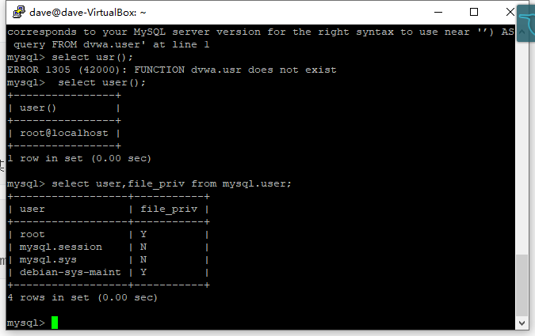

显示的Y说明有权限。

```
#查看允许读写的目录MariaDB [mysql]> show global variables like "%secure%";
```

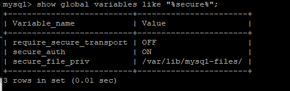

由于我这里**secure_file_priv**值不为空，会限制目录。

如果有值，就需要修改**/etc/my.conf**文件，在[mysqld]下添加**secure_file_priv=’’**。

```
#查看默认目录
dave@dave-VirtualBox:~$ mysql --help | grep 'my.cnf'
#显示：                   
order of preference, my.cnf, $MYSQL_TCP_PORT,
/etc/my.cnf /etc/mysql/my.cnf ~/.my.cnf
#修改
sudo nano  /etc/mysql/my.cnf   #注意把【mysqld】前的#号去掉，不然重启mysql服务出错；
```

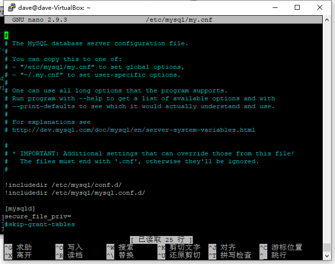

` show global variables like "%secure%";`

#修改成功

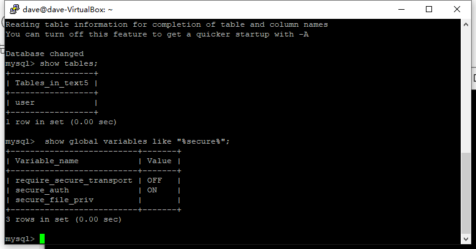

（2）测试

先新建一个文件。

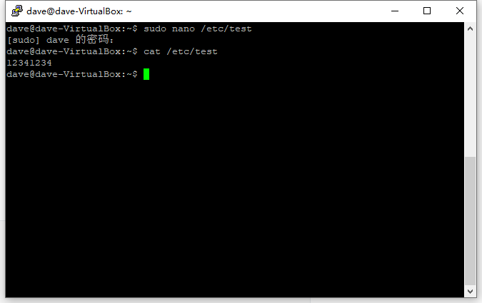

```
#查看文件
create database text5;
use text5;
create table user(data text);
insert into user(data) values (load_file('/etc/test'));   //如果文件不存在，返回NULL
select * from user;
```

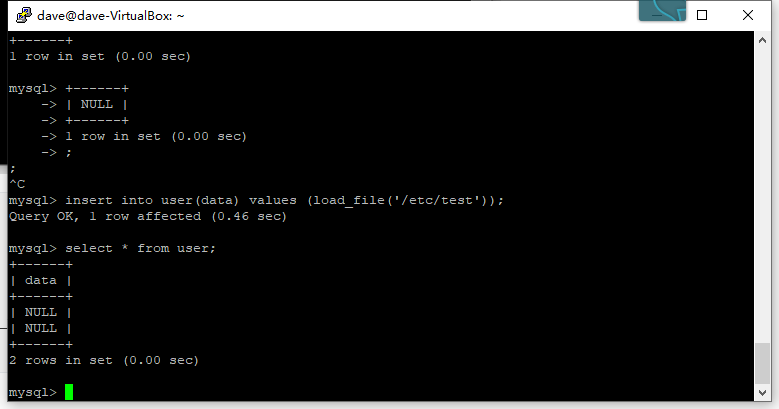

出错；数据显示为null；原因为 ‘ ‘使用不正确；

```
Ubuntu 自带的强制访问控制系统 AppArmor 强制限制了每个程序可使用的资源，它并非针对用户，而是针对程序的，所以不论用户是否能访问某一资源，只要程序被 AppArmor 限制访问该资源，则程序就不能访问该资源。

修改文件 /etc/apparmor.d/usr.sbin.mysqld，在其中添加需要访问的目录, 修改完成后，重新加载 AppArmor 配置：sudo /etc/init.d/apparmor reload。
```


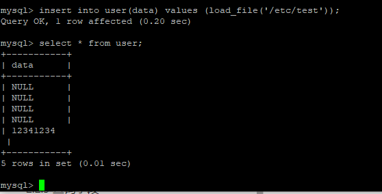

成功读取文件并写入；

##### 1.1.2 load data infile()

和load_file用法相似。sql注入时往往会过滤掉load_file()，但load data infile()仍可以使用。

```
load data infile '/etc/test' into table user;
select * from user;
```

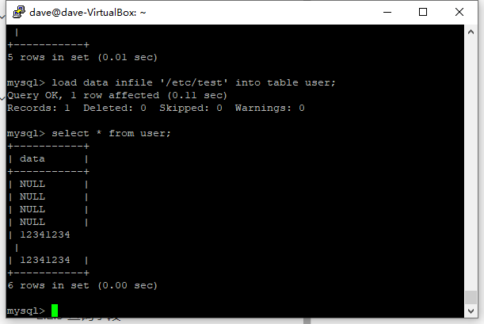

##### 1.1.3 system cat

除了上面两种方法，也可以直接使用命令来查看。

`system cat /etc/test;`


但这种方法**不可以**用于远程连接，只能用于本地读取。也无法越权读取。

#### 1.2 mysql写入文件

##### 1.2.1 select…into outfile()

```
条件：
1.目标目录要有可写权限
2.当前数据库用户要有FILE权限
3.目标文件不能已存在
4.secure_file_priv的值为空
5.路径完整
```

```
#查看权限及可操作路径
show global variables like 'tmpdir';
show global variables like '%secure_file_priv%';
```

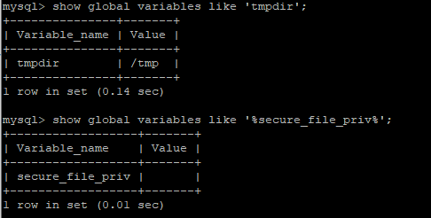

```
#格式
select 'xxxxx' into outfile '/var/tmp/xxx';

select 'test1234' into outfile '/etc/test';
```


```
当没有可读权限时报错； //其实是目标存在，不能写入！！！！！！！！！！
修改文件 /etc/apparmor.d/usr.sbin.mysqld，在其中添加需要访问的目录, 增加写权限；修改完成后
重新加载 AppArmor 配置：sudo /etc/init.d/apparmor reload。
```

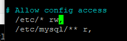

```
#在可写目录试试；
select 'test1234' into outfile '/tmp/test';
system cat /tmp/test;
```

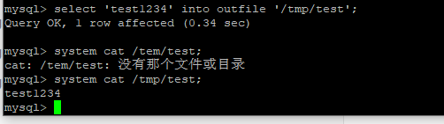

##### 1.2.2 select…into dumpfile()

和into outfile的用法相似，但outfile会自动换行，dumpfile不会。

```
select 'test2345' into dumpfile '/tmp/test1';
system cat /tmp/test1;
```

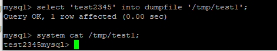

注：outfile函数可以导出多行，而dumpfile只能导出一行数据。
outfile函数在将数据写到文件里时有特殊的格式转换，而dumpfile则保持原数据格式

### 2 数据库系统表

#### 2.1 默认库

根据版本不同，默认创建的库也不同，以下是一定会创建的三个库。

| 库名               | 表数量 | 视图数量 |
| :----------------- | :----- | :------- |
| information_schema | 61     | 0        |
| mysql              | 32     | 0        |
| performance_schema | 87     | 0        |

##### 2.1.1 information_schema

mysql自带的数据库，它提供了访问数据库元数据的方式。

**元数据**是关于数据的数据，如数据库名或表名，列的数据类型，或访问权限等。有些时候用于表述该信息的其他术语包括“数据词典”和“系统目录”。

在MySQL中，把 information_schema看作是信息数据库。其中保存着关于MySQL服务器所维护的所有其他数据库的信息。如数据库名，数据库的表，表栏的数据类型与访问权限等。

在INFORMATION_SCHEMA中，有数个只读表。它们实际上是视图，而不是基本表。因此，你将无法看到与之相关的任何文件。

**information_schema 数据库部分表说明**

| 表名                                  | 注释                                                         |
| :------------------------------------ | :----------------------------------------------------------- |
| SCHEMATA                              | 提供了当前mysql实例中所有数据库的信息。是show databases的结果取之此表 |
| TABLES                                | 提供了关于数据库中的表的信息（包括视图）。详细表述了某个表属于哪个schema、表类型、表引擎、创建时间等信息。是show tables from schemaname的结果取之此表 |
| COLUMNS                               | 提供了表中的列信息。详细表述了某张表的所有列以及每个列的信息。是show columns from schemaname.tablename的结果取之此表 |
| STATISTICS                            | 提供了关于表索引的信息。是show index from schemaname.tablename的结果取之此表 |
| USER_PRIVILEGES                       | 用户权限表:给出了关于全程权限的信息。该信息源自mysql.user授权表。是非标准表 |
| SCHEMA_PRIVILEGES                     | 方案权限表:给出了关于方案（数据库）权限的信息。该信息来自mysql.db授权表。是非标准表 |
| TABLE_PRIVILEGES                      | 表权限表:给出了关于表权限的信息。该信息源自mysql.tables_priv授权表。是非标准表 |
| COLUMN_PRIVILEGES                     | 列权限表:给出了关于列权限的信息。该信息源自mysql.columns_priv授权表。是非标准表 |
| CHARACTER_SETS                        | 字符集表:提供了mysql实例可用字符集的信息。是SHOW CHARACTER SET结果集取之此表 |
| COLLATIONS                            | 提供了关于各字符集的对照信息                                 |
| COLLATION_CHARACTER_SET_APPLICABILITY | 指明了可用于校对的字符集。这些列等效于SHOW COLLATION的前两个显示字段。 |
| TABLE_CONSTRAINTS                     | 描述了存在约束的表。以及表的约束类型                         |
| KEY_COLUMN_USAGE                      | 描述了具有约束的键列                                         |
| ROUTINES                              | 提供了关于存储子程序（存储程序和函数）的信息。此时，ROUTINES表不包含自定义函数（UDF）。名为“mysql.proc name”的列指明了对应于INFORMATION_SCHEMA.ROUTINES表的mysql.proc表列 |
| VIEWS                                 | 给出了关于数据库中的视图的信息。需要有show views权限，否则无法查看视图信息 |
| TRIGGERS                              | 提供了关于触发程序的信息。必须有super权限才能查看该表        |

##### 2.1.2 performance_schema

主要用于收集数据库服务器性能参数

提供进程等待的详细信息，包括锁、互斥变量、文件信息；

保存历史的事件汇总信息，为提供MySQL服务器性能做出详细的判断；

对于新增和删除监控事件点都非常容易，并可以随意改变mysql服务器的监控周期，例如（CYCLE、MICROSECOND

PERFORMANCE_SCHEMA这个功能**默认是关闭**的。

需要设置参数：performance_schema 才可以启动该功能，这个参数是静态参数，只能写在my.cnf 中，不能动态修改。

**performance_schema数据库部分表说明**

| 表名                              | 注释                                                         |
| :-------------------------------- | :----------------------------------------------------------- |
| setup_table                       | 设置表，配置监控选项                                         |
| current_events_table              | 记录当前那些thread 正在发生什么事情                          |
| history_table                     | 发生的各种事件的历史记录表                                   |
| summary_table                     | 对各种事件的统计表                                           |
| setup_consumers\setup_instruments | 描述各种事件, 设置哪些事件能够被收集                         |
| setup_instruments                 | 描述这个数据库下的表名以及是否开启监控                       |
| setup_timers                      | 描述监控选项已经采样频率的时间间隔                           |
| threads                           | 监控服务器所有连接                                           |
| performance_timers                | 设置一些监控信息, 指定mysql服务可用的监控周期，CYCLE表示按每秒检测2603393034次, 目前 performance-schema 只支持’wait’时间的监控，代码树上 wait/ 下的函数都可以监控到 |

##### 2.1.3 mysql

在mysql数据库中，有mysql_install_db脚本初始化权限表，存储权限的表。用于保存MySQL的权限、参数、对象和状态信息。

**mysql数据库部分表说明**

| 表名         | 注释                               |
| :----------- | :--------------------------------- |
| user         | 用户列、权限列、安全列、资源控制列 |
| db           | 用户列、权限列                     |
| host         |                                    |
| table_priv   |                                    |
| columns_priv |                                    |
| proc_priv    |                                    |

#### 2.2 利用sql语句获取信息

```
#查询语法select + 字段列表/* + from + 表名 + [where 条件];#完整查询语法select + [select 选项] + 字段列表[字段别名]/* + from + 数据源 + [where 条件] + [group by 子句] + [order by 子句] + [limit 子句];
```

##### 2.2.1 查询库

```
#查看所有库的信息
select * from information_schema.schemata; 
#查询所有库名
SELECT schema_name from information_schema.schemata;
```

[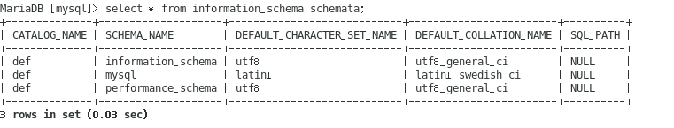](https://i.loli.net/2019/08/17/GRkPpOJV5jqcTzl.jpg)

##### 2.2.2 查询表

```
#查看所有表的信息
select * from INFORMATION_SCHEMA.TABLES;
#查询所有表名
select table_name from information_schema.tables;
#查询某库下的所有表名
select table_name from information_schema.tables where table_schema='库名';


```

[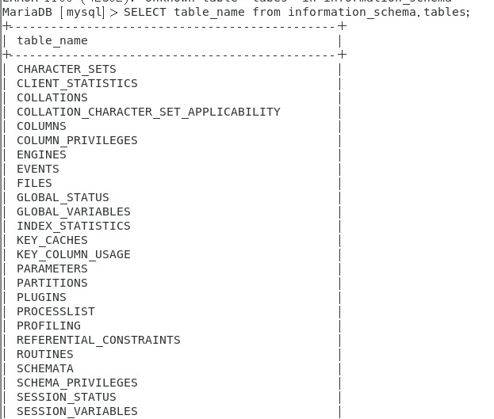](https://i.loli.net/2019/08/17/G5MUb9odHI1DZmi.jpg)

##### 2.2.3 查询字段

```
#获取某表下的字段
select column_name from information_schema.columns where table_name='表名';


```

##### 2.2.4 其他

```
#查看当前用户
select user();
#查看数据库版本
select version();


```

### 3  补充知识（mysql用户及权限）

#### 3.1 查看mysql数据库中的所有用户：

`SELECT DISTINCT CONCAT('User: ''',user,'''@''',host,''';') AS query FROM mysql.user;`

[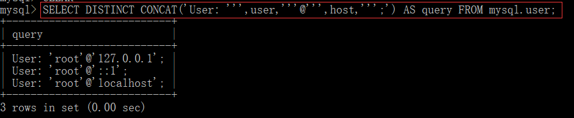](https://s2.ax1x.com/2019/08/12/mpgBdK.png)

#### 3.2 新建用户：

`mysql> CREATE USER 'username'@'host' IDENTIFIED BY 'password';`
Tips: host=”localhost”为本地登录用户，host=”ip”为ip地址登录，host=”%”，为外网ip登录[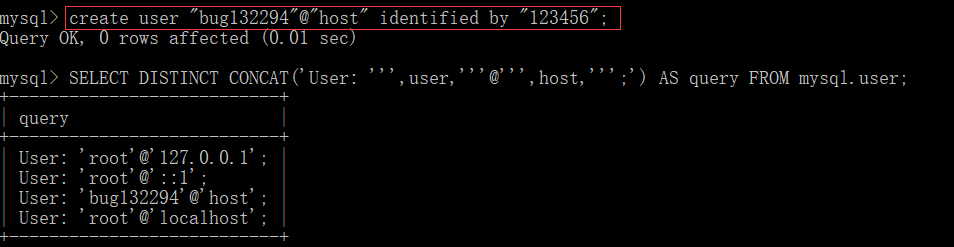](https://s2.ax1x.com/2019/08/12/mpgWLt.png)

#### 3.3 删除用户

drop user ‘username’@’host’;[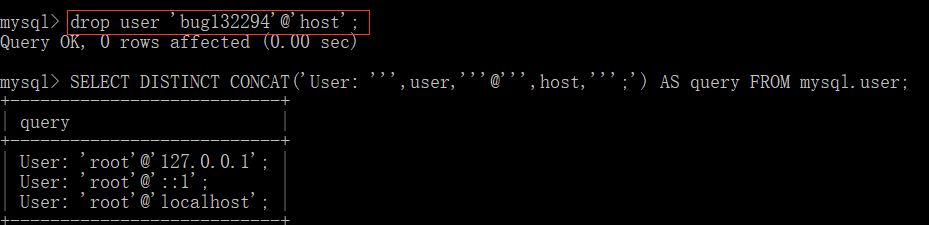](https://s2.ax1x.com/2019/08/12/mpgHzj.png)

#### 3.4 查看某个用户权限

`mysql> show grants for 'user'@'localhost'; 
或者
mysql> select * from mysql.user where user='root' \G;`[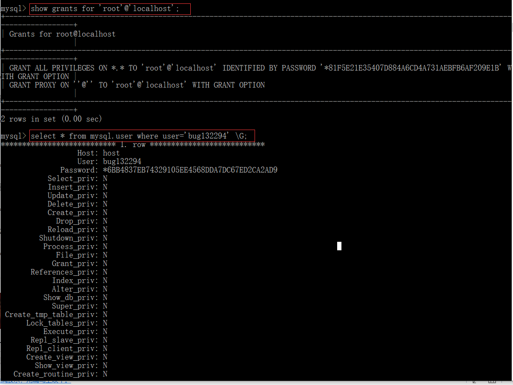](https://s2.ax1x.com/2019/08/12/mp2pYF.png)

#### 3.5 修改用户权限

`grant privileges on databasename.tablename to ‘username’@’host’ IDENTIFIED BY ‘PASSWORD’;`
Tips:
priveleges(权限列表),可以是all priveleges, 表示所有权限，也可以是select、update等权限，多个权限的名词,相互之间用逗号分开。
on用来指定权限针对哪些库和表。
*.*前面的*号用来指定数据库名，后面的*号用来指定表名。
to 表示将权限赋予某个用户, 如 jack@’localhost’ 表示jack用户，@后面接限制的主机，可以是IP、IP段、域名以及%，%表示任何地方。注意：这里%有的版本不包括本地，以前碰到过给某个用户设置了%允许任何地方登录，但是在本地登录不了，这个和版本有关系，遇到这个问题再加一个localhost的用户就可以了。
identified by指定用户的登录密码,该项可以省略。
WITH GRANT OPTION 这个选项表示该用户可以将自己拥有的权限授权给别人。注意：经常有人在创建操作用户的时候不指定WITH GRANT OPTION选项导致后来该用户不能使用GRANT命令创建用户或者给其它用户授权。
可以使用GRANT重复给用户添加权限，权限叠加，比如你先给用户添加一个select权限，然后又给用户添加一个insert权限，那么该用户就同时拥有了select和insert权限。
授权原则说明：
权限控制主要是出于安全因素，因此需要遵循一下几个经验原则：
a、只授予能满足需要的最小权限，防止用户干坏事。比如用户只是需要查询，那就只给select权限就可以了，不要给用户赋予update、insert或者delete权限。
b、创建用户的时候限制用户的登录主机，一般是限制成指定IP或者内网IP段。
c、初始化数据库的时候删除没有密码的用户。安装完数据库的时候会自动创建一些用户，这些用户默认没有密码。
d、为每个用户设置满足密码复杂度的密码。
e、定期清理不需要的用户。回收权限或者删除用户。[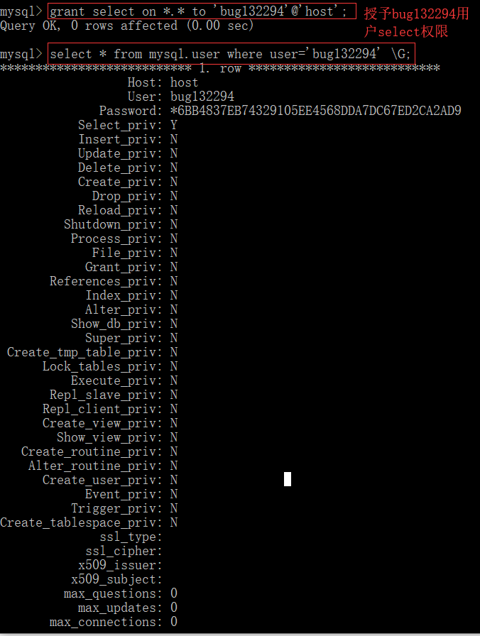](https://s2.ax1x.com/2019/08/12/mp2l6A.png)

#### 3.6 删除权限

revoke privileges on databasename.tablename from ‘username’@’host’;

#### 3.7 修改密码

1.用set password命令
SET PASSWORD FOR ‘root’@’localhost’ = PASSWORD(‘123456’);
2.用mysqladmin [root@rhel5 ~]# mysqladmin -uroot -p123456 password 1234abcd
Tips： 格式：mysqladmin -u用户名 -p旧密码 password 新密码
3.用update直接编辑user表

load_file()示例：
在C盘新建一个名为test的txt格式文件，内容为“good good study,day day up!”[](https://s2.ax1x.com/2019/08/12/mp2BXn.png)
查看权限：

[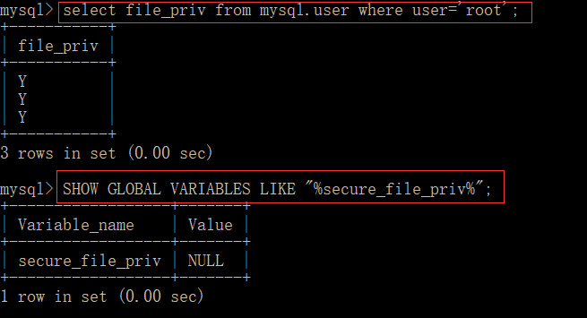](https://s2.ax1x.com/2019/08/12/mp22hF.png)
修改权限：[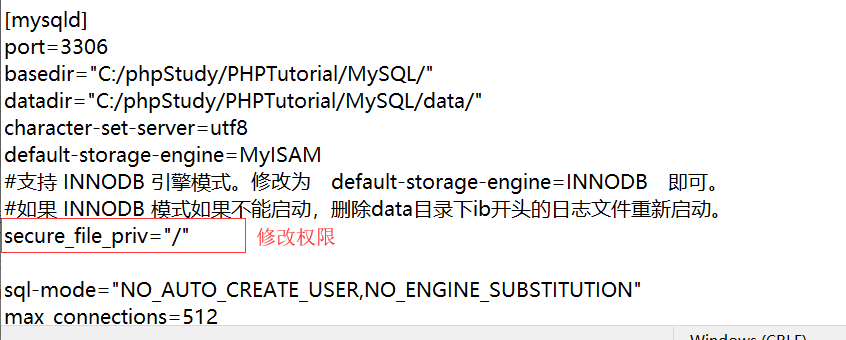](https://s2.ax1x.com/2019/08/12/mp2f1J.png)

权限修改前后比对：
[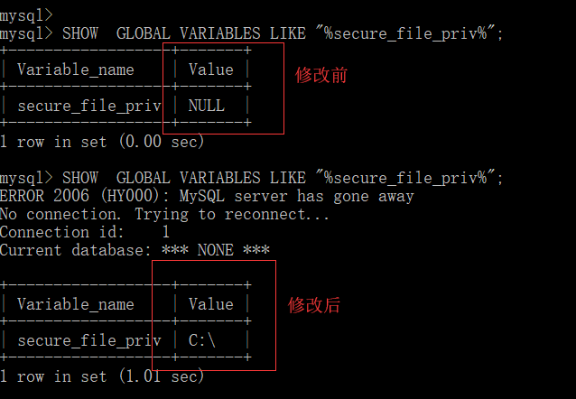](https://s2.ax1x.com/2019/08/12/mp2In1.png)

执行select load_file(‘‪c:\test.txt’);读取成功
[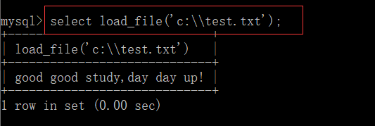](https://s2.ax1x.com/2019/08/12/mpRpHP.png)


### 4 拓展(查询破解用户hash)

尝试查询出用户的 hash，并使用 hashcat 来对获取的 hash 进行暴力破解

```
#查询用户的hash
selcet user,password from users;

#结果
mysql> select user,password from users;
+---------+----------------------------------+
| user    | password                         |
+---------+----------------------------------+
| admin   | 5f4dcc3b5aa765d61d8327deb882cf99 |
| gordonb | e99a18c428cb38d5f260853678922e03 |
| 1337    | 8d3533d75ae2c3966d7e0d4fcc69216b |
| pablo   | 0d107d09f5bbe40cade3de5c71e9e9b7 |
| smithy  | 5f4dcc3b5aa765d61d8327deb882cf99 |
+---------+----------------------------------+
5 rows in set (0.00 sec)


```

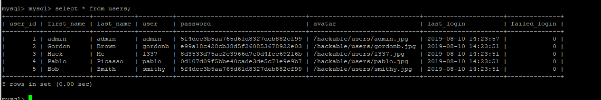

使用[MD5解密网站解密](./003_第三周—数据库系统表相关学习/https://www.cmd5.com/)：

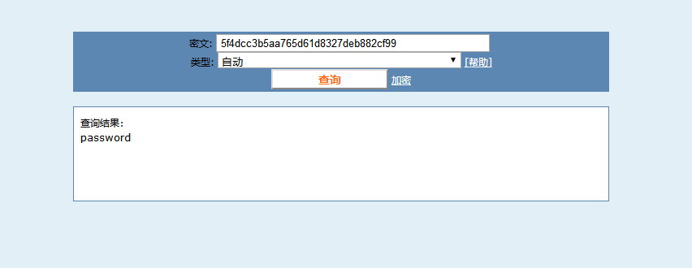

#### 4.1 hash 识别工具

```
HASH 识别工具    hash-identifier    Hashid    可能识别错误或无法识别


```

#### 4.2 hashcat 工具

```
HASHCAT
    开源多线程密码破解工具
    支持80多种加密算法破解
    基于CPU的计算能力破解
    六种模式
        -a 指定模式
        0 Straight:字典破解
        1 Combination:将字典中密码进行组合 （1 2 > 11 22 12 21） 
        2 Toggle case：尝试字典中所有密码的大小写字母组合
        3 Brute force：指定字符集(或全部字符集)所有集合
        4 Permutation：字典中密码的全部字符置换组合(12 21)
        5 Table-lookup:程序为字典中所有密码自动生成掩码
    命令：
        hashcat -b 
            测试当前机器的CPU计算能力
        hashcat -m 100 hash.dump pass.lst 
        hashcat -m 0 hash.txt -a 3 ?l?l?l?l?l?l?l?l?d?d 
        结果：hashcat.pot 
        hashcat -m 100 -a 3 hash -i --increment-min 6 --increment-max 8 ?l?l?l?l?l?l?l?l 
        ?l = abcdefghijklmnopqrstuvwxyz 
        ?u = ABCDEFGHIJKLMNOPQRSTUVWXYZ 
        ?d = 0123456789 
        ?s =  !"#$%&'()*+,-./:;<=>?@[\]^_`{|}~ 
        ?a = ?l?u?d?s 
        ?b = 0x00 - 0xff


```

#### 4.3 获取数据库用户密码 hash 值

```
mysql> select password from user where user='root';
+-------------------------------------------+
| password                                  |
+-------------------------------------------+
| *81F5E21E35407D884A6CD4A731AEBFB6AF209E1B |
| *81F5E21E35407D884A6CD4A731AEBFB6AF209E1B |
|                                           |
+-------------------------------------------+
3 rows in set (0.00 sec)


```

#### 4.4 判断 hash 类型

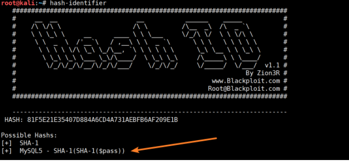

#### 4.5 hashcat 破解

- 查看 hash 所对应的 hashcat 参数
  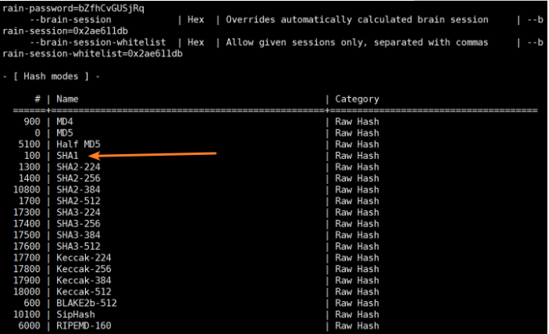

  

- 破解

  ```
  hashcat -m 100 -a 3 hash -i --increment-min 4 --increment-max 4 ?l?l?l?l --force
  ```

```
一些hashcat相关（详细见--help）-a 指定要使用的破解模式（例：-a 0字典攻击）0|字典破解，1|组合破解，3|掩码攻击，6|字典+掩码，7|掩码+字典-m 破解的hash类型，默认为md5
```

## 参考

信安之路博客

https://soyawww.github.io/2019/08/17/sql%E5%9F%BA%E7%A1%80%E5%AD%A6%E4%B9%A0%EF%BC%88%E4%BA%8C%EF%BC%89/#more

https://bug132294.github.io/

https://www.freebuf.com/sectool/164507.html

http://www.cutemore.cn/2019/08/13/%E6%95%B0%E6%8D%AE%E5%BA%93%E7%B3%BB%E7%BB%9F%E8%A1%A8%E7%9B%B8%E5%85%B3%E5%AD%A6%E4%B9%A0/

以及群内各位大佬的文档。