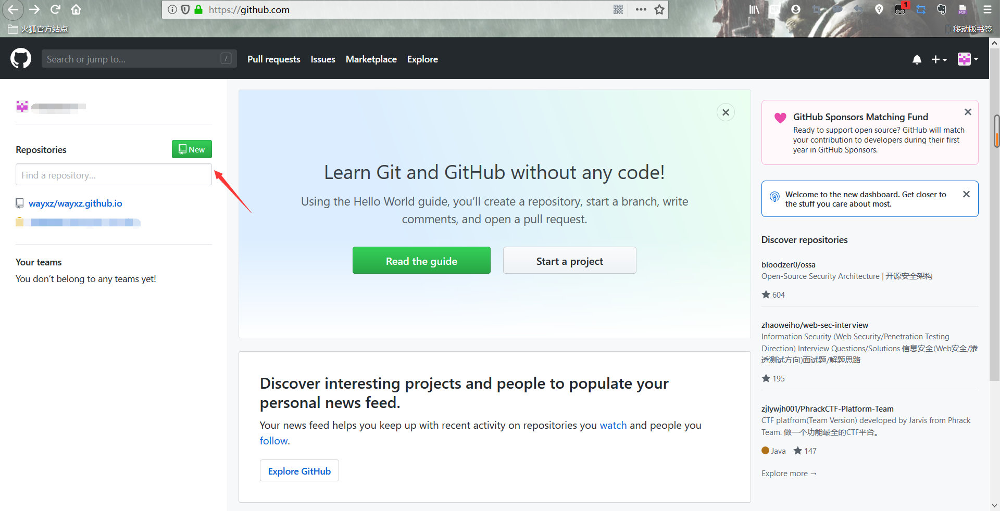
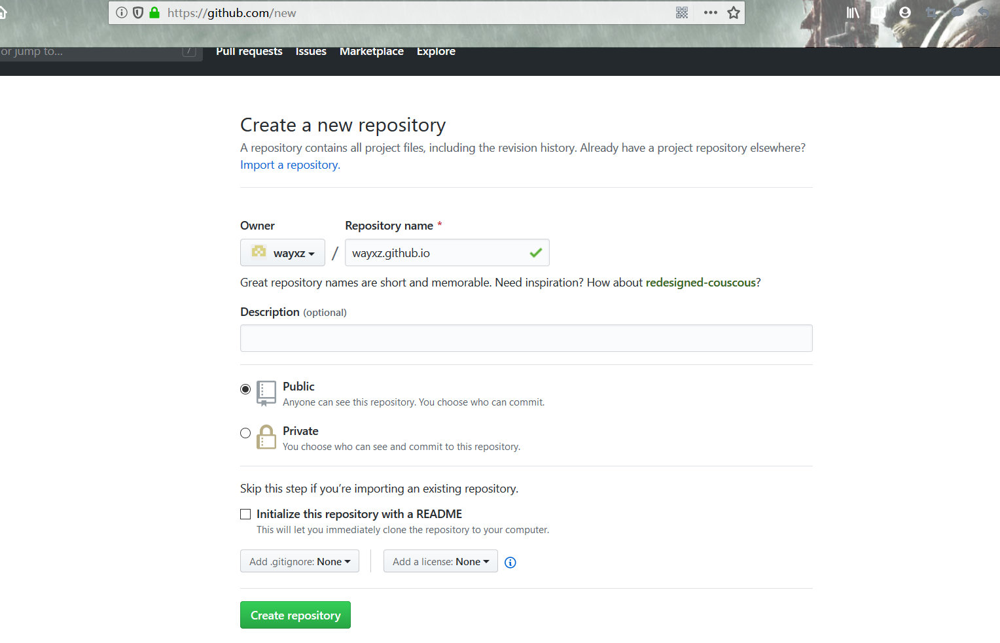
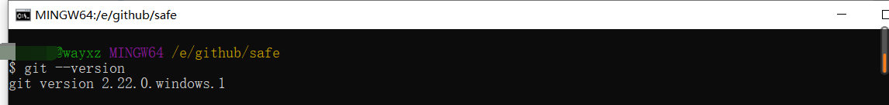
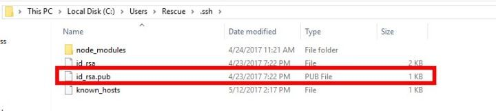
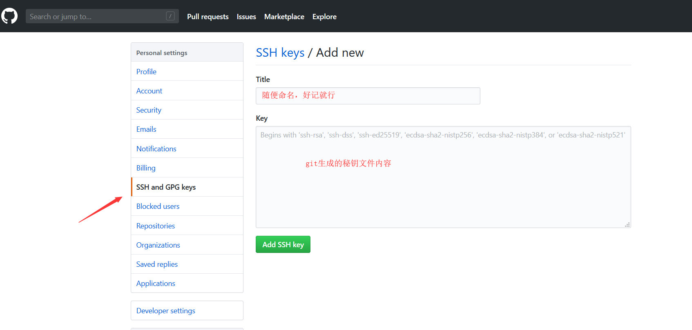
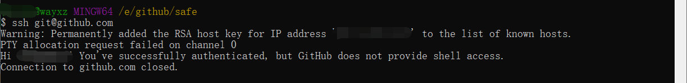
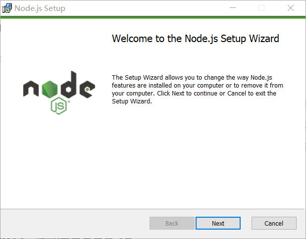
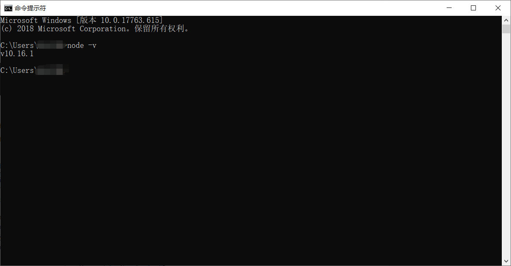
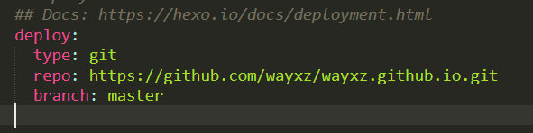

利用github和hexo搭建个人博客

## 0x00. 引言

1. 使用github pages服务搭建博客的好处有：

> 1. 全是静态文件，访问速度快；
> 2. 免费方便，不用花一分钱就可以搭建一个自由的个人博客，不需要服务器不需要后台；
> 3. 可以随意绑定自己的域名，不仔细看的话根本看不出来你的网站是基于github的；
> 4. 数据绝对安全，基于github的版本管理，想恢复到哪个历史版本都行；
> 5. 博客内容可以轻松打包、转移、发布到其它平台；

## 0x01. 准备工作

- 有一个github账号，没有的话去注册一个；
- 安装了node.js，并了解相关基础知识；
- 安装了git for windows（或者其它git客户端）。

------

## 0x02. GitHub创建个人仓库

1. 新建一个github仓库，命名规则为`你的用户名.github.io`（必须是你的用户名，其它名称无效），比如说，我的github用户名是wayxz，那么你就新建`wayxz.github.io`的仓库，将来我的网站访问地址就是 [https://wayxz.github.io](https://wayxz.github.io/) 。

[](http://tva1.sinaimg.cn/large/0060lm7Tly1g5p0s4r50wj31hc0ra7d1.jpg)

[](http://tva1.sinaimg.cn/large/0060lm7Tly1g5p0s4gbajj316g0rbn2a.jpg)

## 0x03. 安装Git

1. 从git官网[下载Git](./002 利用github和hexo搭建个人博客/https://git-scm.com/downloads)，下载安装后在命令行里输入git测试是否安装成功。

[](http://tva1.sinaimg.cn/large/0060lm7Tly1g5p0s5zfs0j30vu03t74d.jpg)

1. 安装成功后，将你的Git与GitHub帐号绑定，鼠标右击打开Git Bash。

```
git config --global user.name "你的GitHub用户名"git config --global user.email "你的GitHub注册邮箱"
```

1. 生成ssh密钥文件。

```
ssh-keygen -t rsa -C "你的GitHub注册邮箱"
```

1. 然后直接三个回车即可，默认不需要设置密码，然后找到生成的.ssh的文件夹中的id_rsa.pub密钥，将内容全部复制。

[](http://tva1.sinaimg.cn/large/0060lm7Tly1g5p0sb82rwj30k004hwem.jpg)

1. 打开[GitHub_Settings_keys](./002 利用github和hexo搭建个人博客/https://link.zhihu.com/?target=https%3A//github.com/settings/keys) 页面，新建new SSH Key。

[](http://tva1.sinaimg.cn/large/0060lm7Tly1g5p0s65vlkj31b20mhwfy.jpg)

1. 在Git Bash中检测GitHub公钥设置是否成功，输入 ssh [git@github.com](./002 利用github和hexo搭建个人博客/mailto:git@github.com) ，如果显示successfully等如下字样，即配置成功。

[](http://tva1.sinaimg.cn/large/0060lm7Tly1g5p0s6ecikj30xz046dg5.jpg)

## 0x04. 安装Node.js

1. 下载Node.js ，从[官网下载](./002 利用github和hexo搭建个人博客/https://nodejs.org/zh-cn/download/)长期支持版: **10.16.1** (包含 npm 6.9.0)的Node.js，并安装。

[](http://tva1.sinaimg.cn/large/0060lm7Tly1g5p0s41p2hj30h60df74r.jpg)

1. 安装成功后输入node -v，显示安装的node版本。

[](http://tva1.sinaimg.cn/large/0060lm7Tly1g5p0s47cszj30xz0hrwes.jpg)

## 0x05. 安装Hexo

1. Hexo就是我们的个人博客网站的框架， 在在电脑常里创建一个文件夹，可以命名为Blog，Hexo框架与以后你自己发布的网页都在这个文件夹中。创建好后，进入文件夹中，右击鼠标运行git bash here。
2. 使用node.js自带的npm命令安装Hexo，输入：

```
npm config set registry http://registry.npm.taobao.org          //由于国外npm源网速过慢，建议更换为国内源npm config list               //查看换源是否成功npm install -g hexo-cli
```

1. 安装完成后，初始化我们的博客，输入：

```
hexo init blog    //新建一个名为blog的网站
```

1. 为了检测博客是否搭建成功，分别按顺序输入以下三条命令：

```
hexo new test_my_site  //新建一篇文章hexo generate         //生成静态文件,该命令可以简写为hexo g                hexo server           //启动服务器。默认情况下，访问网址为：http://localhost:4000/，该命令可以简写为hexo g 。
```

[](http://tva1.sinaimg.cn/large/0060lm7Tly1g5p0saqbw5j31g30r7e82.jpg)

[推荐模板](./002 利用github和hexo搭建个人博客/https://jerryc.me/posts/21cfbf15/)

## 0x06. 推送网站到github

1. 将我们的Hexo与GitHub关联起来，打开站点的配置文件_config.yml，翻到最后修改为：

   deploy:
   type: git
   repo: 这里填入你之前在GitHub上创建仓库的完整路径，记得加上 .git
   branch: master参考如下：

   [](http://tva1.sinaimg.cn/large/0060lm7Tly1g5p0sb0zzzj30gf044q2z.jpg)

2. 保存站点配置文件，其实就是给hexo d 这个命令做相应的配置，让hexo知道你要把blog部署在哪个位置，很显然，我们部署在我们GitHub的仓库里。最后安装Git部署插件，输入命令：

```
npm install hexo-deployer-git --save
```

1. 这时，我们分别输入三条命令：

```
hexo clean hexo g hexo d
```

hexo d 就是部署网站命令，d是deploy的缩写。完成后，打开浏览器，在地址栏输入你的放置个人网站的仓库路径，即 [https://wayxz.github.io](https://wayxz.github.io/)

## 参考

1. [Git教程](./002 利用github和hexo搭建个人博客/https://www.liaoxuefeng.com/wiki/896043488029600)
2. [Node.js教程](./002 利用github和hexo搭建个人博客/https://www.runoob.com/nodejs/nodejs-tutorial.html)
3. [HEXO教程](./002 利用github和hexo搭建个人博客/https://hexo.io/zh-cn/docs/)