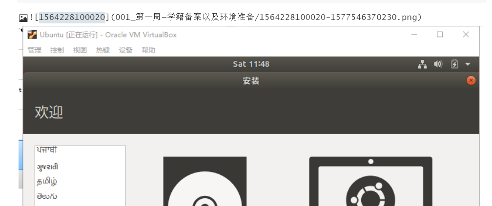
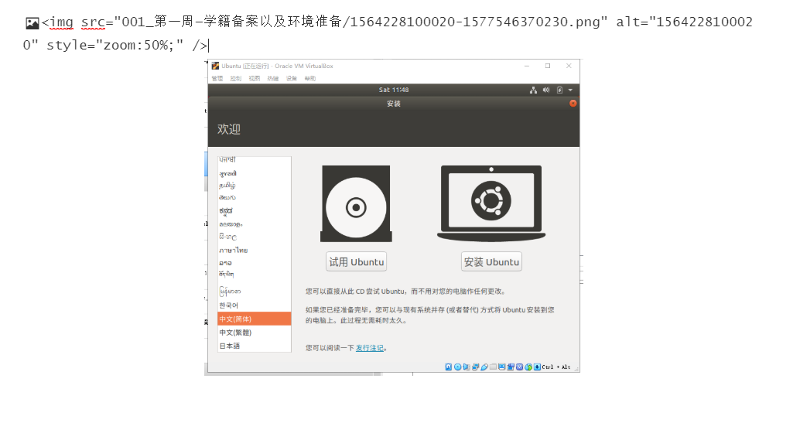
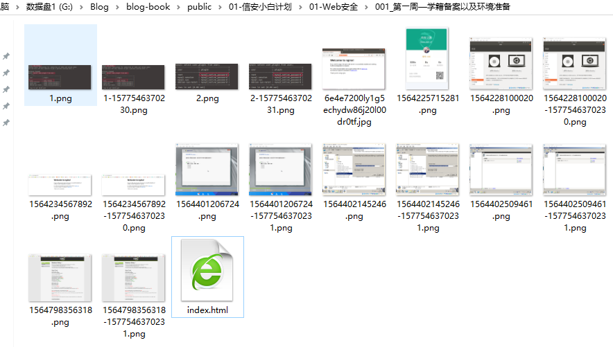
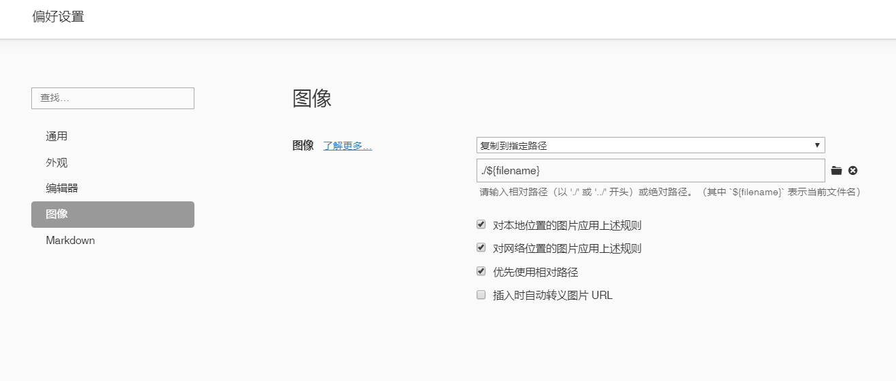
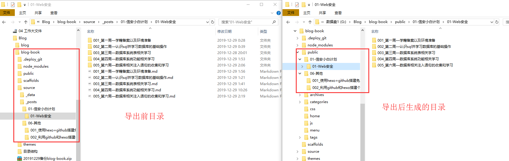

[toc]

----

# hexo-book主题github博客搭建

## 一、hexo windows安装及配置详解

### 1.1 hexo安装

```
#下载安装Node.js及Git后
npm install -g hexo-cli
npm install hexo
hexo init blog			#新建名为blog的博客目录；
cd blog
```


### 1.2 配置文件

```
##默认目录
.
├── _config.yml		#主要配置文件
├── package.json	#默认安装的程序文件，有需要可卸载
├── scaffolds
├── source			#网站内容，软件忽略隐藏的文件以及以_为前缀的文件或文件夹_posts文件夹除外。
|	|				可渲染文件（Markdown，HTML）处理并放入public中，而其他文件将仅被复制。
|   ├── _drafts		#layout 布局模板；new 指令新建文章参数，默认值为 post，还有draft、page。
|   └── _posts		
└── themes			#主题文件夹。Hexo通过将站点内容与主题相结合来生成静态站点。
```

#### 1.2.1  _config.yml	

```
# Hexo Configuration
## Docs: https://hexo.io/docs/configuration.html
## Source: https://github.com/hexojs/hexo/

# Site 
title:   			#您网站的标题
subtitle: 			#您网站的字幕
description: 		#您的网站说明
keywords:			#您网站的关键字。用逗号分隔多个关键字
author: Dabe		#你的名字
language: zh-CN		#您网站的语言。使用2个字母的ISO-639-1代码或可选的其变体。默认值为en
timezone: 			#您网站的时区。Hexo默认使用计算机上的设置。
					#America/New_York  Japan UTC

# URL
## If your site is put in a subdirectory, set url as 'http://yoursite.com/child' and root as '/child/'
url: http://yoursite.com				#您网站的网址
root: /									#您网站的根目录
permalink: :year/:month/:day/:title/	#文章的永久链接格式
permalink_defaults:						#固定链接中每个细分的默认值
# pretty_urls:							#将permalink变量重写为漂亮的URL
  #trailing_index: true 				# 尾随index.html，设置false为删除
  #trailing_html: true 			# 尾随.html，设置为false将其删除（不适用index.html）
		
# Directory
#如果您的网站位于子目录（例如http://example.org/blog）中，则设置url为http://example.org/blog并设置root为/blog/
## e.g. page.permalink is http://example.com/foo/bar/index.html
##pretty_urls:
###trailing_index: false
###becomes http://example.com/foo/bar/
   
source_dir: source				#源文件夹。您的内容存储的位置
public_dir: public				#公用文件夹。静态网站将在哪里生成
tag_dir: tags					#标签目录
archive_dir: archives			#档案目录
category_dir: categories		#分类目录
code_dir: downloads/code		#包含代码目录（source_dir的子目录）
i18n_dir: :lang					#i18n目录
skip_render:					#跳过不渲染
#将被复制到public原始路径而不进行渲染的路径。您可以使用glob表达式进行路径匹配。
#skip_render: "mypage/**/*"
# will output `source/mypage/index.html` and `source/mypage/code.js` without altering them.

## This also can be used to exclude posts,
skip_render: "_posts/test-post.md"
# will ignore the `source/_posts/test-post.md`.

# Writing
new_post_name: :title.md 	# 新帖子的文件名格式
default_layout: post		# 默认布局
titlecase: false 			# 将标题转换为标题大小写？
external_link:				#在新标签页中打开外部链接？
  enable: true 				# 在新标签页中打开外部链接？
  field: site 				# 适用于整体site或仅post
  exclude: ''				#排除主机名。在适用时指定子域，包括www
filename_case: 0			#将文件名转换为1小写；2大写
render_drafts: false		#显示草稿？
post_asset_folder: false	#启用post_asset文件夹？
relative_link: false		#建立相对于根文件夹的链接？
future: true				#显示未来的帖子？
highlight:					#代码块语法高亮设置，由Highlight.js提供支持
  enable: true				#启用语法突出显示
  line_number: true			#显示行号,启用此选项还将启用该wrap选项
  auto_detect: false		#如果未指定语言，则启用自动检测
  tab_replace: ''			#用n个空格替换制表符；如果值为空，则不会替换标签
  wrap: true				#将代码块包装在 <table>
  hljs: false				#hljs-*为CSS类使用前缀?

# Home page setting
# path: Root path for your blogs index page. (default = '')
# per_page: Posts displayed per page. (0 = disable pagination)
# order_by: Posts order. (Order by date descending by default)
index_generator:			#生成帖子存档，由hexo-generator-index提供支持
  path: ''					#博客索引页面的根路径
  per_page: 10				#每页显示的帖子
  order_by: -date			#发布订单。默认情况下按降序排列（从新到旧）。

# Category & Tag 分类和标签
default_category: uncategorized		#默认类别
category_map:						#类别
tag_map:							#标签

# Metadata elements					#元数据元素
## https://developer.mozilla.org/en-US/docs/Web/HTML/Element/meta
meta_generator: true

# Date / Time format	日期/时间格式
## Hexo uses Moment.js to parse and display date
## You can customize the date format as defined in
## http://momentjs.com/docs/#/displaying/format/
date_format: YYYY-MM-DD			#日期格式
time_format: HH:mm:ss			#时间格式
## Use post's date for updated date unless set in front-matter
use_date_for_updated: false		#	post.updated如果前面没有提供更新日期，请使用发布日期。通常与Git工作流程一起使用

# Pagination 分页
## Set per_page to 0 to disable pagination
per_page: 10					#每页上显示的帖子数。0禁用分页
pagination_dir: page			#网址格式
	#Examples:
		#pagination_dir: 'page'       	 # http://yoursite.com/page/2
        #pagination_dir: 'awesome-page'   # http://yoursite.com/awesome-page/2

# Include / Exclude file(s)  包含/排除文件或文件夹
## include:/exclude: options only apply to the 'source/' folder
include:			#包括隐藏文件（包括名称/下划线开头的文件/文件夹，例外情况*）
exclude:			#排除文件/文件夹
ignore:				#忽略文件/文件夹

# Extensions 扩展名
## Plugins: https://hexo.io/plugins/
## Themes: https://hexo.io/themes/
theme: landscape			#主题名称。false禁用主题
#theme_config				#主题配置。在此键下包括所有自定义主题设置，以覆盖主题默认设置。
#meta_generator				#元生成器标签。false禁用标签的注入。
		


# Deployment
## Docs: https://hexo.io/docs/deployment.html
deploy:
  type: ''
```


~~~
目录跳过详解；
#Include / Exclude Examples:
# Include/Exclude Files/Folders
include:
  - ".nojekyll"
  # Include 'source/css/_typing.css'.
  - "css/_typing.css"
  # Include any file in 'source/_css/'.
  - "_css/*"
  # Include any file and subfolder in 'source/_css/'.
  - "_css/**/*"

exclude:
  # Exclude 'source/js/test.js'.
  - "js/test.js"
  # Exclude any file in 'source/js/'.
  - "js/*"
  # Exclude any file and subfolder in 'source/js/'.
  - "js/**/*"
  # Exclude any file with filename that starts with 'test' in 'source/js/'.
  - "js/test*"
  # Exclude any file with filename that starts with 'test' in 'source/js/' and its subfolders.
  - "js/**/test*"
  # Do not use this to exclude posts in the 'source/_posts/'.
  # Use skip_render for that. Or prepend an underscore to the filename.
  # - "_posts/hello-world.md" # Does not work.

ignore:
  # Ignore any folder named 'foo'.
  - "**/foo"
  # Ignore 'foo' folder in 'themes/' only.
  - "**/themes/*/foo"
  # Same as above, but applies to every subfolders of 'themes/'.
  - "**/themes/**/foo"
  
列表中的每个值都必须用单/双引号引起来。
include:并且exclude:不适用于该themes/文件夹。使用ignore:或替代地，在要排除的文件/文件夹名称前加下划线。

* source/_posts文件夹是一个例外，但名称在该文件夹下以下划线开头的任何文件或文件夹仍将被忽略。include:不建议在该文件夹中使用规则。
~~~

#### 1.2.2 package.json

```
package.json
{
  "name": "hexo-site",
  "version": "0.0.0",
  "private": true,
  "hexo": {
    "version": ""
  },
  "dependencies": {
    "hexo": "^3.8.0",
    "hexo-generator-archive": "^0.1.5",
    "hexo-generator-category": "^0.1.3",
    "hexo-generator-index": "^0.2.1",
    "hexo-generator-tag": "^0.2.0",
    "hexo-renderer-ejs": "^0.3.1",
    "hexo-renderer-stylus": "^0.3.3",
    "hexo-renderer-marked": "^0.3.2",
    "hexo-server": "^0.3.3"
  }
}
```

#### 1.2.3 source

```
#source
## Hexo 使用 `new` 指令来新建文章、草稿和页面这三种默认布局语法
$ hexo new 布局 "文章名"
```

| 布局  | 解释 | 路径           | 注释             |
| ----- | ---- | -------------- | ---------------- |
| post  | 文章 | source/_posts  | 新建一个文章文件 |
| draft | 草稿 | source/_drafts | 新建一个草稿文件 |
| page  | 页面 | source         | 新建一个页面文件 |

注意：页面文件需要在主题的 `_config.yml` 中配置才能显示出来。

#### 1.2.4 使用代替配置文件

可以在 hexo-cli 中使用 `--config` 参数来指定自定义配置文件的路径。你可以使用一个 YAML 或 JSON 文件的路径，也可以使用逗号分隔（无空格）的多个 YAML 或 JSON 文件的路径。例如：

```
# use 'custom.yml' in place of '_config.yml'
$ hexo server --config custom.yml

# use 'custom.yml' & 'custom2.json', prioritizing 'custom3.yml', then 'custom2.json'
$ hexo generate --config custom.yml,custom2.json,custom3.yml
```

当你指定了多个配置文件以后，Hexo 会按顺序将这部分配置文件合并成一个 `_multiconfig.yml`。如果遇到重复的配置，排在后面的文件的配置会覆盖排在前面的文件的配置。这个原则适用于任意数量、任意深度的 YAML 和 JSON 文件。

例如，使用 `--options` 指定了两个自定义配置文件：

```
$ hexo generate --config custom.yml,custom2.json
```

如果 `custom.yml` 中指定了 `foo: bar`，在 custom2.json 中指定了 `"foo": "dinosaur"`，那么在 `_multiconfig.yml` 中你会得到 `foo: dinosaur`。

#### 1.2.5 覆盖主题配置

通常情况下，Hexo 主题是一个独立的项目，并拥有一个独立的 `_config.yml` 配置文件。
你可以在站点的 `_config.yml` 配置文件中配置你的主题，这样你就不需要 fork 一份主题并维护主题独立的配置文件。

以下是一个覆盖主题配置的例子：

```
# _config.yml
theme_config:
  bio: "My awesome bio"
# themes/my-theme/_config.yml
bio: "Some generic bio"
logo: "a-cool-image.png"
```

最终主题配置的输出是：

```
{
  bio: "My awesome bio",
  logo: "a-cool-image.png"
}
```

------

## 二、book主题安装

### 2.1 主题下载

```
git clone https://github.com/kaiiiz/hexo-theme-book.git themes/book
```

### 2.2 渲染器安装及配置

如果没有scss渲染器，请遵循以下步骤：

```
npm install hexo-renderer-scss --save
```

修改`theme`条目`_config.yml`

```
theme: book
```

为了获得更好的渲染质量，建议您更改默认渲染器

```
##Uninstall original renderer
	npm uninstall hexo-renderer-marked --save

##Install new renderer
	npm install hexo-renderer-markdown-it --save

##install renderer plugin
    npm install markdown-it-abbr --save
    npm install markdown-it-container --save
    npm install markdown-it-deflist --save
    npm install markdown-it-emoji --save
    npm install markdown-it-footnote --save
    npm install markdown-it-imsize --save
    npm install markdown-it-ins --save
    npm install markdown-it-mark --save
    npm install markdown-it-regexp --save
    npm install markdown-it-sub --save
    npm install markdown-it-sup --save
    npm install markdown-it-checkbox --save
```

### 2.3 渲染器配置

最后，将这些行添加到您网站的中`_config.yml`，切记根据您的设置修改条目。放到最后

```
markdown:
  render:
    html: true # Doesn't escape HTML content so the tags will appear as html.
    xhtmlOut: false # Parser will not produce XHTML compliant code.
    breaks: true # Parser produces `<br>` tags every time there is a line break in the source document.
    linkify: true # Returns text links as text.
    typographer: true # Substitution of common typographical elements will take place.
    quotes: '“”‘’' # "double" will be turned into “single”
                   # 'single' will be turned into ‘single’
  plugins:
    - markdown-it-abbr
    - markdown-it-container
    - markdown-it-deflist
    - markdown-it-emoji
    - markdown-it-footnote
    - markdown-it-imsize
    - markdown-it-ins
    - markdown-it-mark
    - markdown-it-regexp
    - markdown-it-sub
    - markdown-it-sup
    - markdown-it-checkbox
  anchors:
    # Minimum level for ID creation. (Ex. h2 to h6)
    level: 1
    # A suffix that is prepended to the number given if the ID is repeated.
    collisionSuffix: 'v'
    # If `true`, creates an anchor tag with a permalink besides the heading.
    permalink: false
    # Class used for the permalink anchor tag.
    permalinkClass: header-anchor
    # The symbol used to make the permalink
    permalinkSymbol: '# '
```

### 2.4 主题配置

基本不用配置；我配置的`collapse_depth: 1 `# 侧边栏默认展开的深度为1

```
home_page: home.md # filename under /source/_posts/   主页
menu_page: menu.md # filename under /source/_posts/   侧边栏菜单

favicon_url: favicon.ico
zoom_image: true
collapse_depth: 1 # 侧边栏默认展开的深度

codeblock:
  # Code Highlight theme
  # Available values: normal | night | night eighties | night blue | night bright | solarized | solarized dark | galactic
  highlight_theme: normal

comments:
  utterances:
    enable: false
    user: # your github user name
    repo: # your github repo name
    theme: github-light # github-light | github-dark | github-dark-orange | icy-dark | dark-blue | photon-dark
  disqus:
    enable: false
    shortname: # your disqus shortname
  gitalk:
    enable: false
    githubID: # your github id
    repo: # GitHub repository e.g. kaiiiz.github.io
    ClientID: # GitHub Application Client ID
    ClientSecret: # GitHub Application Client Secret
    adminUser: # GitHub repository owner and collaborators
    labels: 'gitalk' # GitHub issue labels
    distractionFreeMode: true

google_analytics: # UA-XXXXX-Y
```

### 2.5 官方menu.md主题示例

https://kaiiiz.github.io/hexo-theme-book-demo/

```
###menu.md 示例
* [Home](/hexo-theme-book-demo)
* Test
  * [hexo-unit-test](https://github.com/hexojs/hexo-theme-unit-test)
    * [Categories](/hexo-theme-book-demo/test/hexo-unit-test/categories)
    * [Elements](/hexo-theme-book-demo/test/hexo-unit-test/elements)
    * [Excerpts](/hexo-theme-book-demo/test/hexo-unit-test/excerpts)
    * [Gallery Post](/hexo-theme-book-demo/test/hexo-unit-test/gallery-post)
    * [Hello World](/hexo-theme-book-demo/test/hexo-unit-test/hello-world)
    * [Images](/hexo-theme-book-demo/test/hexo-unit-test/images)
    * [Untitled](/hexo-theme-book-demo/test/hexo-unit-test/link-post-without-title)
    * [Link Post](/hexo-theme-book-demo/test/hexo-unit-test/link-post)
    * [Lorem ipsum dolor sit amet, consectetur adipiscing elit. Aliquam justo turpis, tincidunt ac convallis id.](/hexo-theme-book-demo/test/hexo-unit-test/long-title)
    * [Untitled](/hexo-theme-book-demo/test/hexo-unit-test/no-title)
    * [Tag Plugins](/hexo-theme-book-demo/test/hexo-unit-test/tag-plugins)
    * [Tags](/hexo-theme-book-demo/test/hexo-unit-test/tags)
    * [Videos](/hexo-theme-book-demo/test/hexo-unit-test/videos)
    * [中文測試](/hexo-theme-book-demo/test/hexo-unit-test/中文測試)
    * [日本語テスト](/hexo-theme-book-demo/test/hexo-unit-test/日本語テスト)
  * [list test](/hexo-theme-book-demo/test/list-test)
* Demo
  * [markdown-it demo](/hexo-theme-book-demo/demo/markdown-it-demo)
  * [katex demo](/hexo-theme-book-demo/demo/katex-demo)
  * [footnotes demo](/hexo-theme-book-demo/demo/footnotes-demo)
  * [繁體中文測試](/hexo-theme-book-demo/demo/tc-demo)
```


### 2.6  创建`book.yml`

为了顺利进行导出，创建一个`book.yml`在`/source/_data`文件夹中命名的配置文件（如果不存在，请创建一个）

> **注意：源文件夹位于您的hexo工作目录下，而不是主题目录！**

复制内容`/themes/book/_config.yml`到`/source/_data/book.yml`，它会替换配置中的内容`/themes/book/_config.yml`。现在，您可以独立配置它，也可以更流畅地更新主题。


## 三、博客搭建

### 3.1 成功的_config.xml示例

```
#参考的ca0y1h的配置； 有些代码我也不理解，后边慢慢研究；
##ca0y1h的github博客
###https://ca0y1h.github.io/

# Hexo Configuration
## Docs: https://hexo.io/docs/configuration.html
## Source: https://github.com/hexojs/hexo/

# Site
title: 信安之路学习纪录
subtitle: 
description: 
keywords:
author: Dave
language: zh-CN
timezone: Asia/Shanghai

# URL
## If your site is put in a subdirectory, set url as 'http://yoursite.com/child' and root as '/child/'
url: https://lauwarrior.github.io
root: /
permalink: :title/
permalink_defaults:
# pretty_urls:
  #trailing_index: true # Set to false to remove trailing 'index.html' from permalinks
  #trailing_html: true # Set to false to remove trailing '.html' from permalinks

# Directory
source_dir: source
public_dir: public
tag_dir: tags
archive_dir: archives
category_dir: categories
code_dir: downloads/code
i18n_dir: :lang
skip_render:     
 
# Writing
new_post_name: :title.md # File name of new posts
default_layout: post
titlecase: false # Transform title into titlecase
external_link: true
#  enable: true # Open external links in new tab
#  field: site # Apply to the whole site
#  exclude: ''
filename_case: 0
render_drafts: false
post_asset_folder: true
relative_link: false
future: true
highlight:
  enable: true
  line_number: true
  auto_detect: false
  tab_replace: 
#  wrap: true
#  hljs: false

## Markdown
## https://github.com/hexojs/hexo-renderer-marked
marked:
  gfm: true

# Home page setting
# path: Root path for your blogs index page. (default = '')
# per_page: Posts displayed per page. (0 = disable pagination)
# order_by: Posts order. (Order by date descending by default)
index_generator:
  path: ''
  per_page: 10
  order_by: -date

# Category & Tag
default_category: uncategorized
category_map:
tag_map:

# Metadata elements
## https://developer.mozilla.org/en-US/docs/Web/HTML/Element/meta
meta_generator: true

# Date / Time format
## Hexo uses Moment.js to parse and display date
## You can customize the date format as defined in
## http://momentjs.com/docs/#/displaying/format/
date_format: YYYY-MM-DD
time_format: HH:mm:ss
## Use post's date for updated date unless set in front-matter
#use_date_for_updated: false

# Pagination
## Set per_page to 0 to disable pagination
per_page: 10
pagination_dir: page

# Include / Exclude file(s)
## include:/exclude: options only apply to the 'source/' folder
include:
exclude:
ignore:

# Extensions
## Plugins: https://hexo.io/plugins/
## Themes: https://hexo.io/themes/
theme: book

### JsonContent
jsonContent:
   meta: false
   pages:
    title: true
    date: true
    path: true
    text: true
   posts:
    title: true
    date: true
    path: true
    text: true
    tags: true
    categories: true
   ignore:
      - 404.html

search:
    path: search.xml
    field: post
    format: html
    limit: 10000
    
symbols_count_time:
    symbols: true
    time: true
    total_symbols: true
    total_time: false

#baidusitemap:
# path: baidusitemap.xml
sitemap:
    path: sitmap.xml
    
# Deployment
## Docs: https://hexo.io/docs/deployment.html
deploy:
  type: git
  repo: https://github.com/lauwarrior/lauwarrior.github.io.git
  branch: master  

markdown:
  render:
    html: true # Doesn't escape HTML content so the tags will appear as html.
    xhtmlOut: false # Parser will not produce XHTML compliant code.
    breaks: true # Parser produces `<br>` tags every time there is a line break in the source document.
    linkify: true # Returns text links as text.
    typographer: true # Substitution of common typographical elements will take place.
    quotes: '“”‘’' # "double" will be turned into “single”
                   # 'single' will be turned into ‘single’
  plugins:
    - markdown-it-abbr
    - markdown-it-container
    - markdown-it-deflist
    - markdown-it-emoji
    - markdown-it-footnote
    - markdown-it-imsize
    - markdown-it-ins
    - markdown-it-mark
    - markdown-it-regexp
    - markdown-it-sub
    - markdown-it-sup
    - markdown-it-checkbox
  anchors:
    # Minimum level for ID creation. (Ex. h2 to h6)
    level: 1
    # A suffix that is prepended to the number given if the ID is repeated.
    collisionSuffix: 'v'
    # If `true`, creates an anchor tag with a permalink besides the heading.
    permalink: false
    # Class used for the permalink anchor tag.
    permalinkClass: header-anchor
    # The symbol used to make the permalink
    permalinkSymbol: '# '
```

### 3.2  网站hexo g前要设置的

```
##需设置，否则文章不会导出
---
title: <string>
---

##例如 *.md 开始需写入
    title: 001_第⼀周—学籍备案以及环境准备
    date: 2019-08-03 13:21:01
    categories: "信安之路" #文章分類目錄 可以省略
    tags:  #文章標籤 可以省略
        # - "信安之路"
        # - "小白成长计划"
        
        
##网上其他参考设置
    ---
    title: 文章名
    date: 2013-05-29 07:56:29  #发表日期
    updated: 2016-04-06 14:58:03  #更新日期
    categories: Life  #文章分类
    tags: [tag1,tag2]  #文章标签，多标签时使用英文逗号隔开
    photos:  #如果使用Fancybox（文章头部展示图片），如此设置
    - URL1
    - URL2
    ---
    #从这里开始
    #就是正文
    #使用markdown
```


### 3.3  关于图片的设置

安装hexo-asset-image组件，成功后在自动`\source\_posts`下相关目录新建与*.md笔记名称相同的文件夹，放入图片
引用图片格式：

` /例子.png)`



也可以是

```

```



***否则上传至github.io不显示图片;***

```
##安装插件
npm install hexo-asset-image --save

##且注意是特定版本
###根目录下package.json中
"hexo-asset-image": "^1.0.0",    ##此版本测试成功，多试验几次；
"hexo-asset-image": "git+https://github.com/CodeFalling/hexo-asset-image.git",	##其他设置
```

~~~
##nexo g 后在public文件夹里找看是否有图片和index.html 有则说明成功了一半；
~~~



```
##然后打开index.html查看源代码，搜索img，如显示为以下说明ok
<p></p>

实际就是
<p></p>

若不是上述结构，说明hexo-asset-image 需网上下载重新更换，建议用老版本，我新版本测试不成功；
```

我使用Typora 编辑器；图片设置如下




### 3.4 关于目录结构



### 3.5 menu.md设置

```
### 直接上我成功的设置；前提是设置好目录结构和图片相对引用；
### 参考2.5 官方示例

Dave's Blog
* [00-文章归档](/archives/index.html)
* 01-信安小白计划
  * 01-Web安全
    * [001_第⼀周—学籍备案以及环境准备](https://lauwarrior.github.io/01-信安小白计划/01-Web安全/001_第⼀周—学籍备案以及环境准备/index.html)   
    * [002_第二周—认识sql并学习数据库的基础操作](https://lauwarrior.github.io/01-信安小白计划/01-Web安全/002_第二周—认识sql并学习数据库的基础操作/index.html)  
    * [003_第三周—数据库系统表相关学习](https://lauwarrior.github.io/01-信安小白计划/01-Web安全/003_第三周—数据库系统表相关学习/index.html)  
    * [004_第四周—数据库系统功能相关学习](https://lauwarrior.github.io/01-信安小白计划/01-Web安全/004_第四周—数据库系统功能相关学习/index.html)  
    * [005_第六周—数据库相关注入语句的收集和学习](https://lauwarrior.github.io/01-信安小白计划/01-Web安全/005_第六周—数据库相关注入语句的收集和学习/index.html)  
  * 02-渗透测试
    * 暂未学习 
  * 03-红蓝对抗
    * 暂未学习  
  * 04-学二进制
    * 暂未学习  
  * 05-病毒分析
    * 暂未学习  
  * 06-安全建设
    * 暂未学习 
  * 07-应急响应  
    * 暂未学习 
  * 08-成长经验
    * 暂未学习 
  * 09-安全工具
    * 暂未学习 
* 02-靶机实战
  * 01-VulnHub
    * 暂未学习 
* 03-Python学习
  * 暂未学习 
* 04-网络建站
  * 暂未学习 
* 05-kali学习
  * 暂未学习 
* 06-其他
  * [001_使用hexo+github搭建免费个人博客详细教程(转载)](https://lauwarrior.github.io/06-其他/001_使用hexo+github搭建免费个人博客详细教程(转载)/index.html)  
  * [002_利用github和hexo搭建个人博客](https://lauwarrior.github.io/06-其他/002_利用github和hexo搭建个人博客/index.html)  
```

### 3.6 调试和部署

```
$ hexo clean 	#清除静态页面缓存（清除 public 文件夹）生成前建议执行
$ hexo g 		#在本地生成静态页面（生成 public 文件夹）
$ hexo s 		#启动本地服务 http://localhost:4000，进行预览调试；
				#注意此时图片不能正常显示，需上传至github才能显示；
$ hexo d		#远程部署，同步到 GitHub
```

如果出现问题，最好先使用 `$ hexo clean` 来清除 Hexo 的缓存。最后使用组合命令 `$ hexo d -g` 远程部署网站。


## 四、后记

研究了一天，目前除了图片加载慢以外，无别的缺点，初学，大神不喜勿喷；

[我的github博客，欢迎指正]: https://lauwarrior.github.io

后面再研究显示时间和浏览次数等其他功能；